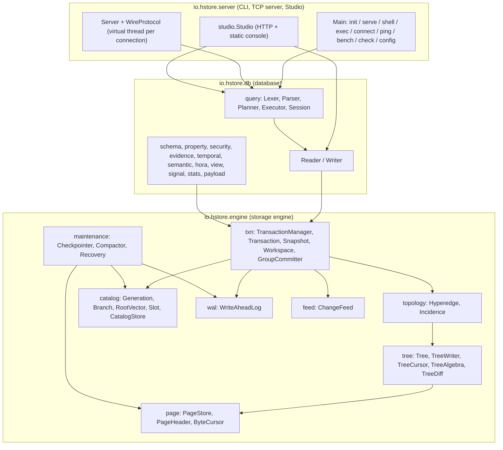
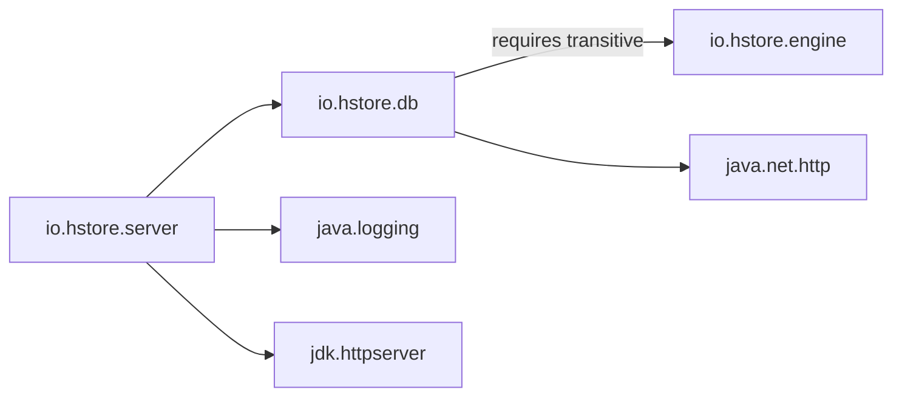
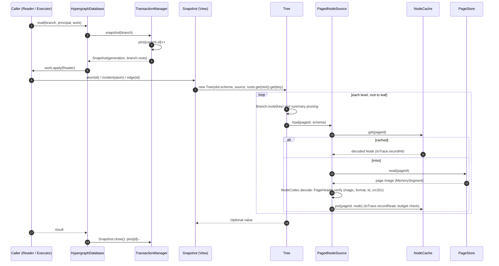

# Architecture overview

HStore is a native, persistent hypergraph store. Every structure it keeps on disk (atoms, hyperedge memberships, reverse incidence, secondary indexes, schema, users) is a copy-on-write counted B+tree stored in fixed-size pages. A commit publishes a new **generation**: an immutable vector of tree roots, one per *slot*. Readers pin a generation and never block writers. Writers build new roots in private and publish them through a write-ahead log and a group-commit barrier.

This document maps the code base and follows a read and a write from the API down to the bytes on disk. The other documents cover each layer in depth:

| Topic | Document |
|---|---|
| Page and segment byte layout | [storage/pages.md](../storage/pages.md) |
| Copy-on-write counted B+tree, summaries, algebra | [storage/persistent-tree.md](../storage/persistent-tree.md) |
| Hyperedge representation, incidence, reverse index | [storage/topology.md](../storage/topology.md) |
| Root vectors, slots, generations, branches, change feed | [storage/catalog-and-generations.md](../storage/catalog-and-generations.md) |
| Checkpoints, compaction, verification | [storage/maintenance.md](../storage/maintenance.md) |
| Transactions, isolation, rebase, group commit | [transactions/transactions.md](../transactions/transactions.md) |
| WAL format, recovery and crash points | [transactions/wal-and-recovery.md](../transactions/wal-and-recovery.md) |
| Data model, HQL, planner, semantic plane, security | [database/](../database/) |
| Docker, configuration, logging, CLI, wire protocol, Studio | [operations/](../operations/) |
| HyperGraphDB comparison | [benchmarks.md](../benchmarks.md) |
| Building and testing | [development.md](../development.md) |

## Layers



* **Engine** (`engine/`, JPMS module `io.hstore.engine`). It knows nothing about types, properties or HQL. It stores *atoms* (records in the `catalog` slot) and *hyperedge memberships* (nested trees referenced from edge records). It also keeps a small set of engine-derived indexes, and any number of extension slots registered by the layer above.
* **Database** (`database/`, module `io.hstore.db`, `requires transitive io.hstore.engine`). This layer adds schema and typed properties, payloads, tenants and security, evidence and provenance, temporal bindings, embeddings and HNSW search, and the higher-order operators (HORA). It also provides materialized views and signals, plus the HQL language. It plugs into the engine through *extension slots* and *derivations* (`EngineOptions.withExtensions`); see [catalog-and-generations.md](../storage/catalog-and-generations.md#extension-slots).
* **Server** (`server/`, module `io.hstore.server`, requires `io.hstore.db`, `java.logging` and `jdk.httpserver`). This layer holds the `hstore` command-line tool, the line-oriented TCP protocol (`Server`, `WireProtocol`), and Postgres-style logging (`Logging`). It also contains the configuration layering (`ServerConfig`, `Setting`) and the Studio web console (`server/studio/Studio.java` plus static assets under `server/src/main/resources/studio`).

### JPMS module graph



The engine has no dependencies outside `java.base`. All three modules build into one GraalVM native image (`server/target/hstore`) with the `native` Maven profile.

## Package map

### `io.hstore.engine`

| Package | Purpose |
|---|---|
| `io.hstore.engine` | `StorageEngine` (open/close, maintenance thread, checkpoint/compact entry points), `EngineOptions`, `EngineStats`, `Dictionary` (interned role names and role sets), `HStoreException` (error codes, retryable conflicts). |
| `engine.page` | Byte-level storage. `PageStore` and `SegmentFile` hold segment files and allocation. `PageHeader` is the 80-byte header and crc32c seal. `PageId` packs page addresses. `ByteCursor` provides little-endian and varint codecs over `MemorySegment`. `IoTrace` counts page visits per query through a `ScopedValue`. |
| `engine.tree` | The copy-on-write counted B+tree. `Tree` is the immutable handle and `TreeWriter` does path-copy updates. Nodes are `Leaf` and `Branch`, referenced by `Ref` (`Empty`, `Pending` or `Stored`). Also here: `Summary` (monoid annotations), `TreeCursor`, `TreeAlgebra` (leapfrog, set algebra), `TreeDiff`, `BulkBuilder`, `NodeCodec`, `NodeCache`, `Materializer`, `TreeWalker` and `TreeVerifier`. |
| `engine.topology` | Hyperedge representation: `Hyperedge` (members tree plus order index), `Incidence` (one member's role set, weight, validity, payload and qualifier), `IncidenceCodec` (columnar leaf encoding), `MemberChange`, `Weight` (fixed point) and `Validity`. |
| `engine.index` | `PostingIndex`, a two-level index from a key to a postings set. Small sets are inlined and large ones are promoted to their own tree. Used by the reverse incidence, type, canonical-key and symbol indexes. |
| `engine.catalog` | `AtomRecord` (`NodeRecord`/`EdgeRecord`) and its codec, `EngineSlots` (built-in slots, schemas and key functions), `Slot`/`SlotRegistry`, `RootVector`, `Generation`, `Branch`, `Symbol`, and `CatalogImage`/`CatalogStore` (checkpoint files). |
| `engine.txn` | `TransactionManager` (commit lock, append, publication, pins, history), `Transaction` (op log, read sets, rebase), `Snapshot`, `View` (read API shared by both), `Workspace` (mutable root vector plus derivations), `GroupCommitter`, `Op`/`EdgeAction`, `Derivation`/`EngineDerivations`, `CrashPoint`, `Durability`, `WalMode`, `Isolation` and `TxnOptions`. |
| `engine.wal` | `WriteAheadLog` (segmented, checksummed records) and `WalRecord` (`Begin`, `Page`, `PageRef`, `Root`, `BranchMeta`, `Feed`, `Commit`, `Abort`, `Checkpoint`). |
| `engine.feed` | `ChangeFeed` (segmented append-only `feed/*.feed` files, sparse generation index, retention, tailing subscriptions), `CommitEvent` and `FeedCodec`; see [change-feed.md](../storage/change-feed.md). |
| `engine.maintenance` | `Checkpointer`, `Compactor` (liveness, relocation, reclamation) and `Recovery` (catalog discovery, WAL redo, durable-prefix rule). |

### `io.hstore.db`

| Package | Purpose |
|---|---|
| `io.hstore.db` | `HypergraphDatabase` (opens the engine with extension slots, retries conflicts), `Reader`/`Writer` (tenant-aware typed API), `Atom`, `Member`, `MemberSpec`, `Incident` and `DatabaseOptions`. |
| `db.schema` | `Schema`, `TypeDef`, `AtomKind` (`NODE`, `SET_EDGE`, `ORDERED_EDGE`) and `SchemaSlots`. |
| `db.value` | `Value` (typed scalar values), `TypeTag`, `Json` (parser, printer, path selection) and `Values`. |
| `db.property` | `PropertyBag`, `PropertyIndex` (tenant-scoped value index), `PropertyIndexing` (a derivation that keeps the index in step with property writes) and `PropertySlots`. |
| `db.payload` | `PayloadStore`: append-only `payload/*.pay` files for large values and documents, synced before every commit. |
| `db.security` | `Principal`, `Role`, `Quota` and `Security` (tenants, users with PBKDF2 hashes, usage accounting). |
| `db.evidence` | `Evidence`, `Qualifier`, `Provenance`, `AssertionType` and `EvidencePolicy`: per-incidence qualifiers and provenance records. |
| `db.temporal` | `Temporal` (valid-time queries), `StateBindings` and `BranchMerge` (three-way branch merge with conflict policies). |
| `db.semantic` | `SemanticPlane` (feed-driven embedding index, persisted at checkpoints), `HnswIndex`, `Encoder`, `HttpEncoder` and `Embedding`. |
| `db.hora` | Higher-order relational algebra: `Hora` (gather/reduce/scatter/propagate, overlap joins, closure), `PatternMatcher` (hypergraph patterns over incidence intersections), `SwapSampler`, `GroupKernel`, `Reducer` and `Budget`. |
| `db.query` | HQL: `Lexer`, `Parser`, `Ast`, `Planner`/`AccessPath`, `Evaluator`, `Executor`, `Session` and `QueryResult`. |
| `db.view` | `MaterializedViews`, kept fresh from the change feed. |
| `db.signal` | `Signals`, a derivation plus resolution of signal atoms. |
| `db.stats` | `Statistics` (feed-maintained cardinality and degree histograms for the planner) and `Histogram`. |

## Life of a read

`HypergraphDatabase.read` opens a `Snapshot` (`engine/src/main/java/io/hstore/engine/txn/Snapshot.java`). Opening it pins the current generation (`TransactionManager.pinCurrent` increments a counter in `pins`) and wraps the branch's `RootVector`. The snapshot never changes, and no lock is held while it is read. `Snapshot.close` unpins.



Notes:

* Nodes are decoded once and then shared by every reader through `NodeCache`. It has 16 shards, each a `ConcurrentHashMap` plus a CLOCK (second-chance) ring, with a total byte budget of `node_cache_mb`, each node counted at an estimate of its heap size (`Node.heapBytes`). Lookups are lock-free; only admission takes a per-shard lock. Decoded nodes are immutable (`owner == null`), so sharing them needs no copying. See [pages.md](../storage/pages.md#caching-and-io-accounting).
* `IoTrace` is bound with `ScopedValue.where(...)` around a query. `recordRead` throws `HStoreException.limit` once page reads plus cache hits exceed the query's page budget (`query_page_budget`).
* Historical reads use `TransactionManager.snapshotAt(generation, branch)`. It looks the generation up in the retained `history` map; see [catalog-and-generations.md](../storage/catalog-and-generations.md#history-retention-and-time-travel).

## Life of a write

A `Transaction` (`engine/src/main/java/io/hstore/engine/txn/Transaction.java`) is a `View` over a private `Workspace`. The workspace starts from the pinned generation's roots. Each operation is recorded in an op log (`Op`) and applied to the workspace immediately. That application path-copies the touched trees under the transaction's `WriteScope`, runs *derivations* to maintain the derived indexes, and collects `MemberChange`/`SlotChange` events for the change feed. Nothing is visible to other transactions until publication.

```mermaid
sequenceDiagram
    autonumber
    participant W as Writer / Executor
    participant TX as Transaction
    participant WS as Workspace
    participant TM as TransactionManager
    participant M as Materializer
    participant WAL as WriteAheadLog
    participant PS as PageStore
    participant GC as GroupCommitter (hstore-group-commit)
    participant F as ChangeFeed
    W->>TX: createNode / insert / put ...
    TX->>WS: Op.apply: path-copy trees (TreeWriter), emit MemberChange / SlotChange
    WS->>WS: derivations update reverse, type, canonical and extension indexes
    W->>TX: commit()
    TX->>TM: commit(txn)
    activate TM
    Note over TM: commitLock held from here
    TM->>TM: fast path when base roots or touched slots are unchanged,<br/>otherwise validateReads and replay the op log on the latest roots (rebase)
    TM->>M: materialize each pending root (post-order)
    M->>M: encode node image (pageId 0)
    M->>PS: allocate(epoch = generation, length): 64-byte units
    M->>M: PageHeader.assign: patch pageId, reseal crc32c
    M-->>TM: Stored refs, WAL Page / PageRef records, node images
    TM->>WAL: append Begin, Page/PageRef*, Root*, BranchMeta*, Feed
    TM->>PS: write page images
    TM->>WAL: append Commit(generation, wallTime, nextAtom, nextTxn)
    TM->>TM: head = next generation
    TM->>GC: submit(Pending(next, publication))
    deactivate TM
    Note over TM: commitLock released; caller waits outside the lock
    GC->>PS: sync() in PAGE_REFERENCES mode (data before log)
    GC->>WAL: sync()
    GC->>TM: publication: current = next, history.put, trimHistory
    GC->>F: append(CommitEvent)
    GC-->>TX: await() returns published generation
```

The ordering above is what makes recovery safe. Under `PAGE_REFERENCES` the WAL carries only `(pageId, length, crc32c)` for each new page. The flusher therefore makes data pages durable *before* the log records that reference them. Recovery replays committed transactions in order and stops at the first commit whose referenced pages fail verification (the *durable-prefix* rule in `Recovery.intact`). The full protocol and the crash-point matrix are in [wal-and-recovery.md](../transactions/wal-and-recovery.md).

## Threading model

| Thread | Kind | Created in | Role |
|---|---|---|---|
| Caller threads | any (the server uses virtual threads) | — | Run reads without locks. Run a transaction's operations without locks, then take `commitLock` only for append (encoding, WAL append, page writes). They then block in `GroupCommitter.await` outside the lock. |
| `hstore-group-commit` | platform, daemon | `GroupCommitter` constructor | Takes every queued `Pending` as one batch and calls `makeDurable(batchSize)` once: data sync in `PAGE_REFERENCES` mode, then WAL sync, both only under `Durability.SYNC`. It then runs each publication in generation order and wakes the waiters. One fsync pair covers the whole batch (`averageGroupCommit` in the statistics). A failure poisons the pipeline, and every later commit fails until restart. |
| `hstore-maintenance` | virtual | `StorageEngine` constructor | Every 500 ms, under the `maintenance` lock (`tryLock`): checkpoint once the WAL written since the last checkpoint exceeds `checkpoint_wal_mb`, then reclaim retired segments that no pinned reader can still see. |
| `feed-subscriber` | virtual, one per subscription | `ChangeFeed.subscribe` | Tails the feed segments, waiting on a condition signalled by `append` (with a 250 ms timeout). Subscribers are `SemanticPlane`, `MaterializedViews` and `Statistics`. |
| Server connections | virtual, one per socket | `Server` (`Executors.newVirtualThreadPerTaskExecutor`) | Each connection runs a `Session`. |
| Studio requests | virtual | `Studio` (`HttpServer.setExecutor`) | HTTP API and static assets. |

Locks:

* `TransactionManager.commitLock` serializes generation assignment and the WAL append order.
* `StorageEngine.maintenance` serializes checkpoint and compaction.
* `TransactionManager.exclusive` holds `commitLock` and drains the group committer, so a checkpoint sees exactly the published state.

Readers take no locks at all.

## Data directory layout

The following is real output from `hstore init` followed by loading `examples/clinical-claims.hql` and running `CHECKPOINT;` (default 16 KiB pages):

```text
FORMAT                                   55 B  format=3, page-size=16384 (java.util.Properties)
LOCK                                      0 B  FileChannel.tryLock() held while open
hstore.conf                            2397 B  server configuration template written by `hstore init`
catalog/manifest                         20 B  name of the latest catalog file
catalog/generations/0000000000000000.cat 37 B  checkpoint of generation 0
catalog/generations/000000000000009d.cat 49147 B  checkpoint of generation 157 (current + retained history)
data/segments/00000001.seg           1210439 B  segment 1: packed node images
wal/segments/0000000000000000.wal      156180 B  WAL segment starting at LSN 0
feed/0000000000000000.feed             29846 B  change feed segment starting at byte 0
payload/000001.pay                        0 B  payload segment (database layer)
semantic/state                           53 B  persisted HNSW index state (database layer)
```

| Path | Owner | Format |
|---|---|---|
| `FORMAT` | `StorageEngine.verifyFormat` | `Properties` with `format=3` (packed extents, sized references) and `page-size` (the maximum node size). Opening a directory written in an older format, or opening with a different page size, fails. |
| `LOCK` | `StorageEngine.open` | An exclusive OS file lock. A second process gets `database ... is opened by another process`. |
| `catalog/generations/%016x.cat` | `CatalogStore.publish` | `int magic 0x54414348`, `int crc32c(payload)`, `long length`, then the `CatalogImage` payload. Written to `*.tmp`, fsynced, atomically renamed, and the directory fsynced. The three newest files are kept. |
| `catalog/manifest` | `CatalogStore` | The file name of the latest `.cat`, written durably the same way. |
| `data/segments/%08x.seg` | `PageStore` / `SegmentFile` | Append-only extents of node images packed at 64-byte alignment, up to 256 MiB per segment by default (1 GiB maximum); see [pages.md](../storage/pages.md). |
| `wal/segments/%016x.wal` | `WriteAheadLog` | Each segment is named by its starting LSN; see [wal-and-recovery.md](../transactions/wal-and-recovery.md). |
| `feed/%016x.feed` | `ChangeFeed` | Segments (64 MiB, named by starting byte offset) of frames `int length`, `int crc32c`, `long generation`, `payload`, trimmed by retention after checkpoints; see [change-feed.md](../storage/change-feed.md). |
| `payload/%06x.pay` | `db.payload.PayloadStore` | Append-only payload extents. |
| `semantic/state`, `semantic/hnsw-<model>.idx` | `db.semantic.SemanticPlane` | A `Properties` file with `generation` and `models`, plus one serialized HNSW graph per model, written atomically at checkpoints and on close. |
| `hstore.conf` | `server.ServerConfig` | Settings, overridden by `HSTORE_*` environment variables and then by `--setting` flags. |

Every hyperedge's membership is a separate nested tree; `hstore check` reports 85 nested trees under the `catalog` slot. Most of them are a single small leaf of 100–200 bytes. Segments pack node images at 64-byte alignment instead of reserving a full `page_size` slot per node, so the whole example occupies 1.2 MB of segment space. With fixed 16 KiB slots it took 17.6 MB. See [pages.md](../storage/pages.md#segment-files).

## Verifying a directory

`hstore check <dir>` (`server/src/main/java/io/hstore/server/Check.java`) opens the engine and runs `TreeVerifier` over every slot root of every active branch, including nested trees. It checks the following:

* page checksums and identity, through decoding;
* strictly ascending keys in leaves;
* separators that route every child;
* equal height for all children of a branch;
* stored summaries equal to recomputed ones, at every node and at the root.

Sample output from the directory above:

```text
generation 157, recovered 0 commits from the log
branch main
  property-index          162 entries        9 pages      8 nested trees  height 1
  ...
  reverse                  53 entries        1 pages      0 nested trees  height 1
  catalog                 458 entries       86 pages     85 nested trees  height 1
verified 105 pages: checksums, ordering, balance and summaries are consistent
```
