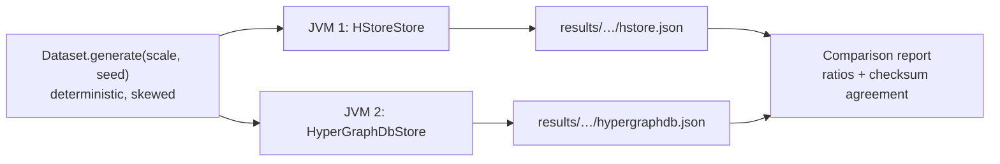

# Benchmarks: HStore and HyperGraphDB

This page compares HStore with [HyperGraphDB](https://github.com/hypergraphdb/hypergraphdb), the established
Java hypergraph database. Both run the same workloads on the same deterministic dataset in separate JVMs. Every
read workload is cross-checked: the two engines must return identical answers, as the "Results agree" column
shows. The harness lives in [`benchmarks/`](../benchmarks) and can be rerun on any machine.



## Setup

| | HStore | HyperGraphDB |
|---|---|---|
| Version | 0.1.0 (this repository) | 1.4 at commit `99485a1`, storage `bdb-je` on Berkeley DB JE 5.0.73 |
| Data model used | node type `Entity` (indexed by key, property `name`); `SET_EDGE` type `Relation` | `String` atoms; `HGPlainLink` links |
| Cache | node cache of 16 GiB (enough for the whole dataset), or `CACHE_MB` | JE cache at 30% of the heap (HyperGraphDB default), or `CACHE_MB`, plus the HyperGraphDB atom cache |
| `async` durability | `durability = async` | HyperGraphDB default: JE `WRITE_NO_SYNC` |
| `sync` durability | `durability = sync`, `wal_mode = references`, group commit | JE `COMMIT_SYNC` |
| History | `history_limit = 64` generations retained for time travel (default) | none |

Each run used a 4 GiB heap and `-XX:+UseParallelGC` on JDK 25 (GraalVM, HotSpot JIT) on macOS 26.5.1 with an
Apple silicon `aarch64` CPU and 10 cores.

**Dataset.** At scale *s*: 50,000·*s* nodes and 100,000·*s* hyperedges. Cardinality follows a geometric tail
starting at 2 (continue with probability 0.62, capped at 32), for a mean of 3.6. Members are drawn as
`⌊n · u^2.2⌋` for uniform `u`, so low-numbered nodes become hubs with large incidence sets, as in real
co-authorship, claims or citation data. Probe sets are 100,000 random nodes and hyperedges, 20,000 node pairs
taken from a common hyperedge (so co-membership counts are non-zero), and 20,000 updates. The seed is fixed
(`20260904`).

**Workloads.**

| Id | Operation | HStore API | HyperGraphDB API |
|---|---|---|---|
| `ingest.nodes` | insert nodes, 1,000 per transaction | `Writer.node` | `graph.add(String)` in `transact` |
| `ingest.edges` | insert hyperedges, 1,000 per transaction | `Writer.edge` + `Writer.load` | `graph.add(new HGPlainLink(…))` |
| `read.incidence` | enumerate a node's incidence set, 1,000 probes per read transaction | `Reader.incident` | `getIncidenceSet(h).getSearchResult()` |
| `read.members` | enumerate a hyperedge's members | `Reader.members` | `HGLink.getTargetAt` over `graph.get(h)` |
| `read.comembership` | count hyperedges containing both nodes of a pair | `TreeAlgebra.intersectKeys` (leapfrog) | `hg.count(hg.and(hg.incident(a), hg.incident(b)))` |
| `read.twohop` | count the distinct nodes that share a hyperedge with a node, 10,000 probes | `Reader.incident` + `Reader.memberIds` | `getIncidenceSet` + the link's targets |
| `read.incidence.parallel` | `read.incidence` from one thread per core | same | same |
| `latency.read` | one incidence lookup per read transaction, each timed on its own | `Reader.incident` | `getIncidenceSet(h).getSearchResult()` |
| `write.update` | replace a node's value, 1,000 per transaction | `Writer.set` | `graph.replace` |
| `latency.commit` | 5,000 write transactions of one update each, each timed on its own | `Writer.set` | `graph.replace` |
| `mixed.read` | single incidence lookups from `threads − 1` threads for 10 s while `mixed.write` runs | `Reader.incident` | `getIncidenceSet(h).getSearchResult()` |
| `mixed.write` | one thread committing 10 updates at a time on a fixed schedule of 1,000 updates/s | `Writer.set` | `graph.replace` |
| `large.ingest` | one hyperedge containing every node | `Writer.load` | one `HGPlainLink` |
| `large.scan` | enumerate the large hyperedge twenty times | `Reader.members` | `getTargetAt` loop |
| `large.probe` | test whether a node belongs to the large hyperedge | `View.incidence(edge, node)` (membership-tree lookup) | `getIncidenceSet(node).contains(edge)` |
| `reopen` | close and reopen, including recovery | `HypergraphDatabase.open` | `HGEnvironment.get` |
| `read.incidence.cold` | `read.incidence` immediately after reopening | | |
| `disk` | bytes on disk after a clean shutdown | | |
| `churn.delete` | delete 20% of the hyperedges, 1,000 per transaction | `Writer.delete` | `graph.remove` |
| `churn.remove` | remove one member from each of 20,000 other hyperedges, 1,000 per transaction | `Writer.remove` | `graph.replace` with a new `HGPlainLink` (links are immutable) |
| `read.incidence.churned` | `read.incidence` after the deletes | | |
| `disk.churned` | bytes on disk after the deletes and a clean shutdown | | |
| `compaction.baseline` | single-update commits at 50/s for 10 s, no compaction | `Writer.set` | `graph.replace` |
| `compaction` | the same commits while a full compaction runs, starting 1 s in | `StorageEngine.compact` | `Environment.cleanLog` until it finds nothing, then a forced checkpoint |
| `disk.compacted` | bytes on disk after the compaction and a clean shutdown | | |
| `recover` | open the store after the process ingesting into it was killed with SIGKILL | `HypergraphDatabase.open` | `HGEnvironment.get` |

Read workloads run a warm-up pass over 10% of the probes before timing, except `read.incidence.cold`.

The two `latency.*` workloads time every operation separately with `System.nanoTime()`. Each operation is a whole
transaction, as it would be for a request to a server. The report adds a second table with p50, p99, p99.9 and the
maximum, taking the median of each percentile across runs. Throughput hides occasional slow operations caused by
group commit, checkpoints, compaction or GC; these percentiles show them. Under `sync` durability,
`latency.commit` is effectively the cost of one durable commit.

**Reads during writes.** In `mixed`, the readers run in a closed loop for 10 s, and a single writer commits on a
fixed schedule (open loop). Each commit's latency is measured from when it was *scheduled* to start, not from
when it actually started. If the engine stalls, the commits queued behind the stall show the delay, instead of
the writer quietly slowing down. The writer stops at the deadline even when it is behind, so an engine that can't
keep up shows an achieved rate below 1,000 updates/s. Readers keep a uniform random sample of 200,000 latencies
each, plus the exact maximum. Both results depend on timing, so *Results agree* shows "n/a".

**Two hops.** `read.twohop` follows each probe node to its hyperedges and from there to their members. It runs
before `large.ingest`, because once the hyperedge containing every node exists, every node is two hops from all
the others. Each adapter uses plain incidence and member calls and its own id type: `long` ids, sorted and
de-duplicated, for HStore, and a `HashSet` of persistent handles for HyperGraphDB, which has no numeric ids.
HyperGraphDB's `HGBreadthFirstTraversal` isn't used, since it would measure that framework rather than the
storage underneath.

**Deletes.** The churn set is drawn from the same seed after everything else, so the rest of the dataset is
unchanged. It has 20% of the hyperedges to delete and 20,000 others, each with at least three members, that lose
one member. `disk` is recorded while the store is closed for a reopen, before the churn starts, so it still means
the loaded store after a clean shutdown. The checksum of `read.incidence.churned` has to agree, which confirms
both engines applied the same deletes. `disk.churned` shows whether the space came back: through compaction for
HStore, and the log cleaner for JE.

**Compaction.** After the churn, `disk.churned` is recorded at a reopen, and then two 10 s windows run. In both, one
writer commits a single update every 20 ms on a fixed schedule, and each commit's latency is measured from when it
was scheduled. In `compaction`, the store also runs a full compaction starting 1 s in, and the window lasts until
the compaction has finished. HStore calls `StorageEngine.compact()`. JE calls `cleanLog()` until it cleans nothing,
then forces a checkpoint so the cleaned files are deleted. The latency table compares the two windows, and the
*Resources* table adds the compaction time and the space reclaimed (disk while open, before against after). That
figure can be negative when compaction frees less than the writer adds. HStore's default segments are 256 MiB, so
at scale 1 most data shares one or two segments. `--pages-per-segment` (`PAGES_PER_SEGMENT`) and
`--compaction-live-ratio` (`COMPACTION_LIVE_RATIO`) change HStore's settings for a run.

**Crash recovery.** `reopen` closes the store cleanly first. `recover` doesn't:
1. The run starts a second JVM (`Comparison crash`) with the same flags and classpath. It ingests nodes into a
   fresh directory and prints the count after every acknowledged commit.
2. Once half the nodes are acknowledged, the parent kills it with SIGKILL.
3. The parent times opening the directory, then counts the nodes that survived.

The *Resources* table shows how many acknowledged nodes were lost, including when it's zero. SIGKILL is a process
crash, not a power failure: bytes the engine handed to the operating system survive it even without an fsync. So
this measures recovery time and the engine's own buffering, not whether `sync` really reaches the disk. Torn
writes and lost fsyncs are covered by HStore's crash matrix (`CrashRecoveryTest`, see [development.md](development.md)), not by this
benchmark.

**Bytes written.** For every write workload the report also shows the bytes each engine wrote per operation, in a
*Resources* table, plus the total for the whole run. Both engines count the bytes they write themselves:

| HStore | HyperGraphDB |
|---|---|
| WAL bytes plus page bytes (`EngineStats.walBytes + dataBytesWritten`), including pages moved by compaction | sequential plus random write bytes from JE's `EnvironmentStats`, including the log cleaner |

Each write workload ends with a flush (an HStore checkpoint, `Environment.sync()` for JE) after its timed section,
so bytes still sitting in buffers are counted against the workload that produced them. The counters restart
when a store reopens, so the adapters carry the total across `reopen`. Bytes written during the final close
aren't counted.

**Amplification.** The *Resources* table also divides physical bytes by an estimate of the logical bytes involved:

| Ratio | Physical bytes | Logical bytes |
|---|---|---|
| write amplification | bytes written (above) | 8 bytes per id plus the value: `node-<i>` for a new node, 24 bytes for an updated value, `(cardinality + 1) × 8` for a new or deleted hyperedge, 16 bytes for a removed member |
| read amplification | bytes read from storage | 8 bytes per id the workload returned (its checksum counts them) |

HStore counts the bytes it reads from segment files (`EngineStats.dataBytesRead`): a first read of up to 4 KiB,
then the rest of the page image if it's bigger. JE reports sequential plus random read bytes. Reads served from a cache read nothing from storage, so read amplification mostly shows up for
cold reads and with a small `CACHE_MB`. The logical sizes are rough estimates; compare the two stores against each
other rather than reading the ratios as absolute numbers.

**Memory.** Every workload also records, from the JVM's own MXBeans, the bytes the whole process allocated
(`getTotalThreadAllocatedBytes`) and the GC pause time (`GarbageCollectorMXBean.getCollectionTime`, which is
stop-the-world time with ParallelGC). Rows where both stores paused for 0 ms are left out. After ingest, the run
forces a full GC and records how much heap the loaded store keeps. A baseline taken before the store opens is
subtracted, so the shared dataset arrays don't count. This number mostly reflects how each engine's cache is
configured (see *Setup*).

## Results

Ratios above 1 favour HStore. Throughput ratios divide HStore by HyperGraphDB; latency and size ratios divide
HyperGraphDB by HStore. Laptop runs vary by up to ±30% from one run to the next, so read the tables for
consistent multiples rather than single digits.

### Scale 1, `async` durability

Dataset: 50,000 nodes, 100,000 hyperedges, 362,757 incidences.

| Workload | HStore | HyperGraphDB | Ratio | Results agree |
|---|---:|---:|---:|:---:|
| `ingest.nodes` — insert nodes in transactions of 1,000 | 12,717 ops/s | 10,451 ops/s | **1.22×** | yes |
| `ingest.edges` — insert hyperedges (mean cardinality 3.6) in transactions of 1,000 | 9,610 ops/s | 16,684 ops/s | **0.58×** | yes |
| `read.incidence` — enumerate the incidence set of a node | 189,969 ops/s | 48,237 ops/s | **3.94×** | yes |
| `read.members` — enumerate the members of a hyperedge | 313,600 ops/s | 853,555 ops/s | **0.37×** | yes |
| `read.comembership` — count hyperedges containing both atoms of a pair | 72,541 ops/s | 9,134 ops/s | **7.94×** | yes |
| `read.incidence.parallel` — incidence sets from 10 threads, 100,000 probes each | 585,719 ops/s | 881,973 ops/s | **0.66×** | yes |
| `write.update` — replace a node value in transactions of 1,000 | 9,821 ops/s | 5,114 ops/s | **1.92×** | yes |
| `large.ingest` — create one hyperedge with 50,000 members | 93,884 ops/s | 40,387 ops/s | **2.32×** | yes |
| `large.scan` — enumerate all members of the large hyperedge (x20) | 2,392,915 ops/s | 81,701,289 ops/s | **0.03×** | yes |
| `large.probe` — test whether a node belongs to the large hyperedge | 594,904 ops/s | 200,944 ops/s | **2.96×** | yes |
| `reopen` — close and reopen the database, including recovery | 961 ms | 1,514 ms | **1.58×** | yes |
| `read.incidence.cold` — incidence sets immediately after reopening | 137,791 ops/s | 35,009 ops/s | **3.94×** | yes |
| `disk` — bytes on disk after a clean shutdown | 243.5 MiB | 252.9 MiB | **1.04×** | yes |

### Scale 1, `sync` durability

| Workload | HStore | HyperGraphDB | Ratio | Results agree |
|---|---:|---:|---:|:---:|
| `ingest.nodes` — insert nodes in transactions of 1,000 | 15,748 ops/s | 11,211 ops/s | **1.40×** | yes |
| `ingest.edges` — insert hyperedges (mean cardinality 3.6) in transactions of 1,000 | 12,349 ops/s | 9,142 ops/s | **1.35×** | yes |
| `read.incidence` — enumerate the incidence set of a node | 339,666 ops/s | 31,321 ops/s | **10.84×** | yes |
| `read.members` — enumerate the members of a hyperedge | 557,841 ops/s | 803,557 ops/s | **0.69×** | yes |
| `read.comembership` — count hyperedges containing both atoms of a pair | 114,055 ops/s | 8,595 ops/s | **13.27×** | yes |
| `read.incidence.parallel` — incidence sets from 10 threads, 100,000 probes each | 912,412 ops/s | 682,443 ops/s | **1.34×** | yes |
| `write.update` — replace a node value in transactions of 1,000 | 12,867 ops/s | 4,844 ops/s | **2.66×** | yes |
| `large.ingest` — create one hyperedge with 50,000 members | 156,773 ops/s | 35,232 ops/s | **4.45×** | yes |
| `large.scan` — enumerate all members of the large hyperedge (x20) | 8,374,222 ops/s | 87,843,227 ops/s | **0.10×** | yes |
| `large.probe` — test whether a node belongs to the large hyperedge | 1,063,080 ops/s | 214,721 ops/s | **4.95×** | yes |
| `reopen` — close and reopen the database, including recovery | 445 ms | 1,472 ms | **3.31×** | yes |
| `read.incidence.cold` — incidence sets immediately after reopening | 289,371 ops/s | 38,394 ops/s | **7.54×** | yes |
| `disk` — bytes on disk after a clean shutdown | 243.5 MiB | 300.3 MiB | **1.23×** | yes |

### Scale 4, `async` durability

Dataset: 200,000 nodes, 400,000 hyperedges, 1,453,427 incidences.

| Workload | HStore | HyperGraphDB | Ratio | Results agree |
|---|---:|---:|---:|:---:|
| `ingest.nodes` — insert nodes in transactions of 1,000 | 11,013 ops/s | 13,093 ops/s | **0.84×** | yes |
| `ingest.edges` — insert hyperedges (mean cardinality 3.6) in transactions of 1,000 | 3,063 ops/s | 3,803 ops/s | **0.81×** | yes |
| `read.incidence` — enumerate the incidence set of a node | 180,086 ops/s | 8,166 ops/s | **22.05×** | yes |
| `read.members` — enumerate the members of a hyperedge | 134,192 ops/s | 888,461 ops/s | **0.15×** | yes |
| `read.comembership` — count hyperedges containing both atoms of a pair | 64,263 ops/s | 2,735 ops/s | **23.50×** | yes |
| `read.incidence.parallel` — incidence sets from 10 threads, 100,000 probes each | 339,512 ops/s | 736,535 ops/s | **0.46×** | yes |
| `write.update` — replace a node value in transactions of 1,000 | 7,015 ops/s | 4,010 ops/s | **1.75×** | yes |
| `large.ingest` — create one hyperedge with 200,000 members | 40,146 ops/s | 15,985 ops/s | **2.51×** | yes |
| `large.scan` — enumerate all members of the large hyperedge (x20) | 2,416,821 ops/s | 78,756,824 ops/s | **0.03×** | yes |
| `large.probe` — test whether a node belongs to the large hyperedge | 841,554 ops/s | 113,450 ops/s | **7.42×** | yes |
| `reopen` — close and reopen the database, including recovery | 2,035 ms | 9,304 ms | **4.57×** | yes |
| `read.incidence.cold` — incidence sets immediately after reopening | 63,822 ops/s | 8,299 ops/s | **7.69×** | yes |
| `disk` — bytes on disk after a clean shutdown | 2361.9 MiB | 1265.5 MiB | **0.54×** | yes |

Rerunning scale 4 with `history_limit = 1` gives the following disk row, which shows that retained history is
not what drives HStore's footprint:

| `disk` — bytes on disk after a clean shutdown | 2115.5 MiB | 1265.5 MiB | **0.60×** | yes |

## Analysis

**Where HStore leads, and why.**

* **Incidence enumeration (4–22×) and co-membership (8–24×).** An atom's incidence set is a counted B+tree keyed
  by hyperedge id. Enumeration is therefore a sequential cursor walk over a few packed nodes, and
  co-membership is a leapfrog intersection that skips whole subtrees by their summaries
  ([persistent-tree.md](storage/persistent-tree.md)). HyperGraphDB stores incidence sets as BDB duplicate
  sets: it opens a cursor for each lookup, and its `hg.and` query plans a general join. The gap widens with
  scale because hubs grow and HStore's cost depends on the smaller side of the intersection.
* **Membership probes on giant hyperedges (3–7×).** A member lookup is a single descent of the hyperedge's
  membership tree. HyperGraphDB answers it through the node's incidence set.
* **Updates (1.8–2.7×) and giant-edge ingest (2.3–4.5×).** A batch becomes one copy-on-write path per touched
  tree and a single root swap at commit, and large edges are bulk-built bottom-up (`BulkBuilder`).
* **Reopen (1.6–4.6×) and cold reads (4–8×).** A clean shutdown leaves a checkpointed catalog, so opening a
  database reads one catalog image and replays an empty WAL suffix. Cold reads benefit from packed 64-byte
  extents: one 4 KiB read usually fetches a whole small node ([pages.md](storage/pages.md)).

**Where HyperGraphDB leads, and why.**

* **Member enumeration (`read.members`, `large.scan`).** `graph.get(link)` returns an `HGPlainLink` from the
  atom cache, which holds a Java array of target handles, so a scan is an array loop. HStore walks a B+tree
  cursor, decodes incidence columns, resolves role sets and builds a `Member` record for each member. That
  record carries roles, weight, validity, position and qualifier. The cost buys per-member metadata and
  snapshot-consistent reads, which a plain link cannot express. This is the clearest optimisation target
  (a raw `LongStream` member path that skips record materialisation).
* **Edge ingest at small batch sizes (about 0.6–0.8× in async mode).** Each commit rewrites the incident-tree
  paths of every touched member, which is copy-on-write write amplification. JE appends log records and
  defers the work to its cleaner. In `sync` mode group commit amortises the fsync and HStore leads (1.35×).
* **Parallel incidence reads at scale 4 (0.46×).** Every probe batch opens a snapshot, which pins a
  generation in a shared skip-list map. At 10 threads this coordination, plus node-cache admission under
  churn (the hot set exceeds the node cache), costs more than JE's latch-free cache hits. At scale 1
  the results are mixed: 0.66× async and 1.34× sync.
* **Disk at scale 4 (0.54×).** Live data is comparable: about 1 GB of live node images in HStore against
  1.27 GB in JE. The difference is garbage that has not been reclaimed yet. Both engines are log-structured
  with a 50% minimum-utilisation cleaner: HStore's `compaction_live_ratio = 0.5`, JE's
  `je.cleaner.minUtilization = 50`. A sealed HStore segment is only relocated once fewer than half of its
  images are live, and the background pass runs after every `checkpoint_wal_mb` of writes
  ([maintenance.md](storage/maintenance.md)). Raising `compaction_live_ratio` trades write amplification for
  space.

## Reproducing

```
benchmarks/install-hypergraphdb.sh                 # clone, compile and install HyperGraphDB 99485a1 and JE 5.0.73
SCALE=1 DURABILITY=async benchmarks/run.sh
SCALE=1 DURABILITY=sync benchmarks/run.sh
SCALE=4 DURABILITY=async benchmarks/run.sh
SCALE=4 DURABILITY=async HISTORY=1 benchmarks/run.sh
```

`run.sh` builds the `benchmarks` module (`-Pbenchmarks`) and runs each store in its own JVM, `RUNS` times
(default 3), alternating the two stores so slow periods hit both. It writes
`benchmarks/results/scale-<s>-<durability>-history-<h>/{hstore,hypergraphdb}-<run>.json`, plus a Markdown report
`report.md` in the same directory. Each cell in the report is the median over the runs, with the fastest and slowest
run in brackets, and "Results agree" requires every run of both stores to return the same checksum. `THREADS`
and `HEAP` override the thread count and heap size. Close other
workloads first: the numbers are only meaningful on an otherwise idle machine.

**Equal cache budgets.** By default the two caches are not the same size. HStore's node cache gets 16 GiB, which is
enough to hold the whole dataset. HyperGraphDB gets JE's default of 30% of the
heap. `CACHE_MB` gives both the same budget:

| HStore | HyperGraphDB |
|---|---|
| node cache of `CACHE_MB`, each node counted at the size of its page | JE cache of exactly `CACHE_MB` |

Decoded nodes take more heap than their page, and HyperGraphDB's own atom and incidence caches can't
be capped in bytes (they shrink under memory pressure). So check the retained-heap line in the report to see what
each store actually kept. Results go to a directory ending in `-cache-<mb>`.

```
SCALE=4 CACHE_MB=64 benchmarks/run.sh   # working set several times larger than either cache
```

With a small budget, reads that miss the cache go to the files, but the operating system's page cache will
usually still serve them from memory. Reads only really hit the disk when the data is larger than the machine's
free RAM.
