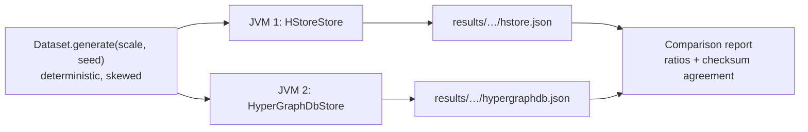

# Benchmarks: HStore and HyperGraphDB

This page compares HStore with [HyperGraphDB](https://github.com/hypergraphdb/hypergraphdb), the established
Java hypergraph database. Both run the same workloads on the same deterministic dataset in separate JVMs. Every
read workload is cross-checked: the two engines must return identical answers, as the "Results agree" column
shows. The harness lives in [`benchmarks/`](../benchmarks) and can be rerun on any machine.



## Setup

| | HStore | HyperGraphDB |
|---|---|---|
| Version | 0.1.0 (this repository) | 1.4 at commit `99485a1`, storage `bdb-je` on Berkeley DB JE 5.0.73 |
| Data model used | node type `Entity` (indexed by key, property `name`); `SET_EDGE` type `Relation` | `String` atoms; `HGPlainLink` links |
| Cache | node cache of 1,048,576 decoded nodes | JE cache at 30% of the heap (HyperGraphDB default) plus the HyperGraphDB atom cache |
| `async` durability | `durability = async` | HyperGraphDB default: JE `WRITE_NO_SYNC` |
| `sync` durability | `durability = sync`, `wal_mode = references`, group commit | JE `COMMIT_SYNC` |
| History | `history_limit = 64` generations retained for time travel (default) | none |

Each run used a 4 GiB heap and `-XX:+UseParallelGC` on JDK 25 (GraalVM, HotSpot JIT) on macOS 26.5.1 with an
Apple silicon `aarch64` CPU and 10 cores.

**Dataset.** At scale *s*: 50,000·*s* nodes and 100,000·*s* hyperedges. Cardinality follows a geometric tail
starting at 2 (continue with probability 0.62, capped at 32), for a mean of 3.6. Members are drawn as
`⌊n · u^2.2⌋` for uniform `u`, so low-numbered nodes become hubs with large incidence sets, as in real
co-authorship, claims or citation data. Probe sets are 100,000 random nodes and hyperedges, 20,000 node pairs
taken from a common hyperedge (so co-membership counts are non-zero), and 20,000 updates. The seed is fixed
(`20260904`).

**Workloads.**

| Id | Operation | HStore API | HyperGraphDB API |
|---|---|---|---|
| `ingest.nodes` | insert nodes, 1,000 per transaction | `Writer.node` | `graph.add(String)` in `transact` |
| `ingest.edges` | insert hyperedges, 1,000 per transaction | `Writer.edge` + `Writer.load` | `graph.add(new HGPlainLink(…))` |
| `read.incidence` | enumerate a node's incidence set, 1,000 probes per read transaction | `Reader.incident` | `getIncidenceSet(h).getSearchResult()` |
| `read.members` | enumerate a hyperedge's members | `Reader.members` | `HGLink.getTargetAt` over `graph.get(h)` |
| `read.comembership` | count hyperedges containing both nodes of a pair | `TreeAlgebra.intersectKeys` (leapfrog) | `hg.count(hg.and(hg.incident(a), hg.incident(b)))` |
| `read.incidence.parallel` | `read.incidence` from one thread per core | same | same |
| `latency.read` | one incidence lookup per read transaction, each timed on its own | `Reader.incident` | `getIncidenceSet(h).getSearchResult()` |
| `write.update` | replace a node's value, 1,000 per transaction | `Writer.set` | `graph.replace` |
| `latency.commit` | 5,000 write transactions of one update each, each timed on its own | `Writer.set` | `graph.replace` |
| `large.ingest` | one hyperedge containing every node | `Writer.load` | one `HGPlainLink` |
| `large.scan` | enumerate the large hyperedge twenty times | `Reader.members` | `getTargetAt` loop |
| `large.probe` | test whether a node belongs to the large hyperedge | `View.incidence(edge, node)` (membership-tree lookup) | `getIncidenceSet(node).contains(edge)` |
| `reopen` | close and reopen, including recovery | `HypergraphDatabase.open` | `HGEnvironment.get` |
| `read.incidence.cold` | `read.incidence` immediately after reopening | | |
| `disk` | bytes on disk after a clean shutdown | | |

Read workloads run a warm-up pass over 10% of the probes before timing, except `read.incidence.cold`.

The two `latency.*` workloads time every operation separately with `System.nanoTime()`. Each operation is a whole
transaction, as it would be for a request to a server. The report adds a second table with p50, p99, p99.9 and the
maximum, taking the median of each percentile across runs. Throughput hides occasional slow operations caused by
group commit, checkpoints, compaction or GC; these percentiles show them. Under `sync` durability,
`latency.commit` is effectively the cost of one durable commit.

## Results

Ratios above 1 favour HStore. Throughput ratios divide HStore by HyperGraphDB; latency and size ratios divide
HyperGraphDB by HStore. Laptop runs vary by up to ±30% from one run to the next, so read the tables for
consistent multiples rather than single digits.

### Scale 1, `async` durability

Dataset: 50,000 nodes, 100,000 hyperedges, 362,757 incidences.

| Workload | HStore | HyperGraphDB | Ratio | Results agree |
|---|---:|---:|---:|:---:|
| `ingest.nodes` — insert nodes in transactions of 1,000 | 12,717 ops/s | 10,451 ops/s | **1.22×** | yes |
| `ingest.edges` — insert hyperedges (mean cardinality 3.6) in transactions of 1,000 | 9,610 ops/s | 16,684 ops/s | **0.58×** | yes |
| `read.incidence` — enumerate the incidence set of a node | 189,969 ops/s | 48,237 ops/s | **3.94×** | yes |
| `read.members` — enumerate the members of a hyperedge | 313,600 ops/s | 853,555 ops/s | **0.37×** | yes |
| `read.comembership` — count hyperedges containing both atoms of a pair | 72,541 ops/s | 9,134 ops/s | **7.94×** | yes |
| `read.incidence.parallel` — incidence sets from 10 threads, 100,000 probes each | 585,719 ops/s | 881,973 ops/s | **0.66×** | yes |
| `write.update` — replace a node value in transactions of 1,000 | 9,821 ops/s | 5,114 ops/s | **1.92×** | yes |
| `large.ingest` — create one hyperedge with 50,000 members | 93,884 ops/s | 40,387 ops/s | **2.32×** | yes |
| `large.scan` — enumerate all members of the large hyperedge (x20) | 2,392,915 ops/s | 81,701,289 ops/s | **0.03×** | yes |
| `large.probe` — test whether a node belongs to the large hyperedge | 594,904 ops/s | 200,944 ops/s | **2.96×** | yes |
| `reopen` — close and reopen the database, including recovery | 961 ms | 1,514 ms | **1.58×** | yes |
| `read.incidence.cold` — incidence sets immediately after reopening | 137,791 ops/s | 35,009 ops/s | **3.94×** | yes |
| `disk` — bytes on disk after a clean shutdown | 243.5 MiB | 252.9 MiB | **1.04×** | yes |

### Scale 1, `sync` durability

| Workload | HStore | HyperGraphDB | Ratio | Results agree |
|---|---:|---:|---:|:---:|
| `ingest.nodes` — insert nodes in transactions of 1,000 | 15,748 ops/s | 11,211 ops/s | **1.40×** | yes |
| `ingest.edges` — insert hyperedges (mean cardinality 3.6) in transactions of 1,000 | 12,349 ops/s | 9,142 ops/s | **1.35×** | yes |
| `read.incidence` — enumerate the incidence set of a node | 339,666 ops/s | 31,321 ops/s | **10.84×** | yes |
| `read.members` — enumerate the members of a hyperedge | 557,841 ops/s | 803,557 ops/s | **0.69×** | yes |
| `read.comembership` — count hyperedges containing both atoms of a pair | 114,055 ops/s | 8,595 ops/s | **13.27×** | yes |
| `read.incidence.parallel` — incidence sets from 10 threads, 100,000 probes each | 912,412 ops/s | 682,443 ops/s | **1.34×** | yes |
| `write.update` — replace a node value in transactions of 1,000 | 12,867 ops/s | 4,844 ops/s | **2.66×** | yes |
| `large.ingest` — create one hyperedge with 50,000 members | 156,773 ops/s | 35,232 ops/s | **4.45×** | yes |
| `large.scan` — enumerate all members of the large hyperedge (x20) | 8,374,222 ops/s | 87,843,227 ops/s | **0.10×** | yes |
| `large.probe` — test whether a node belongs to the large hyperedge | 1,063,080 ops/s | 214,721 ops/s | **4.95×** | yes |
| `reopen` — close and reopen the database, including recovery | 445 ms | 1,472 ms | **3.31×** | yes |
| `read.incidence.cold` — incidence sets immediately after reopening | 289,371 ops/s | 38,394 ops/s | **7.54×** | yes |
| `disk` — bytes on disk after a clean shutdown | 243.5 MiB | 300.3 MiB | **1.23×** | yes |

### Scale 4, `async` durability

Dataset: 200,000 nodes, 400,000 hyperedges, 1,453,427 incidences.

| Workload | HStore | HyperGraphDB | Ratio | Results agree |
|---|---:|---:|---:|:---:|
| `ingest.nodes` — insert nodes in transactions of 1,000 | 11,013 ops/s | 13,093 ops/s | **0.84×** | yes |
| `ingest.edges` — insert hyperedges (mean cardinality 3.6) in transactions of 1,000 | 3,063 ops/s | 3,803 ops/s | **0.81×** | yes |
| `read.incidence` — enumerate the incidence set of a node | 180,086 ops/s | 8,166 ops/s | **22.05×** | yes |
| `read.members` — enumerate the members of a hyperedge | 134,192 ops/s | 888,461 ops/s | **0.15×** | yes |
| `read.comembership` — count hyperedges containing both atoms of a pair | 64,263 ops/s | 2,735 ops/s | **23.50×** | yes |
| `read.incidence.parallel` — incidence sets from 10 threads, 100,000 probes each | 339,512 ops/s | 736,535 ops/s | **0.46×** | yes |
| `write.update` — replace a node value in transactions of 1,000 | 7,015 ops/s | 4,010 ops/s | **1.75×** | yes |
| `large.ingest` — create one hyperedge with 200,000 members | 40,146 ops/s | 15,985 ops/s | **2.51×** | yes |
| `large.scan` — enumerate all members of the large hyperedge (x20) | 2,416,821 ops/s | 78,756,824 ops/s | **0.03×** | yes |
| `large.probe` — test whether a node belongs to the large hyperedge | 841,554 ops/s | 113,450 ops/s | **7.42×** | yes |
| `reopen` — close and reopen the database, including recovery | 2,035 ms | 9,304 ms | **4.57×** | yes |
| `read.incidence.cold` — incidence sets immediately after reopening | 63,822 ops/s | 8,299 ops/s | **7.69×** | yes |
| `disk` — bytes on disk after a clean shutdown | 2361.9 MiB | 1265.5 MiB | **0.54×** | yes |

Rerunning scale 4 with `history_limit = 1` gives the following disk row, which shows that retained history is
not what drives HStore's footprint:

| `disk` — bytes on disk after a clean shutdown | 2115.5 MiB | 1265.5 MiB | **0.60×** | yes |

## Analysis

**Where HStore leads, and why.**

* **Incidence enumeration (4–22×) and co-membership (8–24×).** An atom's incidence set is a counted B+tree keyed
  by hyperedge id. Enumeration is therefore a sequential cursor walk over a few packed nodes, and
  co-membership is a leapfrog intersection that skips whole subtrees by their summaries
  ([persistent-tree.md](storage/persistent-tree.md)). HyperGraphDB stores incidence sets as BDB duplicate
  sets: it opens a cursor for each lookup, and its `hg.and` query plans a general join. The gap widens with
  scale because hubs grow and HStore's cost depends on the smaller side of the intersection.
* **Membership probes on giant hyperedges (3–7×).** A member lookup is a single descent of the hyperedge's
  membership tree. HyperGraphDB answers it through the node's incidence set.
* **Updates (1.8–2.7×) and giant-edge ingest (2.3–4.5×).** A batch becomes one copy-on-write path per touched
  tree and a single root swap at commit, and large edges are bulk-built bottom-up (`BulkBuilder`).
* **Reopen (1.6–4.6×) and cold reads (4–8×).** A clean shutdown leaves a checkpointed catalog, so opening a
  database reads one catalog image and replays an empty WAL suffix. Cold reads benefit from packed 64-byte
  extents: one 4 KiB read usually fetches a whole small node ([pages.md](storage/pages.md)).

**Where HyperGraphDB leads, and why.**

* **Member enumeration (`read.members`, `large.scan`).** `graph.get(link)` returns an `HGPlainLink` from the
  atom cache, which holds a Java array of target handles, so a scan is an array loop. HStore walks a B+tree
  cursor, decodes incidence columns, resolves role sets and builds a `Member` record for each member. That
  record carries roles, weight, validity, position and qualifier. The cost buys per-member metadata and
  snapshot-consistent reads, which a plain link cannot express. This is the clearest optimisation target
  (a raw `LongStream` member path that skips record materialisation).
* **Edge ingest at small batch sizes (about 0.6–0.8× in async mode).** Each commit rewrites the incident-tree
  paths of every touched member, which is copy-on-write write amplification. JE appends log records and
  defers the work to its cleaner. In `sync` mode group commit amortises the fsync and HStore leads (1.35×).
* **Parallel incidence reads at scale 4 (0.46×).** Every probe batch opens a snapshot, which pins a
  generation in a shared skip-list map. At 10 threads this coordination, plus node-cache admission under
  churn (the hot set exceeds one million decoded nodes), costs more than JE's latch-free cache hits. At scale 1
  the results are mixed: 0.66× async and 1.34× sync.
* **Disk at scale 4 (0.54×).** Live data is comparable: about 1 GB of live node images in HStore against
  1.27 GB in JE. The difference is garbage that has not been reclaimed yet. Both engines are log-structured
  with a 50% minimum-utilisation cleaner: HStore's `compaction_live_ratio = 0.5`, JE's
  `je.cleaner.minUtilization = 50`. A sealed HStore segment is only relocated once fewer than half of its
  images are live, and the background pass runs after every `checkpoint_wal_mb` of writes
  ([maintenance.md](storage/maintenance.md)). Raising `compaction_live_ratio` trades write amplification for
  space.

## Reproducing

```
benchmarks/install-hypergraphdb.sh                 # clone, compile and install HyperGraphDB 99485a1 and JE 5.0.73
SCALE=1 DURABILITY=async benchmarks/run.sh
SCALE=1 DURABILITY=sync benchmarks/run.sh
SCALE=4 DURABILITY=async benchmarks/run.sh
SCALE=4 DURABILITY=async HISTORY=1 benchmarks/run.sh
```

`run.sh` builds the `benchmarks` module (`-Pbenchmarks`) and runs each store in its own JVM, `RUNS` times
(default 3), alternating the two stores so slow periods hit both. It writes
`benchmarks/results/scale-<s>-<durability>-history-<h>/{hstore,hypergraphdb}-<run>.json`, plus a Markdown report
`report.md` in the same directory. Each cell in the report is the median over the runs, with the fastest and slowest
run in brackets, and "Results agree" requires every run of both stores to return the same checksum. `THREADS`
and `HEAP` override the thread count and heap size. Close other
workloads first: the numbers are only meaningful on an otherwise idle machine.
