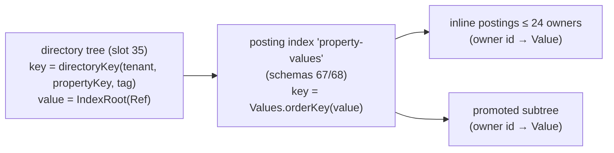

# Data model

This page specifies the logical data model of the database layer (`io.hstore.db`) and how each concept is mapped
onto engine slots. The layering of engine, database and server is summarised in
[architecture overview](../architecture/overview.md). Byte layouts of the underlying trees, pages and generations are covered in
[persistent tree](../storage/persistent-tree.md), [topology](../storage/topology.md) and
[catalog and generations](../storage/catalog-and-generations.md); the query language is specified in [HQL](hql.md).

## Atoms

Every addressable object is an **atom** with a 64-bit id allocated by the engine
(`TransactionManager.allocateAtom`). An atom is either a node or a hyperedge; its catalog entry is an
`AtomRecord` stored in engine slot `CATALOG` (slot id 1):

```java
// engine/src/main/java/io/hstore/engine/catalog/AtomRecord.java
record NodeRecord(int type, String canonicalKey, long dataRef, long embeddingRef, int flags, int tenant, int isolation)
record EdgeRecord(int type, EdgeKind kind, Ref members, Ref order, long version, long dataRef, int tenant, int isolation)
```

| Field | Meaning |
|---|---|
| `type` | id of the `TypeDef` in the schema slot `TYPES` |
| `canonicalKey` | optional, at most `NodeRecord.MAX_KEY_LENGTH` = 512 characters; unique per `(tenant, type)` |
| `members` / `order` | roots of the membership tree and (for ordered edges) the order tree, see [topology](../storage/topology.md) |
| `version` | incremented on every `withRoots` (membership change) |
| `embeddingRef` | payload reference of the node's current embedding vector (set by `Writer.embed`) |
| `tenant` | owning tenant; enforced by every `Reader` (see [security](security.md)) |

Ids are dense and monotone but not contiguous per type: evidence records, assertions and signals also draw ids from
the same allocator (`Provenance.record`, `Provenance.assertion`, `Signals.register`) without creating catalog
entries.

The `Atom` record exposed by the API (`database/src/main/java/io/hstore/db/Atom.java`) is
`Atom(long id, TypeDef type, AtomRecord record)` with `isEdge()`, `key()` and `cardinality()`.

### Canonical keys

`INSERT NODE Person 'alice'` / `Writer.node("Person", "alice", …)` stores `"alice"` as the canonical key. Keys are
resolved through the derived engine slot `CANONICAL` (slot id 4), keyed by

```
EngineSlots.canonicalKey(tenant, type, key) = Hashing.of(tenant, type, Hashing.of(key))
```

so the same key may exist once per tenant and type. `Reader.find(type, key)` / `resolve(type, key)` and the HQL
reference form `@Type:'key'` use this index. Edges have no canonical key.

### Type index

Atoms of a type are enumerated through the derived slot `TYPES` (slot id 3), a posting index keyed by

```
EngineSlots.typeKey(tenant, type) = (tenant << 32) | (type & 0xFFFF_FFFF)
```

`Reader.atomsOfType(typeId)` and `countOfType(typeId)` read this index, which is why `TypeScan` is the cheapest
full-type access path in the [planner](planner.md).

## Types

```java
// database/src/main/java/io/hstore/db/schema/TypeDef.java
record TypeDef(int id, String name, AtomKind kind, List<PropertyDef> properties, List<String> roles,
               List<JsonIndex> jsonIndexes, int version)
record PropertyDef(String name, TypeTag type, boolean indexed, boolean required)
record JsonIndex(String path, TypeTag type)
```

`AtomKind` (`database/src/main/java/io/hstore/db/schema/AtomKind.java`):

| Kind | Engine `EdgeKind` | Semantics |
|---|---|---|
| `NODE` | none | a vertex; may carry a canonical key, properties, a document and an embedding |
| `SET_EDGE` | `SET` | unordered hyperedge; each member appears at most once |
| `ORDERED_EDGE` | `ORDERED` | sequence hyperedge; members have positions `0..n-1`, each member appears at most once |

Hyperedges are atoms, so a hyperedge may contain other hyperedges (higher-order relations). Roles are optional:
`TypeDef.allowsRole(role)` accepts any role when the role list is empty, otherwise only declared roles.

### Persistence

Types live in database extension slot `TYPES` (slot id 32, tree schema id 64) keyed by type id; a second slot
`TYPE_NAMES` (slot 33, schema 65) maps `Hashing.of(name.toLowerCase())` to `TypeName(name, id)`
(`schema/SchemaSlots.java`). Type names are therefore case-insensitive for lookup and must match
`[A-Za-z_][A-Za-z0-9_]*` (`Schema.define`).

The row codec (`TypeDef.write`) is:

```
varint id | string name | u8 kind.ordinal | varint version
varint nProps  { string name | u8 TypeTag.ordinal | u8 flags (bit0 indexed, bit1 required) }*
varint nRoles  { string role }*
varint nJson   { string path | u8 TypeTag.ordinal }*
```

The entry fingerprint is `Hashing.of(canonical bytes)` (`TypeDef.hash`), deterministic across JVM runs.

### Versions

`version` starts at 1 (`Schema.define`) and is incremented by `withProperty` and `withJsonIndex`. `Schema.alter`
rejects changes of name or kind. Ids are assigned as `last TYPES key + 1` inside the defining transaction, and both
the `TYPES` and `TYPE_NAMES` writes use `merge(..., Optional::isEmpty, ...)`, so two concurrent definitions of the
same name or id conflict at commit instead of overwriting each other.

The schema is global: all tenants share one type catalog (`Schema` has no tenant dimension), while the atoms of a
type are tenant-scoped.

## Values

`Value` (`database/src/main/java/io/hstore/db/value/Value.java`) is a sealed interface:

| `TypeTag` | Record | HQL literal | Notes |
|---|---|---|---|
| `NULL` | `Null` | `NULL` | never indexed |
| `BOOL` | `Bool(boolean)` | `TRUE`, `FALSE` | |
| `INT` | `Int(long)` | `42`, `-7`, `1_000` | |
| `FLOAT` | `Real(double)` | `0.5`, `1e-3` | numbers with a fraction or exponent |
| `STRING` | `Text(String)` | `'it''s'`, `"x"` | texts longer than 1024 chars are externalised (below) |
| `TIMESTAMP` | `Time(long epochMillis)` | `TIMESTAMP '2026-03-01'` | `Instant.parse`, date-only strings get `T00:00:00Z` |
| `DECIMAL` | `Decimal(BigDecimal)` | `DECIMAL '12.50'` | normalised by `stripTrailingZeros` |
| `PAYLOAD` | `Payload(long ref, long length, String mediaType)` | none | reference into the payload store |

`TypeTag.parse` accepts aliases: `BOOLEAN`, `INTEGER`/`LONG`, `DOUBLE`/`REAL`, `TEXT`, `TIME`, `BLOB`/`JSON`.

**Ordering** (`Value.compareTo`): all numeric tags (`INT`, `FLOAT`, `DECIMAL`, `TIMESTAMP`) compare by numeric
value (via `BigDecimal`; infinities map to ±1e400); otherwise values of different tags order by tag ordinal.

**Coercion** on write: `Writer.set` coerces to the declared property type with `Values.coerce`
(`INT`←integral `FLOAT`/`DECIMAL`/numeric text/`TIMESTAMP`; `FLOAT`←any number; `DECIMAL`←`INT`/`FLOAT`/text;
`TIMESTAMP`←`INT`/ISO text; `STRING`←anything; `BOOL`←`'true'/'false'`/`INT`). Undeclared properties are
stored as given. A failed coercion raises `INVALID_SCHEMA` `cannot use … as …`.

**Binary codec** (`Values.write`): `u8 tag | body`, where the body is empty (`NULL`), `u8` (`BOOL`),
signed varlong (`INT`, `TIMESTAMP`), 8-byte double (`FLOAT`), length-prefixed UTF-8 (`STRING`),
`signed varlong scale | blob unscaledValue` (`DECIMAL`), `varlong ref | varlong length | string mediaType`
(`PAYLOAD`).

**Hash** (`Values.hash`) mixes the tag ordinal for numeric types, so `Int(1)` and `Real(1.0)` hash differently even
though they compare equal; this matters only for posting fingerprints, never for comparisons.

## Properties

Properties are stored per atom as one `PropertyBag` in extension slot `PROPERTIES` (slot 34, schema 66):

```java
// database/src/main/java/io/hstore/db/property/PropertyBag.java
record PropertyBag(SortedMap<Integer, Property> entries)
record Property(Value value, long validFrom, long validTo)   // validAt(t) = validFrom <= t < validTo
```

The map key is the **property key**, an interned dictionary symbol in namespace `Schema.PROPERTY_KEY` = 10
(`Schema.propertyKey`). The reserved name `$document` (`Schema.DOCUMENT`) holds the atom's JSON document.

Codec:

```
varint n { varint key | Value | signed varlong validFrom | signed varlong validTo }*
```

### Write path and conflict granularity

`Writer.set(atom, name, value, validity)`:

1. checks the WRITER role and that the atom is visible to the principal's tenant;
2. coerces against the declared type;
3. externalises `Text` longer than `INLINE_TEXT_LIMIT` = 1024 characters into the payload store as
   `Payload(ref, bytes, "text/plain")` (charged to the tenant's `payload_bytes`);
4. calls `txn.merge(PROPERTIES, atom, precondition, change)` where the precondition is
   *"the bag still holds exactly the value of this key that this transaction read"*.

Because the precondition is per key, two transactions that change different properties of the same atom commit
without conflict (the change function is replayed onto the newer bag during rebase), while two transactions that
change the same key conflict with `RETRYABLE_CONFLICT`. See [transactions](../transactions/transactions.md).

### Validity intervals

A property holds a single value plus a validity interval. `SET … VALID [from, to)` replaces the previous value of
the key; it does not append a version. `Reader.property(atom, name, validAt)` returns the value only when the
stored interval contains `validAt`:

```java
writer.set(bo, "age", new Value.Int(30), new Validity(500, Long.MAX_VALUE));
reader.property(bo, "age", 100);   // Optional.empty: the earlier value was replaced, 100 is outside [500, +inf)
```

Historical values are recovered by generation, not by validity: `AT GENERATION g` / `Database.readAt` reads the
bag as it was committed at `g` (see [evidence and temporal](evidence-and-temporal.md)).

## Property indexes

A property declared `INDEXED` (or indexed later with `CREATE INDEX ON T (p)`) is maintained by the derivation
`PropertyIndexing` (`property/PropertyIndexing.java`), which runs inside every transaction for every change of
the `PROPERTIES` slot and diffs the before/after bags key by key.

### Directory layout

The index is a two-level structure in the derived slot `PROPERTY_INDEX` (slot 35, schema 69):



```
directoryKey(tenant, propertyKey, tag) = (tenant << 40) | (propertyKey << 8) | tag.ordinal
```

| Bits | Field |
|---|---|
| 63..40 | tenant id (24 bits) |
| 39..8 | property key (32 bits; dictionary ids) |
| 7..0 | `TypeTag.ordinal` |

Every `(tenant, property, tag)` combination has its own value tree, so an index on `age` never mixes `INT` and
`FLOAT` values and tenants never see each other's postings. The value tree (`PostingIndex.of(67, 68,
"property-values", VALUE_CODEC, Values::hash, 24)`) maps an **order key** to the set of owners; up to 24 owners are
stored inline in the leaf entry, larger sets are promoted to their own subtree and demoted again when they shrink to
12 (`PostingIndex.remove`).

### Order keys

`Values.orderKey` maps a value to a signed 64-bit key whose order matches value order:

| Tag | Order key |
|---|---|
| `INT`, `TIMESTAMP` | the long value |
| `FLOAT`, `DECIMAL` | IEEE-754 bits with the sign trick `bits ^ ((bits >> 63) & Long.MAX_VALUE)`; `-0.0` folded to `0.0` |
| `STRING` | the first 8 UTF-8 bytes, big-endian, xor `Long.MIN_VALUE` |
| `BOOL` | 0 / 1 |
| `PAYLOAD` | the payload reference |

String keys are a prefix: values sharing their first 8 bytes collide on the same order key, which is why
`Reader.range` re-checks every candidate with the exact `Value.compareTo` predicate after the index scan.

Range bounds are translated by `PropertyIndex.lowerKey/upperKey`: a bound of a different numeric tag is rounded
outward (`floor` for lower, `ceil` for upper on `INT`/`TIMESTAMP` trees), so `age > 29.5` scans from 29 and the
residual predicate removes 29. Range estimates come from `PostingIndex.countRange(index, low, high) = index.summarize(low, high).weightSum()`:
every directory entry carries `weight = postings.size()` in its summary, so the count is assembled from subtree
summaries without enumerating owners.

### Backfill

`CREATE INDEX` alters the type (`version + 1`) and then, in the same transaction, scans the `TYPES` posting list of
every tenant and adds each existing value (`Writer.createIndex`). `CREATE JSON INDEX` parses the stored document of
every atom of the type, extracts the path and adds the coerced values. Both run as ordinary write transactions, so
they are atomic with the schema change.

## Payloads

Large values live outside the trees in an append-only payload store (`payload/PayloadStore.java`) under
`<data>/payload/`:

- segment files `%06x.pay`, rolled at `SEGMENT_LIMIT` = 1 GiB;
- record layout `int32 length | int32 crc32c(bytes) | bytes`;
- reference `ref = (segment << 40) | offset` (40-bit offset);
- every read verifies the CRC32C and fails with `INVALID_SCHEMA "payload … failed its checksum"`.

`HypergraphDatabase.commit` calls `payloads.sync()` (an `fsync` of the active segment if anything was appended)
before `txn.commit()`, so a committed reference never points at unsynced bytes. Payload bytes written by a
transaction that later aborts are not reclaimed (append-only).

Payloads are used for externalised long texts, JSON documents and embedding vectors.

## JSON documents and JSON indexes

`DOCUMENT @x '{…}'` / `Writer.document(atom, json)` serialises the `Json` value (`value/Json.java`), appends it to
the payload store and stores `Payload(ref, length, "application/json")` under the reserved `$document` property.
`Reader.document(atom)` parses it back.

`CREATE JSON INDEX ON T ('$.a.b') AS STRING` adds `JsonIndex(path, tag)` to the type and interns the path as a
property key. On every document change `PropertyIndexing.reindexDocument` evaluates `json.select(path)` on the old
and new document, coerces each selected scalar to the index tag (values that do not coerce are skipped) and applies
the difference to the same property-index structure, keyed by the path's property key.

JSON indexes are consulted by the Java API and by HQL: `Reader.range/lookup` treat a property name that matches a
JSON index path as indexed (`Reader.indexedTag`) and otherwise evaluate `$`-prefixed names by parsing every
document of the type; in HQL the function `json(x, '$.path')` reads a path, and the planner turns comparisons of
it with literals into index ranges when a JSON index on that exact path exists ([planner](planner.md#access-paths)).

```java
reader.lookup("Person", "$.address.city", new Value.Text("Oslo"));   // uses the JSON index
```

## Membership

A hyperedge's members are `Incidence` records (`engine/.../topology/Incidence.java`):

```java
record Incidence(long member, int roleSet, long weight, long validFrom, long validTo, long dataRef, long qualifier)
```

| Field | Encoding |
|---|---|
| `roleSet` | interned dictionary group (namespace `ROLE_SET` = 2) of role names (namespace `ROLE` = 1); 0 = no roles |
| `weight` | fixed point, `Weight.SCALE` = 10⁹, default `Weight.ONE` |
| `validFrom/validTo` | half-open validity interval of the membership |
| `dataRef` | optional per-incidence payload reference |
| `qualifier` | id of an assertion record (see [evidence](evidence-and-temporal.md)), 0 = unqualified |

The database API converts incidences to `Member(atom, roles, weight, validity, position, dataRef, qualifier)`;
`position` is `0..n-1` for ordered edges and `-1` for set edges. The reverse direction (`Reader.incident(atom)`)
yields `Incident(edge, roles, locator)`; `Reader.position(incident)` converts the locator of an ordered edge into a
position. Membership trees, their summaries (role bitmaps, weight min/max/sum, validity bounds) and the reverse
index are described in [topology](../storage/topology.md).

`MemberSpec` (`MemberSpec.java`) carries the per-member options on writes:
`MemberSpec.roles("host").withWeight(0.75).withValidity(new Validity(0, 1_000))`.

## Dictionary namespaces

Names are interned to dense integers by the engine `Dictionary`. Interning a new symbol runs a separate system
transaction on `main` (`Dictionary.intern` → `TransactionManager.system`), independent of the caller's
transaction, so symbols survive the caller's rollback; this is harmless because symbols are immutable.

| Namespace | Constant | Used for |
|---|---|---|
| 1 | `Dictionary.ROLE` | role names |
| 2 | `Dictionary.ROLE_SET` | sorted groups of role ids |
| 10 | `Schema.PROPERTY_KEY` | property names and JSON index paths |
| 11 | `SemanticPlane.MODEL_NAMESPACE` | embedding model names |
| 12 | `StateBindings.STATE_SCHEMA_NAMESPACE` | state schema names |

## Extension slot map

`HypergraphDatabase.extensionSlots()` registers the database slots with the engine (ids ≥ 32,
`EngineSlots.FIRST_EXTENSION_SLOT`):

| Slot | Name | Kind | Schema id | Defined in |
|---|---|---|---|---|
| 32 | `types` | primary | 64 | `schema/SchemaSlots.java` |
| 33 | `type-names` | primary | 65 | `schema/SchemaSlots.java` |
| 34 | `properties` | primary | 66 | `property/PropertySlots.java` |
| 35 | `property-index` | derived | 69 (postings 67/68) | `property/PropertySlots.java` |
| 36 | `embeddings` | primary | 72 | `semantic/Embedding.java` |
| 37 | `qualifiers` | primary | 73 | `evidence/Provenance.java` |
| 38 | `evidence` | primary | 74 | `evidence/Provenance.java` |
| 39 | `state` | primary | 75 | `temporal/StateBindings.java` |
| 40 | `signals` | primary | 76 | `signal/Signals.java` |
| 41 | `signals-by-atom` | derived | 77/78 | `signal/Signals.java` |
| 42 | `views` | primary | 79 | `view/MaterializedViews.java` |
| 43 | `view-data` | primary | 80 | `view/MaterializedViews.java` |
| 44 | `tenants` | primary | 81 | `security/Security.java` |
| 45 | `users` | primary | 82 | `security/Security.java` |
| 46 | `tenant-usage` | primary | 83 | `security/Security.java` |

Derived slots are rebuilt by derivations (`PropertyIndexing`, `Signals.INDEXING`) inside the writing
transaction; they are never written directly by API calls.

## Java API

`HypergraphDatabase` (`HypergraphDatabase.java`) opens the payload store, the engine (with the extension slots
and derivations above), the semantic plane, statistics and views:

| Method | Semantics |
|---|---|
| `open(Path)` / `open(Path, DatabaseOptions)` | opens or creates a data directory |
| `read(work)` / `read(branch, principal, work)` | runs `work` on a `Reader` over a snapshot of the branch head |
| `readAt(generation, branch, principal, work)` | same, over a retained historical generation |
| `write(work)` / `write(txnOptions, principal, work)` | runs `work` on a `Writer` and commits; on `RETRYABLE_CONFLICT` re-runs the whole function up to `MAX_ATTEMPTS` = 8 times with randomised backoff of 1..2^min(attempt,6) ms |
| `reader(snapshot, principal)` / `writer(transaction, principal)` | low-level constructors for callers that manage snapshots/transactions themselves |
| `commit(txn)` | `payloads.sync()` then `txn.commit()` |

Because `write` may re-run the function, the function must be free of external side effects.

`DatabaseOptions(engine, encoder, defaultQueryPages, transactionPages)` defaults to engine defaults,
`Encoder.hashing(256)`, a query page budget of 2,000,000 page visits and an unlimited transaction page budget.

### Runnable example

The program below runs against a build of this repository (`./mvnw -q install -DskipTests`), saved as
`Example.java` and launched with
`java -p engine/target/classes:database/target/classes --add-modules io.hstore.db Example.java`:

```java
import io.hstore.db.HypergraphDatabase;
import io.hstore.db.MemberSpec;
import io.hstore.db.schema.AtomKind;
import io.hstore.db.schema.TypeDef.PropertyDef;
import io.hstore.db.value.Json;
import io.hstore.db.value.TypeTag;
import io.hstore.db.value.Value;
import io.hstore.engine.topology.Validity;

import java.nio.file.Files;
import java.nio.file.Path;
import java.util.List;
import java.util.Map;
import java.util.Optional;

void main() throws Exception {
    Path directory = Files.createTempDirectory("hstore-example");
    try (HypergraphDatabase database = HypergraphDatabase.open(directory)) {
        database.write(writer -> {
            writer.defineNode("Person", List.of(new PropertyDef("name", TypeTag.STRING, true, true),
                    new PropertyDef("age", TypeTag.INT, true, false)));
            writer.defineEdge("Meeting", AtomKind.SET_EDGE, List.of(new PropertyDef("room", TypeTag.STRING, false, false)),
                    List.of("host", "guest"));
            writer.createJsonIndex("Person", "$.address.city", TypeTag.STRING);
            return null;
        });
        long meeting = database.write(writer -> {
            long ann = writer.node("Person", "ann", Map.of("name", "Ann", "age", 41));
            long bo = writer.node("Person", "bo", Map.of("name", "Bo", "age", 29));
            writer.document(ann, Json.parse("{\"address\": {\"city\": \"Oslo\"}}"));
            long edge = writer.edge("Meeting", Map.of("room", "4.12"));
            writer.add(edge, ann, MemberSpec.roles("host").withWeight(0.75));
            writer.add(edge, bo, MemberSpec.roles("guest").withValidity(new Validity(0, 1_000)));
            writer.set(bo, "age", new Value.Int(30), new Validity(500, Long.MAX_VALUE));
            return edge;
        });
        database.read(reader -> {
            IO.println(reader.members(meeting).toList());
            IO.println(reader.range("Person", "age", Optional.of(new Value.Int(30)), Optional.empty(), true, true).boxed().toList());
            IO.println(reader.lookup("Person", "$.address.city", new Value.Text("Oslo")).boxed().toList());
            IO.println(reader.property(reader.resolve("Person", "bo"), "age", 100));
            IO.println(reader.incident(reader.resolve("Person", "ann")).toList());
            return null;
        });
    }
}
```

Output (atom ids are allocation-order dependent):

```
[Member[atom=1, roles=[host], weight=0.75, validity=Validity[from=-9223372036854775808, to=9223372036854775807], position=-1, dataRef=0, qualifier=0], Member[atom=2, roles=[guest], weight=1.0, validity=Validity[from=0, to=1000], position=-1, dataRef=0, qualifier=0]]
[1, 2]
[1]
Optional.empty
[Incident[edge=3, roles=[host], locator=1]]
```

### Writer reference

| Method | Required role | Effect |
|---|---|---|
| `defineNode(name, props)` / `defineEdge(name, kind, props, roles)` | ADMIN | new type, version 1 |
| `createIndex(type, prop)` / `createJsonIndex(type, path, tag)` | ADMIN | mark indexed and backfill |
| `node(type, key, props)` | WRITER | new node; charges `Usage(1, 0, 0)`; checks `REQUIRED` properties |
| `edge(type, props)` | WRITER | new empty hyperedge; charges `Usage(1, 1, 0)` |
| `add(edge, member, spec)` | WRITER | upsert an incidence (roles validated against the type) |
| `insertAt(edge, index, member, spec)` / `append(...)` | WRITER | ordered edges |
| `remove(edge, member)` / `removeAt(edge, index)` | WRITER | membership removal |
| `load(edge, members, spec)` | WRITER | replaces the whole membership with a tree built bottom-up from `members` (`Hyperedge.build`) |
| `qualify(edge, member, qualifier)` | WRITER | attach an assertion id to an incidence |
| `set(atom, name, value[, validity])` / `unset(atom, name)` | WRITER | per-key OCC on the property bag |
| `document(atom, json)` | WRITER | stores `$document` |
| `embed(atom, text)` / `embed(atom, model, version, vector)` | WRITER | see [semantic](semantic.md) |
| `delete(atom)` | WRITER | deletes catalog entry, properties and embedding; charges negative usage |

### Reader reference

| Method | Notes |
|---|---|
| `atom`, `require`, `visible` | tenant-filtered catalog lookups |
| `find`, `resolve` | canonical key lookup |
| `atoms(type)`, `atomsOfType`, `count`, `countOfType`, `allAtoms(edges)` | type index / catalog scans |
| `property(atom, name[, validAt])`, `properties`, `text(value)`, `document` | property access; `text` dereferences payloads |
| `edge`, `members`, `members(edge, validAt)`, `membersWithRole`, `membersWeighted` | membership access with summary pruning |
| `memberIds(edge)` | member ids only, as a `LongStream` in membership order, without building `Member` records |
| `cardinality`, `degree`, `incident`, `position` | topology statistics and reverse lookup |
| `lookup`, `range` | property and JSON index access with exact re-check |
| `similar(text, k, consistency)`, `similar(model, vector, k, consistency)`, `embedding` | [semantic](semantic.md) |
