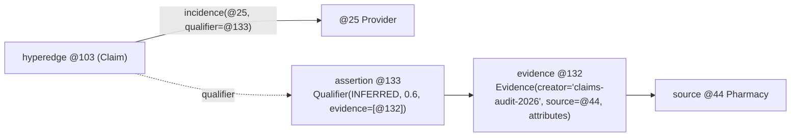
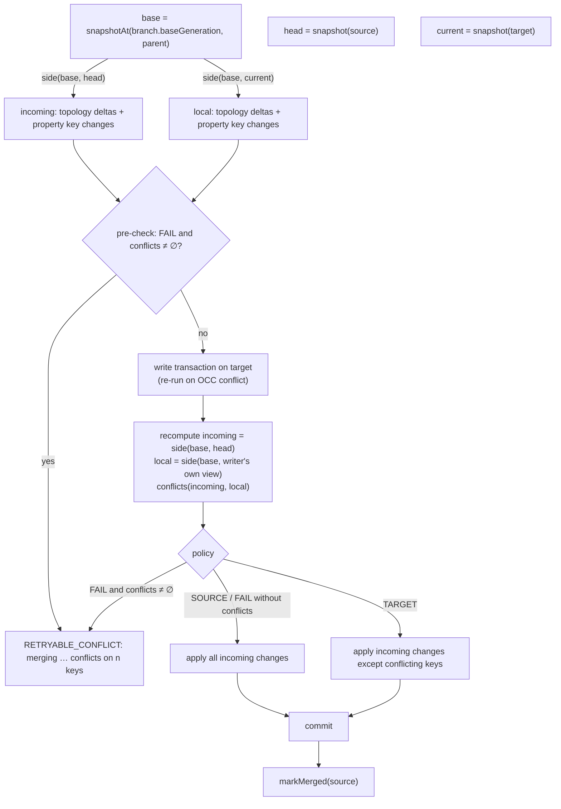

# Evidence, provenance and time

This page covers the epistemic layer (assertions about memberships and the evidence behind them) and the two time
dimensions of the database. Sources: `database/src/main/java/io/hstore/db/evidence/`,
`database/src/main/java/io/hstore/db/temporal/`.

## Assertions and evidence

A membership `v ∈ M(e)` can be **qualified**: the incidence's `qualifier` field holds the id of an assertion record
that states what kind of claim the membership is and how confident it is. Assertions cite evidence records, which
cite sources (atoms), forming a provenance graph.



### Records

```java
// evidence/Qualifier.java
record Qualifier(long source, AssertionType type, double confidence, long method, long observedAt,
                 List<Long> evidence, int tenant)
// evidence/Evidence.java
record Evidence(long source, long method, long observedAt, String creator, long inputHash,
                Map<String, String> attributes, int tenant)
enum AssertionType { OBSERVED, INFERRED, HYPOTHESIZED, PROJECTED, SIMULATED, REJECTED }
```

| Slot | Name | Schema | Key | Codec |
|---|---|---|---|---|
| 37 | `qualifiers` | 73 | assertion id | `varlong source, u8 type, f64 confidence, varlong method, svarlong observedAt, varint n, n × varlong evidence, varint tenant` |
| 38 | `evidence` | 74 | evidence id | `varlong source, varlong method, svarlong observedAt, string creator, i64 inputHash, varint n, n × (string key, string value) sorted by key, varint tenant` |

`confidence` must lie in `[0, 1]` (`Qualifier` constructor). Ids come from the atom allocator
(`TransactionManager.allocateAtom`) so they never collide with atoms, but they are not catalog entries.
Fingerprints (`Qualifier.hash`, `Evidence.hash`) are computed from explicit field hashes with sorted attributes, so
they are deterministic across JVM runs.

### Operations

| API | HQL | Effect |
|---|---|---|
| `Provenance.record(writer, evidence)` | `EVIDENCE 'creator' [SOURCE ref] [ATTRIBUTES {…}] [AS $v]` | stores an evidence record stamped with the writer's tenant |
| `Provenance.assertion(writer, qualifier)` | — | stores an assertion stamped with the writer's tenant |
| `Provenance.qualify(writer, edge, member, qualifier)` | `QUALIFY ref IN ref AS type [CONFIDENCE c] [EVIDENCE (…)] [AS $v]` | stores the assertion and sets the incidence's `qualifier` (`Writer.qualify` → `txn.upsert(edge, member, i -> i.withQualifier(id))`) |
| `Provenance.qualifier(reader, id)` / `evidence(reader, id)` | — | lookups filtered to the reader's tenant |
| `Provenance.trace(reader, id, depth)` | `TRACE ref [DEPTH n]` | provenance walk |
| `Provenance.effective(reader, edge, policy)` | `MEMBERS OF e POLICY …` | members admitted by a policy |

HQL `QUALIFY` stamps `observedAt` with the current wall time; `EVIDENCE` stores the attributes as strings.

### Evidence policies

`EvidencePolicy(accepted types, minimumConfidence)` (`evidence/EvidencePolicy.java`). An unqualified incidence is
treated as `Qualifier.OBSERVED` (type `OBSERVED`, confidence 1.0), and so is an incidence whose qualifier is not
visible to the reader's tenant.

| HQL | Accepted types | Minimum confidence |
|---|---|---|
| `POLICY ANY` (default) | all | 0 |
| `POLICY OBSERVED` | `OBSERVED` | 0 |
| `POLICY SUPPORTED [c]` | all except `REJECTED` | `c` (default 0.5) |

```sql
QUALIFY @Provider:'dr-ada-park' IN @103 AS INFERRED CONFIDENCE 0.6 EVIDENCE ($e) AS $q;
MEMBERS OF @103 POLICY OBSERVED;        -- 3 members: the INFERRED one is excluded
MEMBERS OF @103 POLICY SUPPORTED 0.5;   -- 4 members
MEMBERS OF @103 POLICY SUPPORTED 0.7;   -- 3 members
```

### Trace

`Provenance.trace` is an iterative depth-first walk with an explicit stack and a visited set:

1. Pop `(id, depth)`. If `id` was visited, emit `Cycle(depth, id)`.
2. If `id` is an assertion visible to the tenant, emit `Assertion` and, below the depth limit, push its evidence ids
   in order.
3. Else if it is an evidence record, emit `Support` and push its `source` if non-zero.
4. Else if it is a visible atom, emit `Source`.

```
| 0 | assertion | @133                     | INFERRED confidence 0.6                              |
| 1 | evidence  | @132                     | by claims-audit-2026 {method=manual review, batch=7} |
| 2 | source    | @44 Pharmacy:'harbor-rx' |                                                      |
```

## Two time dimensions

| Dimension | Meaning | Where it lives | How it is queried |
|---|---|---|---|
| **Generation (transaction) time** | when a fact was committed | the generation chain of the catalog ([catalog and generations](../storage/catalog-and-generations.md)) | `AT GENERATION g`, `AS OF t`, `DIFF GENERATION a AND b`, `HISTORY`, `Database.readAt` |
| **Validity (application) time** | when a fact holds in the modelled world | `validFrom/validTo` on incidences, properties and state bindings | `VALID AT t`, `MEMBERS … VALID AT`, `INCIDENT … VALID AT`, `state(x, t)`, `Reader.property(atom, name, t)` |

All validity intervals are half-open `[from, to)` in epoch milliseconds (`Validity.contains`); `*` in HQL maps to
`Long.MIN_VALUE`/`Long.MAX_VALUE`. Empty intervals are rejected.

### Generation time

Every commit produces a generation with a wall-clock timestamp. `AT GENERATION g` opens a snapshot of `g` on the
session's branch; `AS OF t` resolves `TransactionManager.generationAsOf(t)` — the newest retained generation with
`wallTime ≤ t` — and fails with `no retained generation precedes …` when `t` predates the retained window. The window
holds the last `history_limit` generations (engine option, default 64). Historical snapshots are read-only.

### Validity time

Membership validity is indexed: every membership-tree summary carries the minimum `validFrom` and maximum
`validTo` of its subtree, so `Hyperedge.validAt(t)` and `overlapping(from, to)` prune whole subtrees
(`Summary.mayBeValidAt`, `mayOverlapInterval`). `Temporal.activeEdges(reader, atom, t)` returns the hyperedges
whose incidence for `atom` is valid at `t`.

Property validity is a filter on a single stored value: a property bag holds one value per key, and `SET … VALID`
replaces it ([data model](data-model.md#validity-intervals)). To keep the history of a value in validity time,
model it as members of an edge with validity intervals or as successive generations.

### State bindings

A **state binding** is a typed, versioned, validity-scoped value attached to an atom, separate from properties
(`temporal/StateBindings.java`):

```java
record Binding(int schema, Value value, long validFrom, long validTo, long version)
```

- Slot `STATE` = 39 (schema 75), keyed by atom id; codec `varint schema, Value, svarlong validFrom, svarlong
  validTo, varlong version`.
- `schema` is a name interned in dictionary namespace 12 (`STATE ref = v SCHEMA 'name'`, default `default`).
- `bind` replaces the binding and increments `version` (read-modify-write through `txn.update`, so concurrent binds
  of the same atom conflict).
- `state(x)` returns the current binding's value regardless of validity; `state(x, t)` returns it only if
  `validFrom ≤ t < validTo`.
- `StateBindings.transition(writer, topology, states, schema, validity)` applies a topology change and a set of
  state updates in the same transaction, so a state machine step is atomic with the structural change that causes it.
- HORA reads the binding with `Field.State` (`GATHER state FROM e`, `REDUCE …(state)`).

```sql
STATE @Patient:'asha-rao' = 'admitted' SCHEMA 'care' VALID ['2026-03-01', '2026-03-09');
MATCH NODE p:Patient WHERE p.name = 'Asha Rao'
  RETURN state(p), state(p, TIMESTAMP '2026-03-05'), state(p, TIMESTAMP '2026-04-01');
-- | admitted | admitted | null |
```

### Diffs

`Temporal.diff(before, after)` compares two readers (two generations or two branches):

1. `TreeDiff.diff` over the two catalog trees yields added, removed and changed atom records; structural sharing
   between copy-on-write trees lets the diff skip shared subtrees in `O(1)` (`Ref.same`: same stored page id or
   same in-memory node), and subtrees with disjoint key ranges are expanded on one side only
   ([persistent tree](../storage/persistent-tree.md)).
2. Added atoms become `AtomCreated` plus, for edges, a `MembersChanged` delta against an empty edge.
3. Removed atoms become `AtomDeleted`.
4. Changed edge records become `MembersChanged` with the member-level changes from `Hyperedge.diff`
   (`MemberChange.Added/Removed/Updated`).

Property changes are not part of `Temporal.diff`; `BranchMerge` computes them separately. `Temporal.events(commit)`
groups the member changes of one change-feed event into per-edge `TopologyEvent`s.

## Branch merge

Branches are copy-on-write forks of a parent branch at a base generation ([catalog and
generations](../storage/catalog-and-generations.md)). `MERGE BRANCH s [INTO t] [ON CONFLICT FAIL|SOURCE|TARGET]`
(`temporal/BranchMerge.merge`) performs a three-way merge of `s` into `t`.

Requirements:

- `t` must be the branch's parent (`branch.parent() == target`), otherwise `INVALID_SCHEMA`; without `INTO` the
  parent is used.
- The base generation must still be retained (`snapshotAt(base, parent)`); otherwise the merge fails with
  `cannot merge branch … its fork generation … is no longer retained`.
- Merging a branch into itself is rejected.



### Sides

`side(before, after)` returns:

- `topology`: `Temporal.diff` between the two readers;
- `properties`: for every atom whose property bag differs (`TreeDiff` over the `PROPERTIES` trees), the map
  `propertyKey → new value or empty (removed)` of keys whose `Property` (value and validity) changed.

### Conflict kinds

`Conflict(kind, atom, detail)`; rendered as `kind @atom[/detail]`.

| Kind | Detected when | `detail` |
|---|---|---|
| `deleted-while-modified` | the source deleted an atom whose members or properties the target changed | 0 |
| `modified-while-deleted` | the source changed members or properties of an atom the target deleted | 0 |
| `membership` | both sides changed the membership of the same `(edge, member)` | member id |
| `property` | both sides changed the same `(atom, property key)` to different values | property key id |

Changes to different members of the same edge, or to different properties of the same atom, merge without
conflict.

### Policies

| Policy | Behaviour |
|---|---|
| `FAIL` (default) | any conflict aborts the merge; the error lists up to 20 conflicts |
| `SOURCE` | apply every incoming change; source wins on conflicts |
| `TARGET` | skip the incoming change for every conflicting key; target wins |

### Applying

In one transaction on the target (`BranchMerge.apply`):

| Incoming delta | Action |
|---|---|
| `AtomCreated` | `txn.adopt(atom, record)` if the id does not exist on the target (the record is copied with empty membership; its members arrive with the accompanying `MembersChanged`) |
| `AtomDeleted` | delete the atom and its properties unless skipped |
| `MembersChanged` on a set edge | replay each `Added`/`Updated` as `upsert`, each `Removed` as `remove`, skipping conflicting members |
| `MembersChanged` on an ordered edge | if no change is contested, replace the target's membership with the source's full sequence (`txn.load`); positions are not merged element-wise |
| property changes | `txn.update` of the bag with the accepted keys (set or remove) |

The outcome reports `atomsCreated, atomsDeleted, memberChanges, propertyChanges` and the conflict list; the message
adds `n conflicts resolved for <POLICY>` when conflicts were resolved. After a successful merge the source branch is
marked merged and no longer appears in `SHOW BRANCHES`.

Conflicts are computed twice. A pre-check from fresh snapshots of base, source and target fails fast under `FAIL`
without opening a write transaction. Inside the write transaction the incoming side is recomputed from the source
head and the local side from the writer's own view of the target (`side(base, writer)`), conflicts are recomputed
and the policy is applied to that set. When `HypergraphDatabase.write` re-runs the transaction after an OCC
conflict with a concurrent writer on the target, the recomputation sees the target's current state, so changes
that landed between the pre-check and the commit are classified correctly.

```sql
CREATE BRANCH experiment; USE BRANCH experiment; SET @Lab:'lab-a'.name = 'Lab A (experiment)';
USE MAIN; SET @Lab:'lab-a'.name = 'Lab A (main)';
MERGE BRANCH experiment;
-- error [RETRYABLE_CONFLICT, retryable]: merging experiment conflicts on 1 keys: property @123/1
MERGE BRANCH experiment INTO main ON CONFLICT target;
-- merged experiment: 0 atoms created, 0 deleted, 0 membership and 0 property changes, 1 conflicts resolved for TARGET
```
