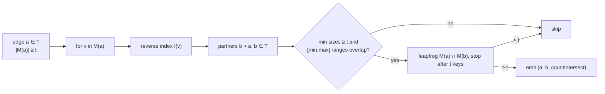

# HORA: higher-order relational algebra

HORA is the set of operators that treat a hyperedge as a first-class group of members rather than as a pair of
endpoints. They are implemented in `database/src/main/java/io/hstore/db/hora/` (`Hora`, `PatternMatcher`,
`SwapSampler`, `Budget`, `Field`, `Reducer`, `GroupKernel`) on top of the membership and reverse-index trees
described in [topology](../storage/topology.md), and exposed through HQL statements
([grammar](hql.md#hora-operators)) and the Java API (`Hora.on(reader)`).

Notation: for a hyperedge `e`, `M(e)` is its member set with weights `w(e, v)`; for an atom `v`, `I(v)` is the set
of hyperedges containing `v` (the reverse index). `|M(e)|` is the cardinality, `|I(v)|` the degree. Both sets are
stored as counted B+-trees keyed by atom id, so `|M(e)|` and `|I(v)|` are `O(1)` (root counts) and sorted iteration
and `seek` are `O(log n)` per step.

All operators run on a single snapshot (`Reader`), respect tenant visibility (`Reader.require`, `Reader.edge`) and
are bounded by a [budget](#budgets).

## Fields

A `Field` names the per-member value an operator reads (`hora/Field.java`):

| Field | Value for member `v` of `e` |
|---|---|
| `weight` | `w(e, v)` as a double |
| `degree` | `|I(v)|` |
| `state` | `v`'s current state binding ([temporal](evidence-and-temporal.md#state-bindings)) |
| any other name | property `name` of `v`, `NULL` if absent |

## Gather and reduce

**GATHER** `field FROM e` (`Hora.gather`) streams one `Gathered(edge, member, value, weight, roles)` per incidence
in membership-tree order. Cost `O(|M(e)|)` plus one property lookup per member.

**REDUCE** `r(field) OVER e [WEIGHTED]` (`Hora.reduce`) folds the gathered values with `Reducer`
`SUM | MIN | MAX | MEAN (AVG) | COUNT`. `NULL` values are dropped before reduction (so `count(age)` counts members
that have an `age`); `WEIGHTED` multiplies each value by its member weight.

`REDUCE … (weight) OVER e` without `WEIGHTED` is answered from the membership tree's root **summary** in `O(1)`,
without visiting members: the summary monoid maintains `count`, `weightSum`, `weightMin` and `weightMax`
(fixed-point, divided by `Weight.SCALE` = 10⁹), see [persistent tree](../storage/persistent-tree.md). For an
empty edge `SUM` and `COUNT` return 0 and the others no value.

```sql
GATHER age FROM @103;
REDUCE sum(weight) OVER @103;          -- 3.88, O(1) from the summary
REDUCE avg(age) OVER @103;             -- column "mean"
REDUCE max(degree) OVER @103 WEIGHTED;
```

### Group kernels (Java API)

`Hora.apply(edges, field, kernel, budget)` evaluates a user function per hyperedge with an explicit memory
contract (`GroupKernel`):

| Kernel | Contract | Memory |
|---|---|---|
| `Streaming(f)` | `f` consumes the member stream once | `O(1)` beyond `f` |
| `TwoPass(summarize, finish)` | two streaming passes; the summary of pass 1 is passed to pass 2 | `O(|summary|)` |
| `Materialize(f)` | `f` receives a `List<Gathered>` | `O(|M(e)|)`; rejected with `ABORTED_RESOURCE_LIMIT` if `|M(e)| > budget.maxRows` |

Every consumed member is charged to the budget meter.

## Scatter and propagate

Two linear operators between node values and edge values:

```
edgeValues(E, x)(e) = Σ_{v ∈ M(e)} x(v) · (weighted ? w(e, v) : 1)          (Hora.edgeValues, "gather to edges")
nodeValues(E, y)(v) = Σ_{e ∈ E, v ∈ M(e)} y(e) · (weighted ? w(e, v) : 1)   (Hora.nodeValues, "scatter to nodes")
```

With the incidence matrix `B` (`B[v, e] = w(e, v)` or 1), these are `Bᵀx` and `By`.

**SCATTER** `field FROM EDGES T [WEIGHTED]` computes `nodeValues` over all hyperedges of type `T`, with
`y(e)` = the numeric value of `field` read **on the edge** (a property of the edge, its `state`, its `degree`, or
its weight sum for `weight`); non-numeric or missing values count as 0. Output: one row per member atom.

**PROPAGATE** `field OVER EDGES T` computes `nodeValues(E, edgeValues(E, x))` with `x(v)` the numeric `field`
of `v` and the inner sum always weighted (`Hora.propagate` with unit edge weights):

```
propagate(x)(v) = Σ_{e ∋ v} w(e, v) · Σ_{u ∈ M(e)} w(e, u) · x(u)        i.e.  B·W·Bᵀ·x
```

This is one step of signal propagation over the clique expansion of the hypergraph, including the self term
(`u = v`); it is not a (normalised) hypergraph Laplacian: no degree normalisation or subtraction is applied.
`Hora.propagate(edges, x, edgeWeight)` accepts an explicit per-edge weight `W`; HQL passes 1. Cost `O(Σ_e |M(e)|)` for each of the two passes.

```sql
SCATTER amount FROM EDGES Claim WEIGHTED;   -- total weighted claim amount per member
PROPAGATE age OVER EDGES CarePathway;
```

## Neighbourhoods

**NEIGHBORS OF v THRESHOLD t** for a node (`Hora.neighbors`): for every `e ∈ I(v)` and every `u ∈ M(e)`, `u ≠ v`,
count co-memberships; return atoms with count `≥ t`, sorted. Cost `O(Σ_{e ∈ I(v)} |M(e)|)`, memory
`O(distinct neighbours)`.

**NEIGHBORS OF e THRESHOLD t** for a hyperedge (`Hora.edgeNeighbors`): candidates are all hyperedges sharing at
least one member (`∪_{v ∈ M(e)} I(v)`); a candidate `f` qualifies when `|M(e) ∩ M(f)| ≥ t`, tested with
`TreeAlgebra.intersectKeys(...).limit(t)` — the leapfrog stops after `t` shared members, so the test costs at most
`t` seeks per side rather than a full intersection.

`Hora.adjacent(u, v, t)` (Java) tests whether two atoms co-occur in at least `t` hyperedges by intersecting
`I(u)` and `I(v)` with the same early stop.

```sql
NEIGHBORS OF @Patient:'ines-duarte' THRESHOLD 2;   -- atoms sharing ≥ 2 hyperedges with Ines
NEIGHBORS OF @103 THRESHOLD 2 LIMIT 5;             -- hyperedges sharing ≥ 2 members with @103
```

## Overlap join

**OVERLAP JOIN T THRESHOLD t** (`Hora.overlapJoin`) returns all pairs `(a, b)` of hyperedges of type `T` with
`a < b` and `|M(a) ∩ M(b)| ≥ t`:

1. For each `a` with `|M(a)| ≥ t`, collect partners `b > a` of type `T` from `∪_{v ∈ M(a)} I(v)` (index nested
   loop over the reverse index — no quadratic pair enumeration).
2. Skip pairs with `min(|M(a)|, |M(b)|) < t` or whose summaries prove disjointness
   (`a.summary().disjointFrom(b.summary())`: either side empty, or the member-id ranges `[min, max]` do not
   overlap).
3. Verify with a leapfrog intersection limited to `t` keys, then report the exact overlap with
   `TreeAlgebra.countIntersect`.

Cost `O(Σ_a Σ_{v ∈ M(a)} |I(v)| + Σ_{candidate pairs} t·log n)`. Every candidate pair is charged to the budget.



```sql
OVERLAP JOIN Claim THRESHOLD 3 LIMIT 5;
-- | @101 Claim | @130 Claim | 3 |
```

## Set algebra on hyperedges

`INTERSECT`, `UNION`, `DIFFERENCE`, `SUBSET`, `EQUAL`, `JACCARD`, `CONTAINMENT`, `OVERLAP`
([HQL](hql.md#set-algebra)) operate directly on two membership trees through `TreeAlgebra`. Counting variants
(`countIntersect`, `subset`, `sameKeys`, `jaccard`, `containment`) use the root summaries to short circuit (for
example `sameKeys` first compares sizes, `subset` is `countIntersect(a, b) == |a|`). With `INTO`, `UNION`/`INTERSECT`/`DIFFERENCE` build the
result as a new tree with structural sharing (`TreeAlgebra.union/intersection/difference` with a `WriteScope`) and
load it into a fresh hyperedge.

## Closure

**CLOSURE e DIM d** (`Hora.closure`) enumerates the downward closure of `e` viewed as a simplex: all non-empty
member subsets of size `1 .. d+1`, in increasing size and lexicographic index order, generated lazily by a
combination iterator. The number of rows is `Σ_{k=1}^{d+1} C(|M(e)|, k)`; the operation is rejected up front when
`|M(e)| > budget.maxRows`, and every emitted subset is charged.

```sql
CLOSURE @106 DIM 1;     -- [@9], [@25], [@9, @25]
CLOSURE @103 DIM 2 LIMIT 4;
```

## Expansion of nested hyperedges

**EXPAND e DEPTH d** (`Hora.expand`) unfolds higher-order hyperedges: a depth-first traversal from `e` that
descends into members that are themselves hyperedges and emits leaves.

| Status | Meaning |
|---|---|
| `EMIT` | a non-edge member reached through `path` |
| `CYCLE` | a hyperedge already visited on this traversal (cycles through membership are possible because hyperedges can contain hyperedges) |
| `BUDGET_EXHAUSTED` | depth `0` reached or the row budget denied the next step |

The effective depth is `min(d, budget.maxDepth)` (default 8); `LIMIT` sets the row budget.

```sql
EXPAND @120 DEPTH 2 LIMIT 20;
-- | [@120, @27]      | @27 Provider:'dr-clara-voss' | EMIT |
-- | [@120, @83, @11] | @11 Patient:'kavya-iyer'     | EMIT |
```

## Pattern matching

`PATTERN (vars) WHERE constraints` (`PatternMatcher`) is a conjunctive query over node and edge variables:

| Constraint | Meaning |
|---|---|
| `e CONTAINS v` | `v ∈ M(e)` |
| `e HAS v AS role` | `v ∈ M(e)` with `role` in its role set |
| `CARD(e) op n` | cardinality bounds |
| `SHARED(a, b) op n` | `|M(a) ∩ M(b)|` bounds |
| `a SUBSET b` | `M(a) ⊆ M(b)` |
| `e VALID AT t` | some member of `e` is valid at `t`; also restricts `CONTAINS`/`HAS` checks on `e` to incidences valid at `t` |
| `a != b` | distinct bindings |
| `x = ref` | `x` is bound to a known atom |

### Variable ordering

`PatternMatcher.plan` orders variables greedily: at each step it picks the unbound variable with the smallest
estimate given the variables already bound:

| Situation | Estimate |
|---|---|
| bound by `x = ref` | 1 |
| edge `e` with a bound member via `HAS` / `CONTAINS` | 8 / 16 |
| node `v` with a bound edge via `HAS` / `CONTAINS` | 16 / 32 |
| edge related to a bound edge via `SHARED` / `SUBSET` | 256 |
| otherwise | `countOfType(type)` or unbounded |

### Candidate generation

For each partial binding, `candidates` produces the domain of the next variable:

- **Edge variable**: the leapfrog intersection of `I(v)` over all bound members `v` it must contain; if the variable
  is only related through `SHARED`/`SUBSET` to a bound edge `f`, the candidates are `∪_{u ∈ M(f)} I(u)`; otherwise
  a type scan.
- **Node variable**: the leapfrog intersection of `M(e)` over all bound edges that must contain it; otherwise a type
  scan.
- Candidates are filtered by type, then every constraint whose variables are now all bound is checked
  (`admissible`). Each accepted extension is charged to the budget.

Bindings are extended breadth-first, one variable at a time; the result is the list of complete bindings.

```sql
PATTERN (c: EDGE Claim, p: NODE Patient, d: NODE Provider)
  WHERE c HAS p AS patient AND c HAS d AS provider AND p = @Patient:'ines-duarte' AND d = @Provider:'dr-ada-park'
  LIMIT 10;
-- plan: p (bound), d (bound), c = I(p) ∩ I(d), then role checks
PATTERN (a: EDGE Claim, b: EDGE Prescription) WHERE SHARED(a, b) >= 3 AND CARD(a) >= 3 LIMIT 5;
PATTERN (s: EDGE Claim, i: EDGE Investigation) WHERE i CONTAINS s AND i = @120;   -- higher-order containment
PATTERN (inner: EDGE Claim, outer: EDGE Claim) WHERE inner SUBSET outer AND inner != outer LIMIT 5;
```

A variable whose domain comes from a single incidence or membership tree uses a one-tree leapfrog, which is an
ordered scan of that tree.

## Null models: degree-preserving swaps

**SAMPLE n SWAPS ON T [SEED s] INTO BRANCH b** (`SwapSampler`) creates branch `b` from `main` and, in one
transaction on that branch, performs `n` attempted swaps over the set hyperedges of type `T`:

1. Pick two hyperedges `e, f` and one incidence in each (`L64X128MixRandom` seeded with `s`).
2. Reject if `e = f`, the members are equal, or either member already belongs to the other edge.
3. Otherwise move member `a` from `e` to `f` and member `b` from `f` to `e`, each new incidence keeping the
   **slot** (roles, weight, validity, data reference, qualifier) of the incidence it replaces.

Every atom keeps its degree and every hyperedge its cardinality and role multiset, so `b` is a sample from the
configuration-model null distribution of `T`. Statistics computed on the branch (for example `OVERLAP JOIN`) can be
compared with `main` to test whether observed overlaps exceed chance; the branch is discarded with
`DROP BRANCH b`. Branches are copy-on-write, so the sample costs only the pages it modifies
([catalog and generations](../storage/catalog-and-generations.md)).

## Budgets

`Budget(maxRows, maxDepth, maxTime)` (`hora/Budget.java`); `Budget.DEFAULT` = 1,000,000 rows, depth 8, 30 s. A
`Meter` started per operator counts consumed rows atomically and checks a monotonic deadline:
`consume(n)` throws `ABORTED_RESOURCE_LIMIT "operator exceeded its budget of … rows or …"`, `tryConsume(n)` returns
`false` (used by `EXPAND` to mark `BUDGET_EXHAUSTED` instead of failing). HQL `LIMIT` on `EXPAND` and `CLOSURE` sets
`maxRows`; on other HORA statements `LIMIT` truncates the output stream.

## Complexity summary

| Operator | Time | Extra memory |
|---|---|---|
| `GATHER e` | `O(|M(e)|)` | streaming |
| `REDUCE weight OVER e` | `O(1)` | none |
| `REDUCE f OVER e` | `O(|M(e)|)` | streaming |
| `SCATTER`, `PROPAGATE` over `T` | `O(Σ_{e∈T} |M(e)|)` | `O(#nodes touched)` |
| `NEIGHBORS v` | `O(Σ_{e∈I(v)} |M(e)|)` | `O(#neighbours)` |
| `NEIGHBORS e THRESHOLD t` | `O(Σ_{v∈M(e)} |I(v)| + #candidates · t log n)` | `O(#candidates)` |
| `OVERLAP JOIN T THRESHOLD t` | `O(Σ_{a∈T} Σ_{v∈M(a)} |I(v)| + #pairs · t log n)` | `O(#partners of one edge + #results)` |
| set algebra | `O(min(|A|,|B|) · log max(|A|,|B|))` for intersections via leapfrog | result size |
| `CLOSURE e DIM d` | `O(Σ_{k≤d+1} C(|M(e)|, k))` | `O(d)` per subset (lazy) |
| `EXPAND e DEPTH d` | `O(rows emitted)` | `O(depth + visited)` |
| `PATTERN` | bounded by the product of candidate domains after pruning | `O(partial bindings)` |
