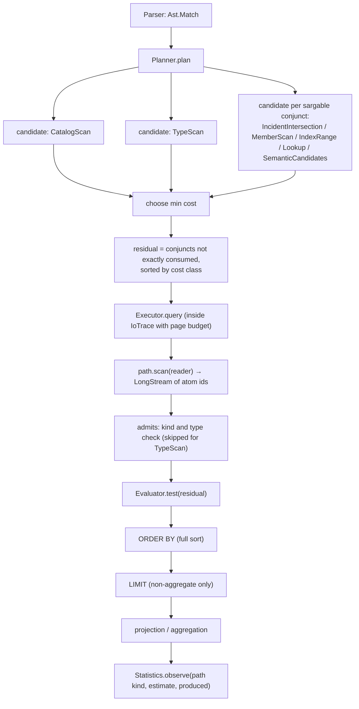
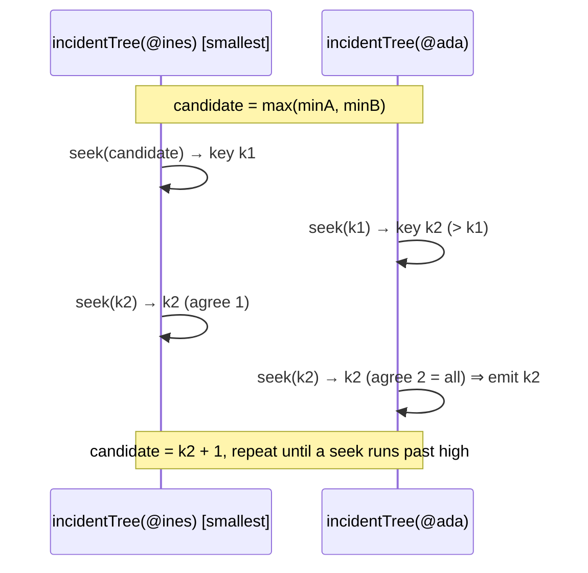

# Query planning and execution

This page describes how a `MATCH` statement ([HQL](hql.md#match)) is planned and executed:
`query/Planner.java`, `query/AccessPath.java`, `query/Evaluator.java`, `query/Executor.java#query`,
`stats/Statistics.java`, `engine/.../tree/TreeAlgebra.java` and `engine/.../page/IoTrace.java`.

## Pipeline



A `MATCH` is a single-variable query: it enumerates atoms of one kind (`NODE` or `EDGE`), optionally of one type,
filters them and projects expressions. Multi-variable joins are expressed with [`PATTERN`](hora.md#pattern-matching).

## Conjunct extraction

`Planner.conjuncts` flattens nested `AND`s of the `WHERE` expression into a list. Only top-level conjuncts can
drive an access path; a predicate inside `OR` or `NOT` is always evaluated as a residual filter.

## Access paths

`AccessPath` is a sealed interface; every path has a `kind()` used as the key for cardinality feedback.

| Path | `kind()` | Produced by | `scan` | Exact? |
|---|---|---|---|---|
| `AllAtoms(edges)` | `catalog-scan` | always | `Reader.allAtoms` (full catalog scan, tenant-filtered) | no |
| `TypeScan(type)` | `type-scan` | `MATCH x:Type` | `Reader.atomsOfType` (type posting list of the tenant) | no |
| `Incident(atoms)` | `incident` | `x CONTAINS (r1..rn)`, `x HAS r [AS role]` on an edge match | leapfrog intersection of the incidence trees of `r1..rn` | yes, except `HAS … AS role` |
| `Members(edge)` | `members` | `x IN r` | keys of `r`'s membership tree | yes |
| `IndexRange(type, p, lo, hi, …)` | `property-index` | `x.p op literal`, `literal op x.p`, `x.p BETWEEN a AND b` on an `INDEXED` declared property; the same forms with `json(x, '$.path')` in place of `x.p` when the type has a JSON index on exactly `'$.path'` (`Planner.indexed`) | `Reader.range` | yes |
| `Semantic(text, k, consistency)` | `semantic` | `x SIMILAR TO 'text' TOP k` | `Reader.similar` | no |
| `Fixed(atom)` | `fixed` | `x = r` | the single atom if visible | yes |

`!=` on an indexed property maps to a `TypeScan` (`Planner.range`, case `NE`). A path is **exact** when every atom
it yields satisfies the conjunct that produced it (`Planner.exact`); an exact conjunct is dropped from the residual
filters. `HAS r AS role` is not exact because the incidence tree only says that `r` is a member, not in which role.

Paths other than `TypeScan` may yield atoms of the wrong kind or type (an incidence set contains hyperedges of every
type), so `Executor.admits` re-checks `isEdge` and the type id for them.

### Incidence intersection (`CONTAINS`)

`Incident.scan` obtains, for every referenced atom, its reverse-index tree `View.incidentTree(atom)` — the sorted
set of hyperedge ids the atom belongs to (see [topology](../storage/topology.md)) — and calls
`TreeAlgebra.intersectKeys(trees)`:

1. If any tree is empty the result is empty.
2. The key window is `[max(tree.summary().min), min(tree.summary().max)]`; an empty window returns immediately
   without touching leaves.
3. Cursors are opened over each tree ordered by ascending size, with a summary predicate
   `summary.overlaps(low, high)` that prunes subtrees outside the window.
4. A leapfrog join (`TreeAlgebra.Leapfrog`) repeatedly `seek`s each cursor to the current candidate: if the
   cursor lands on the candidate, one more tree agrees; otherwise the landed key becomes the new candidate with one
   agreeing tree. After either case the join checks whether all trees agree and emits the key, so a single tree
   (`CONTAINS (one ref)`, `HAS`) degenerates to an ordered scan of that tree.



Each `seek` descends the B+-tree from the cursor's position using the counted-tree structure, so the cost is
`O(Σ_i min(|T_i|, k · log|T_i|))` for `k` emitted keys plus skipped runs, instead of the
`O(Σ|T_i|)` of a merge join. Results are emitted in ascending edge-id order, which is the order of all other
access paths too.

### Property index ranges

`IndexRange.scan` calls `Reader.range(type, property, low, high, lowInclusive, highInclusive)`:

1. Resolves the property key; an unknown property yields nothing.
2. Translates the bounds to order keys (`PropertyIndex.lowerKey/upperKey`, see
   [data model](data-model.md#order-keys)) and streams postings of the value tree
   `directoryKey(tenant, propertyKey, tag)` between those keys.
3. Applies the exact predicate with `Value.compareTo` (necessary because string order keys are 8-byte prefixes and
   cross-tag bounds are rounded outward).
4. Keeps only owners whose catalog record has the matched type and the reader's tenant, then `sorted().distinct()`.

The `tag` is `Reader.indexedTag(type, property)`: the declared property type, or the tag of the JSON index whose
path equals the property name. A query on an `INT` property therefore never scans values stored with a different
tag (possible only for undeclared properties). For a JSON index the property key is the interned path and the
indexed values are the coerced values selected from documents ([data model](data-model.md#json-documents-and-json-indexes));
`EXPLAIN` shows it as `IndexRange(Person.$.address.zip [94110, 94110])`.

### Semantic candidates

`Semantic.scan` returns the top-`k` atoms by cosine distance from [the semantic plane](semantic.md). As a residual
filter, `SIMILAR TO … TOP k` is evaluated by computing the global top-`k` once per statement (cached by
`k:consistency:text` in `Executor.evaluator`) and testing membership. Therefore
`d SIMILAR TO 'x' TOP 3 AND d.class = 'statin'` means *"among the 3 nearest atoms, those that are statins"*, not
*"the 3 nearest statins"*.

### Intersections and unions

**`AND`: intersection.** Conjuncts whose access path is exact for them (property and JSON index ranges,
`CONTAINS`, `IN`, an atom equality) are sorted by estimated rows. For every prefix of two to four of them the
planner adds an `Intersection` candidate.

* **Execution:** each part is scanned into a sorted, distinct id array, starting from the smallest, and the
  arrays are merge-intersected.
* **Estimated rows:** `rows₁ · Π (rowsᵢ / population)`, which assumes independence. `population` is the type's
  atom count, or the catalog size when there is no type.
* **Cost:** the sum of the part scans plus verification of the conjuncts nobody consumed.

An intersection only wins when verifying the first part's rows would cost more than scanning the next index
(roughly when both ranges are large and similar in size).

```text
EXPLAIN MATCH NODE i:Item WHERE i.color = 'red' AND i.shape = 'round';
Intersect[IndexRange(Item.color ['red', 'red']), IndexRange(Item.shape ['round', 'round'])]  rows≈1000  cost≈189
```

**`OR`: union.** When every operand of a disjunction has an access path of its own, the planner adds a `Union`
candidate that scans each part and merges the ids, sorted and deduplicated. Its estimate is the sum of the
parts, capped at the population. If every part is exact for its operand, the whole `OR` conjunct is consumed and
not verified again.

```text
EXPLAIN MATCH NODE i:Item WHERE i.size = 1 OR i.size = 2;
Union[IndexRange(Item.size [1, 1]), IndexRange(Item.size [2, 2])]  rows≈80  cost≈27
```

## Cost model

For each candidate the planner computes an estimated row count, corrects it with feedback, and prices it
(`Planner.candidate`):

```
rows'  = rows × correction(path.kind)
pages  = 3                      (Fixed)
       = 2k + 3                 (Semantic)
       = rows' / 128 + 3        (otherwise; 128 entries per page, tree depth 3)
cost   = 4.0 × pages + 0.01 × rows' + 0.05 × rows' × verification
```

`verification` is the sum of the **cost classes** of the conjuncts that would remain as residual filters for this
candidate (`Planner.costClass`):

| Conjunct | Cost class |
|---|---|
| comparison, `BETWEEN` | 1 |
| `IN`, `HAS` | 2 |
| `CONTAINS`, `VALID AT` | 3 |
| other (calls, booleans, `OR`) | 4 |
| `SIMILAR TO` | 5 |
| `NOT e` | class of `e` |

Residual filters are evaluated cheapest-class first, and `AND`/`OR` short-circuit (`Evaluator.test` uses
`allMatch`/`anyMatch`). `CatalogScan` gets `+1` on its verification weight so that a `TypeScan` with the same
estimate always wins.

### Row estimates (`Planner.estimate`)

| Path | Estimate |
|---|---|
| `CatalogScan` | catalog tree size (all atoms, all tenants) |
| `TypeScan` | `countOfType` — exact, from the type posting list |
| `Members(e)` | `cardinality(e)` — exact, from the edge's subtree count |
| `Fixed` | 1 |
| `Semantic` | `k` |
| `IndexRange` | `PostingIndex.countRange` over the order-key window of the tree selected by `Reader.indexedTag` — exact count of postings in the window, assembled from subtree weights without visiting leaves |
| `Incident(r1..rn)` | `d1 × Π_{i≥2} min(1, d_i / N)`, with degrees `d` sorted ascending and `N` the catalog size (independence assumption) |

The independence estimate is a lower bound for correlated members; in the demo dataset
`CONTAINS (@ines, @ada)` is estimated at 1 row and produces 3.

### Cardinality feedback

After execution, `Statistics.observe(kind, estimated, produced)` records the ratio
`(produced + 1) / (estimated + 1)` where `produced` counts atoms emitted by the access path before residual
filtering. Per path kind, the ratio is smoothed as an exponentially weighted moving average:

```
weight = 1 / (n + 1)   for the first 8 observations
       = 0.2           afterwards
ratio' = ratio × (1 - weight) + sample × weight
```

`correction(kind)` returns the current ratio (1.0 when unseen) and multiplies every future estimate of that kind.
The corrections are process-local and visible in `STATS` as `planner feedback <kind>`.

### Catalog statistics

`Statistics.refresh` (also triggered after 10,000 member/slot changes from the change feed) scans the catalog
snapshot and builds cardinality and degree histograms (`Histogram`, 65 power-of-two buckets), counts of edges by
exact cardinality (`Count_k`) and per-`(tenant, type)` counts. Above `SAMPLE_LIMIT` = 200,000 atoms, only atoms
with `id % stride == 0` are sampled (`stride = ceil(total / 200000)`); the edge total and every per-cardinality count
`Count_k` are extrapolated by multiplying the sampled counts by `stride`. Atom ids are allocated sequentially, so the sample is a systematic 1-in-`stride` sample:
the relative standard error of a proportion `p` estimated from `m` sampled edges is about `sqrt(p(1-p)/m)`
(≈0.11 % for `p = 0.5`, `m = 200,000`). The planner uses these statistics only through `STATS` and the
cardinality feedback; access-path estimates come from exact tree counts. See
[statistics](views-signals-stats.md#statistics).

## Execution

`Executor.query`:

1. Creates `IoTrace.withBudget(database.queryPageBudget(principal))`, the minimum of
   `DatabaseOptions.defaultQueryPages` (default 2,000,000) and the tenant's `query_pages` quota.
2. Plans (outside the budget).
3. Inside `trace.call(...)` (a `ScopedValue` binding): streams `path.scan`, counts produced atoms, applies
   `admits` and the residual filters, sorts if `ORDER BY` is present (a full in-memory sort of the matching
   bindings), applies `LIMIT` when there is no aggregate, and materialises the binding list.
4. Feeds the observation to the statistics.
5. Evaluates projections or aggregates over the bindings (outside the budget).
6. Attaches `QueryResult.Trace(txn, generation, plan, estimatedRows, outputRows, pagesRead, cacheHits, cpuNanos)`.

Page accounting: every page served from the node cache calls `IoTrace.recordHit`, every page decoded from a segment
calls `IoTrace.recordRead`; the budget is checked on reads and compares `reads + hits` against the limit, raising
`ABORTED_RESOURCE_LIMIT "query exceeded its budget of N page visits"`. The stream is lazy, so `LIMIT` without
`ORDER BY` stops the scan early and only pays for the pages it touched.

The whole statement runs on one snapshot (or the session transaction), so results are consistent at
`trace.generation`.

## EXPLAIN output

`EXPLAIN MATCH …` returns `Planner.Plan.describe()`:

```
<chosen path>  rows≈<estimate>  cost≈<cost>
  -> Verify(<residual 1>)          (one line per residual filter, in evaluation order)
  -> Project(<aliases>)
  -> Sort(<order expr> [DESC])
  -> Limit(<n>)
  rejected <path> rows≈<estimate> cost≈<cost>   (every other candidate)
```

Example on the demo dataset (two indexed conjuncts competing):

```sql
EXPLAIN MATCH NODE p:Patient WHERE p.age BETWEEN 30 AND 40 AND p.city = 'Boston' RETURN p ORDER BY p.age LIMIT 5;
```
```
IndexRange(Patient.city ['Boston', 'Boston'])  rows≈3  cost≈12
  -> Verify(p.age BETWEEN 30 AND 40)
  -> Project(p)
  -> Sort(p.age)
  -> Limit(5)
  rejected CatalogScan(nodes) rows≈128 cost≈36
  rejected TypeScan(Patient) rows≈24 cost≈15
  rejected IndexRange(Patient.age [30, 40]) rows≈5 cost≈12
```

Reading it: both index ranges cost about 12 (dominated by `4 × 3` for the tree descent); the city range is chosen
because it yields fewer rows (3 vs 5), so fewer residual verifications. The `BETWEEN` conjunct becomes a residual
filter of class 1.

A semantic candidate competing with an index:

```sql
EXPLAIN MATCH NODE d:Drug WHERE d SIMILAR TO 'blood glucose' TOP 3 SNAPSHOT AND d.class = 'biguanide' RETURN d;
```
```
IndexRange(Drug.class ['biguanide', 'biguanide'])  rows≈1  cost≈12
  -> Verify(d SIMILAR TO 'blood glucose' TOP 3 SNAPSHOT)
  -> Project(d)
  rejected CatalogScan(nodes) rows≈130 cost≈63
  rejected TypeScan(Drug) rows≈8 cost≈15
  rejected SemanticCandidates(top 3 for 'blood glucose', SNAPSHOT) rows≈3 cost≈37
```

The semantic path is priced at `2k + 3` pages, so an exact index path wins whenever one exists.

### Trace line

Executed `MATCH` results end with the trace (`QueryResult.render`):

```
generation 190, pages read 1, cache hits 49, 1.674708 ms
```

In JSON format the same data is the `trace` object (`generation, plan, estimatedRows, pagesRead, cacheHits,
elapsedMicros`), which is how [HStore Studio](../operations/studio.md) renders its plan tab.

## Limitations

- Negations never drive an access path; they are evaluated as residual filters.
- A disjunction drives a `Union` only when each of its operands has an access path by itself; an operand that is
  itself an `AND` does not.
- Intersections consider at most four parts, chosen in order of estimated rows.
