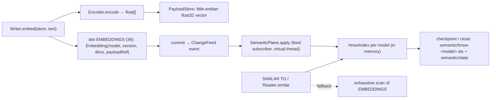
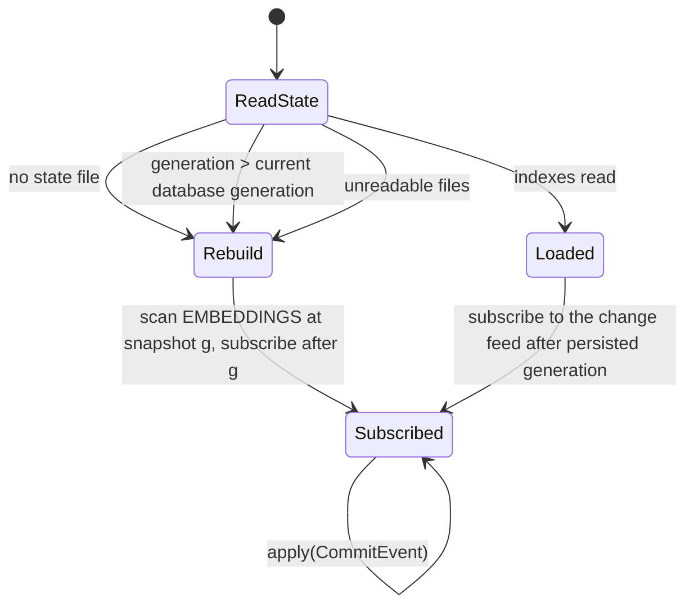
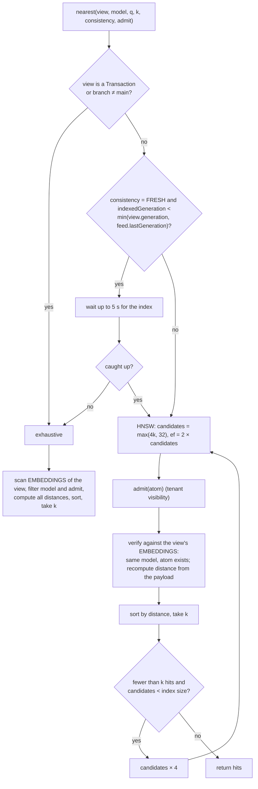

# Semantic plane

The semantic plane attaches dense vectors to atoms and answers nearest-neighbour queries. It consists of a
transactional source of truth (embedding records in a slot, vectors in the payload store) and a derived,
in-memory, persisted HNSW index that is maintained asynchronously from the change feed.
Sources: `database/src/main/java/io/hstore/db/semantic/` (`Encoder`, `HttpEncoder`, `Embedding`, `HnswIndex`,
`SemanticPlane`).



## Embedding records

```java
// semantic/Embedding.java
record Embedding(int model, int version, int dimensions, long payloadRef)
```

- Slot `EMBEDDINGS` = 36, tree schema 72, keyed by atom id; one embedding per atom (a new embedding replaces the
  previous one regardless of model).
- `model` is the model name interned in dictionary namespace `SemanticPlane.MODEL_NAMESPACE` = 11.
- The vector is stored in the [payload store](data-model.md#payloads) as `dimensions × float32` little-endian
  (`Embedding.encode/decode`, via a `MemorySegment` with `JAVA_FLOAT_UNALIGNED` in `LITTLE_ENDIAN` order) and
  charged to the tenant's `payload_bytes` quota.
- For nodes, `NodeRecord.embeddingRef` is set to the same payload reference (`Writer.embed`).
- `Writer.delete` removes the embedding record together with the atom.

`EMBED @x TEXT '…'` encodes with the database encoder; `EMBED @x VECTOR [..] MODEL 'm'` stores an external vector
under model `m`, version 1 ([HQL](hql.md#semantic)).

## Encoders

`Encoder` (`semantic/Encoder.java`): `model()`, `version()`, `dimensions()`, `encode(text) → Encoded(vector, model,
version)`.

### Hashing encoder (default)

`Encoder.hashing(dimensions)`, model name `hashing-<dims>` (default 256, `DatabaseOptions.defaults`). Deterministic
feature hashing with no external dependency:

1. Lower-case (`Locale.ROOT`), split on `[^\p{L}\p{N}]+`.
2. For every token add `±1.0` at slot `floorMod(Hashing.of("w:" + token), dims)`.
3. For every character trigram of `"^" + token + "$"` add `±0.5` at `floorMod(Hashing.of("g:" + trigram), dims)`.
4. The sign is the top bit of the hash (signed feature hashing, reducing collision bias).
5. L2-normalise.

It captures lexical and sub-word overlap, not meaning; it exists so that the semantic plane works offline and
deterministically (hashes are stable across JVMs). Use an HTTP encoder for semantic similarity.

### HTTP encoder

`HttpEncoder(endpoint, model, dimensions, apiKey, protocol)` (`semantic/HttpEncoder.java`) calls an embedding
service with `java.net.http.HttpClient`:

| | `OPENAI` | `OLLAMA` |
|---|---|---|
| Request body | `{"model": m, "input": text}` | `{"model": m, "prompt": text}` |
| Vector path | `$.data[0].embedding[*]` | `$.embedding[*]` |
| Typical endpoint | `https://api.openai.com/v1/embeddings` or any OpenAI-compatible server | `http://localhost:11434/api/embeddings` |

- `Authorization: Bearer <key>` when an API key is configured.
- Connect and request timeout 30 s.
- Up to 3 attempts with backoff `200 ms << attempt` (400, 800, 1600 ms); HTTP 4xx other than 429 fails
  immediately, 5xx/429/I/O errors are retried; the final failure is `RETRYABLE_IO`.
- The response must have exactly `dimensions` numeric components, otherwise `INVALID_SCHEMA`.
- `version()` is 1.

Encoding happens inside `Writer.embed`, i.e. inside the writing transaction; a slow embedding service lengthens the
transaction but does not hold the engine's commit lock.

Server configuration (`server/.../Setting.java`, see [configuration](../operations/configuration.md)):
`embedding_provider = hashing | openai | ollama`, `embedding_url`, `embedding_model`, `embedding_dimensions`,
`embedding_api_key`.

## HNSW index

`HnswIndex(connections M, efConstruction)` is a hierarchical navigable small-world graph over L2-normalised
vectors with cosine distance `1 − a·b` (`Embedding.cosineDistance`). The plane creates one index per model with
`M = 16`, `efConstruction = 128` (`SemanticPlane.index`).

| Parameter | Value |
|---|---|
| Level distribution | `level = floor(−ln(1 − U) · 1/ln M)`, `U` from `L64X128MixRandom` seeded `0x5EED` (deterministic) |
| Neighbours per node | `2M = 32` on layer 0, `M = 16` on higher layers |
| Neighbour selection | the `limit` nearest candidates of the layer search (no diversity heuristic) |
| Back-links | appended to each chosen neighbour; when over `limit`, that neighbour's list is re-pruned to its nearest `limit` |
| Insert search | greedy descent from the entry point through layers above the new level, then `search(ef = efConstruction)` on each layer from `min(level, top)` to 0 |
| Query | greedy descent to layer 1, then `search(ef)` on layer 0, drop tombstones, return the `k` nearest |
| Concurrency | `ReentrantReadWriteLock`: queries share, inserts/removes exclude |

Node storage is columnar (`vectors`, `ids`, `links[node][layer]`), with `byId: atom → node` for live nodes.

### Tombstones and compaction

`upsert` of an existing atom and `remove` mark the old node in a `deleted` bitset and drop it from `byId`; the node
stays in the graph for routing. `tombstoneRatio() = |deleted| / |nodes|`. After applying each commit,
`SemanticPlane.apply` replaces every index whose ratio exceeds `TOMBSTONE_LIMIT` = 0.3 with `compacted()`, a fresh
index built by re-inserting only live vectors.

### Persistence format

`HnswIndex.writeTo` (big-endian `DataOutputStream`):

```
int32  MAGIC = 0x484E5357            ("HNSW")
int32  connections
int32  efConstruction
int32  entry                         (node index, -1 if empty)
int32  topLevel
int32  count                         (nodes, including tombstones)
repeat count:
  int64   atom id
  bool    deleted
  int32   dims, then dims × float32  (normalised vector)
  int32   layers
  repeat layers:
    int32 n, then n × int32 neighbour node indexes
```

`readFrom` validates the magic, restores nodes in order and rebuilds `byId` from the non-deleted ones. The random
generator is re-seeded, so subsequent level draws differ from an uninterrupted process; this affects only graph
shape, not correctness.

Files under `<data>/semantic/`:

| File | Content |
|---|---|
| `hnsw-<modelId>.idx` | one index per model |
| `state` | `java.util.Properties`: `generation=<indexed generation>`, `models=<comma-separated model ids>` |

`SemanticPlane.persist` writes each index to `hnsw-<id>.tmp` and atomically renames it, then writes
`state.tmp` → `state` last, all under the apply lock, so `state` never names a generation newer than the index files
it describes. Persistence runs from the engine checkpoint listener (`engine.onCheckpoint(semantic::persist)`) and
on close, and is skipped when nothing was indexed since the last persist. Failures are logged and leave the
previous files in place.

### Startup and catch-up



`SemanticPlane` subscribes to the change feed after the starting generation; `ChangeFeed.subscribe` replays every
retained event with a larger generation on a virtual thread and then tails new commits. `apply`:

1. ignores events of other branches (the index covers `main` only);
2. for each change of the `EMBEDDINGS` slot, upserts the new vector (reading it from the payload store) or removes
   the atom from every model's index;
3. compacts indexes over the tombstone limit;
4. advances `indexedGeneration` and signals waiting queries.

A state file ahead of the database (possible after restoring an older data directory) forces a rebuild, as do
unreadable index files.

## Queries

`SemanticPlane.nearest(view, model, query, k, consistency, admit)`:



| Consistency | Meaning |
|---|---|
| `FRESH` (default) | the answer reflects the reader's snapshot: if the index lags `min(snapshot generation, feed.lastGeneration())`, wait up to `FRESHNESS_TIMEOUT` = 5 s, else fall back to an exact scan. The minimum matters because generations without a feed event (commits that changed nothing) would otherwise never be reached by the index |
| `SNAPSHOT` | use the index as it is; candidates are still verified against the snapshot, so stale index entries cannot surface deleted or re-embedded atoms with wrong distances, but atoms embedded after the index's generation may be missing |

The verification step reads the embedding of every candidate from the reader's view, so results always reflect the
snapshot's vectors; the index only proposes candidates. Reads inside an open transaction or on a branch use the
exhaustive scan, which sees uncommitted and branch-local embeddings.

### Tenant visibility

The HNSW indexes are shared by all tenants. `Reader.similar` passes `this::visible` as the `admit` predicate, which
accepts only atoms whose catalog record belongs to the reader's tenant; the exhaustive path applies the same
predicate. Filtering happens after the approximate search, so `nearest` widens the candidate pool: it starts with
`max(4k, 32)` candidates (`ef` = twice that) and multiplies the pool by 4 per round until `k` admitted, verified
hits are found or the pool covers the whole index (`index.size()`). A tenant therefore receives `k` results whenever
at least `k` of its vectors are indexed; the cost of a query grows with the inverse of the tenant's share of the
model's vectors (`O(log₄(N / visible))` rounds).

### HQL

```sql
EMBED @Drug:'warfarin' TEXT 'anticoagulant blood thinner that prevents clots';
EMBED @Drug:'metformin' TEXT 'oral diabetes medication lowering blood glucose';
MATCH NODE d:Drug WHERE d SIMILAR TO 'blood clot prevention' TOP 2 RETURN d.name;
MATCH NODE d:Drug WHERE d SIMILAR TO 'blood glucose' TOP 3 SNAPSHOT AND d.class = 'biguanide' RETURN d;
```

`SIMILAR TO … TOP k [SNAPSHOT | FRESH]` uses the database encoder's model; as an access path it yields the top `k`
atoms; as a residual filter it tests membership in the global top `k` ([planner](planner.md#semantic-candidates)).
`Reader.similar(model, vector, k, consistency)` searches with a caller-supplied vector under any model.

### Observability

`STATS` reports `semantic index generation`; the Studio dashboard reports it as `semanticGeneration`. Index load,
rebuild and persistence failures are logged under logger `hstore.semantic`.
