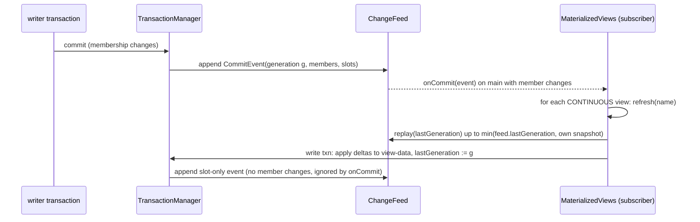

# Materialized views, signals and statistics

Sources: `database/src/main/java/io/hstore/db/view/` (`MaterializedViews`, `ViewCell`),
`database/src/main/java/io/hstore/db/signal/Signals.java`, `database/src/main/java/io/hstore/db/stats/`
(`Statistics`, `Histogram`). All three are driven by the engine change feed
(`engine/.../feed/ChangeFeed.java`): an append-only log of `CommitEvent(generation, txnId, wallTime, branch,
members, slots)` written after each commit is published, replayable from any retained generation and tailed by
subscribers on virtual threads.

## Materialized views

A view maintains derived per-key cells in a transactional slot and advances them incrementally from change-feed
events.



### Storage

| Slot | Name | Schema | Key | Value |
|---|---|---|---|---|
| 42 | `views` | 79 | view id | `Descriptor(id, name, kind, refresh, parameter, lastGeneration, tenant)` |
| 43 | `view-data` | 80 | `(viewId << 48) \| key` | `ViewCell` |

Cell keys are limited to 48 bits (`KEY_BITS`); `cellKey` rejects larger or negative keys. Scanning a view is a
range scan `[(id << 48), (id << 48) | (2^48 − 1)]` of `view-data`.

`ViewCell` codec: `u8 tag` then `Count`: `svarlong value` (tag 0); `Activity`: `varlong added, varlong removed`
(tag 1); `Ranked`: `varint n, n × (varlong edge, varlong overlap)` (tag 2).

### Kinds

| Kind | HQL | Key | Cell | Initial build | Incremental rule per event |
|---|---|---|---|---|---|
| `DEGREE` | `AS DEGREE` | atom id | `Count(degree)` | `degree(atom)` for every atom with degree > 0 | `+1` per `MemberChange.Added` of the member, `−1` per `Removed`; a cell reaching 0 is deleted |
| `CARDINALITY` | `AS CARDINALITY` | edge id | `Count(cardinality)` | record cardinality of every edge | same deltas keyed by edge |
| `ACTIVITY` | `AS ACTIVITY [BUCKET ms]` | `wallTime / bucket` | `Activity(added, removed)` | replay of all retained `main` events up to the creation generation | add the event's added/removed counts to its bucket |
| `OVERLAP_TOP_K` | `AS OVERLAP TOP k` | edge id | `Ranked` top-`k` `(edge, overlap)` | for every edge, overlaps with all edges sharing a member | recompute every changed edge and every edge incident to a changed member; delete cells of deleted edges |

`OVERLAP_TOP_K` ranks by overlap descending, then edge id ascending, and omits zero overlaps. Only events of branch
`main` are applied.

### Refresh

| Mode | Behaviour |
|---|---|
| `ON_DEMAND` | `REFRESH VIEW v` replays events in `(lastGeneration, feed.lastGeneration]`, applies them and advances `lastGeneration`, in one write transaction |
| `CONTINUOUS` | a change-feed subscriber (`MaterializedViews.onCommit`) refreshes every continuous view after each `main` commit that changed memberships |

View maintenance commits are slot-only events (no member changes), so they do not re-trigger continuous refresh.
A refresh is an ordinary write transaction: it conflicts with a concurrent refresh of the same cells and is retried
by `HypergraphDatabase.write`.

### Staleness

`VIEW v KEY k` returns `Reading(cell, staleness)`, where staleness is the number of `main` change-feed events with
membership changes in `(lastGeneration, reader.generation]` — how many topology-changing commits the cell has not
absorbed yet. A continuous view is typically at staleness 0 or 1 (the subscriber runs asynchronously).

```sql
CREATE VIEW provider_degree AS DEGREE CONTINUOUS;
CREATE VIEW claim_overlap AS OVERLAP TOP 3;
VIEW provider_degree KEY @Provider:'dr-ada-park';    -- | 25 | 14 | 0 |
INSERT EDGE Claim {amount: 10.0, status: 'paid'} MEMBERS (@Patient:'ines-duarte' AS patient, @Provider:'dr-ada-park' AS provider);
VIEW claim_overlap KEY @103;                          -- | 103 | @50×2, @101×2, @106×2 | 1 |   (stale by one commit)
REFRESH VIEW claim_overlap;
VIEW claim_overlap KEY @103;                          -- staleness 0
```

### Scope and permissions

Creating, refreshing and reading views requires ADMIN (`Executor.administrative`, `MaterializedViews.create/read/
scan`). A view belongs to the tenant of the admin who created it:

* The build only covers that tenant's atoms.
* Feed deltas only touch that tenant's cells. An existing cell is always updated, which handles atoms deleted
  since the last refresh.
* View names are unique per tenant, and `SHOW VIEWS`, `VIEW` and `REFRESH VIEW` only see the session's own
  tenant.
* Continuous views are refreshed internally as `system` within the view's tenant, so tenant checks in the
  computation still apply ([security](security.md)).

## Signals

A signal registers that an external time series (an ICU monitor, a sensor clock) is attached to an atom over an
interval, so queries over hyperedges can find which series cover a window.

```java
// signal/Signals.java
record Signal(long atom, long source, String clock, long from, long to, long resolution, String schema)
```

| Slot | Name | Schema | Content |
|---|---|---|---|
| 40 | `signals` | 76 | signal id → `Signal` (codec: `varlong atom, varlong source, string clock, svarlong from, svarlong to, varlong resolution, string schema`) |
| 41 | `signals-by-atom` | 77/78 | derived posting index `atom → {signal ids}` (inline up to 16) |

The derivation `Signals.INDEXING` keeps slot 41 in sync with slot 40 inside each transaction. Signal ids come from
the atom allocator.

| Operation | HQL | Semantics |
|---|---|---|
| `Signals.register(writer, signal)` | `SIGNAL ON ref CLOCK c FROM t1 TO t2 [RESOLUTION r] [SCHEMA s]` | requires WRITER and a visible atom; default resolution 1, schema `series` |
| `Signals.of(reader, atom, from, to)` | — | signals of a visible atom overlapping `[from, to)` |
| `Signals.resolve(reader, edges, from, to)` | `SIGNALS FOR e1, e2 DURING [t1, t2)` | the distinct members of the edges whose **membership** validity overlaps the window (`Hyperedge.overlapping`, pruned by summary time bounds), each mapped to its overlapping signals |

`SIGNALS FOR` returns only members that have at least one signal. Columns: `atom, signal, clock, from, to`.

```sql
SIGNAL ON @Patient:'ines-duarte' CLOCK 'icu-monitor' FROM '2026-03-01T00:00:00Z' TO '2026-03-02T00:00:00Z'
  RESOLUTION 1000 SCHEMA 'heart-rate';
SIGNALS FOR @103, @101 DURING ['2026-03-01T12:00:00Z', '2026-03-01T13:00:00Z');
-- | @9 Patient:'ines-duarte' | @134 | icu-monitor | 1772323200000 | 1772409600000 |
```

Signal records carry no tenant field; tenant isolation follows from the requirement that the signal's atom is
visible to the reader.

## Statistics

`Statistics` (`stats/Statistics.java`) maintains a catalog summary used by `STATS`, the Studio dashboard and the
planner's cardinality feedback.

### Catalog snapshot

```java
record Catalog(long generation, long atoms, long edges, boolean sampled, Histogram cardinality, Histogram degree,
               Map<Long, Long> edgesByCardinality, Map<Integer, Long> typeCounts)
```

`refresh()` reads a snapshot of `main`:

| Field | Computation |
|---|---|
| `atoms` | catalog tree size (exact, from the root count) |
| `cardinality` | histogram of `EdgeRecord.cardinality()` over (sampled) edges |
| `degree` | histogram of reverse-index posting counts over (sampled) atoms |
| `edgesByCardinality` | `Count_k`: number of edges with cardinality exactly `k` (sampled counts × `stride`) |
| `edges` | `#sampled edges × stride` |
| `typeCounts` | posting count per `typeKey(tenant, type)` from the type index (exact) |

Refresh happens on first use, on `STATS`, and from a change-feed subscriber whenever more than
`REFRESH_AFTER_CHANGES` = 10,000 member and slot changes accumulated.

### Bounded-error sampling

Above `SAMPLE_LIMIT` = 200,000 catalog entries, `stride = ceil(atoms / 200,000)` and only atoms with
`id % stride == 0` contribute to the histograms and `Count_k`; `sampled` is set. Because ids are allocated
sequentially across all kinds, this is a systematic sample of at most ~200,000 atoms, which bounds refresh cost to
`O(atoms)` key iteration plus `O(200,000)` value decodes and degree lookups. For a proportion `p` (for example the
fraction of edges with cardinality `k`) estimated from `m` sampled edges, the standard error is
`sqrt(p(1 − p) / m)`; the extrapolated edge count `edges = m × stride` and every `Count_k` (each sampled count is
multiplied by `stride`) have relative error of the same order. Histogram totals and sums describe the sample.

### Histograms

`Histogram(buckets, total, maximum, sum)` has 65 logarithmic buckets: bucket 0 holds values `≤ 0`, bucket `b ≥ 1`
holds `[2^(b−1), 2^b)` (`64 − numberOfLeadingZeros(v)`). It stores the exact `total`, `maximum` and `sum` of the
(sampled) values, so `mean() = sum / total` is exact for the values it saw; `STATS` reports `average degree` from
it.

### Cardinality feedback

`observe(path, estimated, actual)` and `correction(path)` implement the planner's per-access-path correction
factors (an EWMA of `(actual + 1)/(estimated + 1)`), described in [planner](planner.md#cardinality-feedback).

### Helper functions

`Statistics.degree(view, atom)`, `cardinality(view, edge)`, `weight(view, edge)` (weight sum from the summary) and
`overlap(view, a, b)` (`TreeAlgebra.countIntersect`) back the HQL functions `degree`, `card`, `weight` and
`overlap`.

### STATS

```
| generation                | 157                                     |
| atoms                     | 122                                     |
| hyperedges                | 76                                      |
| cardinality               | Histogram[total=76, max=6, mean=3.8]    |
| degree                    | Histogram[total=122, max=17, mean=2.37] |
| average degree            | 2.37                                    |
| edges with cardinality 2  | 7                                       |
| …                         |                                         |
| semantic index generation | 157                                     |
```

`STATS` prints `Count_k` for `k = 2..5`, the engine counters from `EngineStats` and the planner feedback factors.
