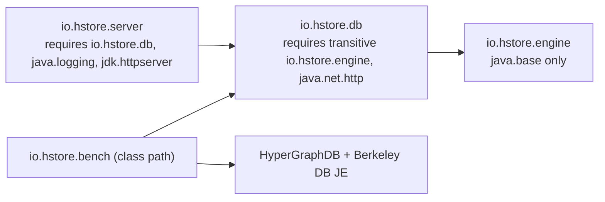

# Development

## Repository layout

```
engine/       io.hstore.engine     storage engine: pages, persistent trees, topology, WAL, transactions, recovery
database/     io.hstore.db         database: schema, properties, HQL, HORA, semantic plane, evidence, security
server/       io.hstore.server     CLI, wire-protocol server, configuration, logging, HStore Studio
benchmarks/   io.hstore.bench      HStore vs HyperGraphDB comparison (Maven profile -Pbenchmarks)
docker/       docker-entrypoint.sh
examples/     sample HQL datasets
docs/         this documentation
```

The modules are JPMS modules with a strictly layered dependency graph:



| Package | Contents |
|---|---|
| `engine.page` | Segment files, 80-byte page header with CRC32C, `PageId` (segment 24 / offset 24 / generation 16 bits), page store and cache |
| `engine.tree` | Copy-on-write counted B+tree, monoid summaries, write scopes, cursors, `TreeAlgebra` (leapfrog intersection, synchronized traversal), `TreeDiff`, `TreeVerifier` |
| `engine.topology` | Hyperedge membership and incidence encodings, `Incidence`, `Validity` |
| `engine.catalog` | Slots, root vectors, branches, generations, dictionary |
| `engine.txn` | `Transaction`, workspaces and rebase, `TransactionManager`, `GroupCommitter`, `View`, durability and WAL modes, `CrashPoint` |
| `engine.wal` | WAL records and segments |
| `engine.maintenance` | `Recovery`, `Checkpointer`, `Compactor` |
| `engine.feed` | Change feed and subscriptions |
| `engine.index` | Engine-level derivations and canonical-name index |
| `db` | `HypergraphDatabase`, `Reader`, `Writer`, `Atom`, `Member`, `Incident`, `MemberSpec` |
| `db.query` | HQL `Lexer`, `Parser`, `Ast`, `Planner`, `Executor`, `Evaluator`, `Session`, `QueryResult` |
| `db.hora` | Hypergraph relational operators: gather, scatter, propagate, overlap join, closure, pattern matching |
| `db.semantic` | Encoders (hashing, HTTP), HNSW index, `SemanticPlane` |
| `db.security` | Tenants, users, roles, quotas |
| `db.temporal`, `db.evidence`, `db.signal`, `db.view`, `db.stats`, `db.property`, `db.payload`, `db.schema`, `db.value` | Remaining database services |
| `server` | `Main`, `Server`, `WireProtocol`, `Shell`, `Setting`, `ServerConfig`, `Logging`, `StatementLogger`, `Bench`, `Check` |
| `server.studio` | Studio HTTP server: `Studio`, `Sessions`, `Neighborhood`, `Assets` |

Architecture documents start at [architecture/overview.md](architecture/overview.md).

## Toolchain

| Tool | Version |
|---|---|
| JDK | GraalVM for JDK 25 (`native-image` included) |
| Maven | via the wrapper `./mvnw` (Maven 3.9.11). No global install needed. |
| Docker | optional, for the image (BuildKit) |
| Node.js | optional, only for `node --check` syntax checks of Studio modules |

```
sdk install java 25-graal          # SDKMAN; or download GraalVM for JDK 25 and point JAVA_HOME at it
export JAVA_HOME=/path/to/graalvm-jdk-25
```

The build uses `--release 25`, `-Xlint:all` and `-Werror`, so new warnings fail the build.

## Build and test

```
./mvnw install                      # compile, run all tests, install the modules locally
./mvnw -q install -DskipTests       # fast build
./mvnw test -pl engine              # one module
./mvnw test -pl database -am -Dtest=SecurityTest -Dsurefire.failIfNoSpecifiedTests=false
./mvnw -Pnative -DskipTests package -pl server     # native executable: server/target/hstore
```

Run from the JVM build without the native image:

```
java -p engine/target/classes:database/target/classes:server/target/classes \
     -m io.hstore.server/io.hstore.server.Main serve /tmp/hstore-dev
```

Test suites:

| Suite | Focus |
|---|---|
| `engine/…/tree/TreeTest` | tree invariants, summaries, intersection, diff |
| `engine/…/EngineTest` | transactions, rebase, branches, history, compaction |
| `engine/…/CrashRecoveryTest` | crash matrix, durable-prefix rule, group-commit barriers |
| `database/…/DatabaseTest` | reader/writer API, properties, temporal, evidence |
| `database/…/query/QueryLanguageTest` | HQL end to end, planner choices |
| `database/…/SecurityTest` | tenant isolation, roles, quotas, three-way merge, JSON output |
| `database/…/semantic/SemanticPersistenceTest` | HNSW persistence across restarts, HTTP encoder against a stub server |
| `server/…/ServerTest` | wire protocol, authentication, configuration layering |
| `server/…/studio/StudioTest` | Studio assets, authentication, CSRF, query and graph API |

The database and server test runtimes add `jdk.httpserver` and `java.net.http` respectively through
`--add-modules`/`--add-reads` in their POMs. These are needed only by tests.

### Crash-recovery matrix

`CrashRecoveryTest.recoveryYieldsPriorOrNewStateNeverAMixture` is parameterised over
`WalMode × CrashPoint` (2 × 7 cases). A `CrashPoint.Injector` throws `SimulatedCrash` when the commit
pipeline reaches the chosen point:

```
PAGE → WAL_APPEND → DATA_WRITE → COMMIT_APPEND → DATA_SYNC → WAL_SYNC → CATALOG_PUBLISH
```

The engine is then abandoned without closing and reopened. The recovered state must equal either the state
before the transaction or the state after it, never a mixture. It must be the *after* state exactly when the
crash point is at or beyond `COMMIT_APPEND`. A change that touches the commit path, the WAL or recovery must
keep the matrix green. Add a `CrashPoint` when you introduce a new durability step.

## Coding conventions

* **No comments in code.** Names and structure carry the meaning. Explanations belong in `docs/`. Package-level
  descriptions may go in `package-info.java`.
* Prefer records for data, sealed interfaces for closed hierarchies, and exhaustive `switch` with pattern
  matching and record deconstruction. Use `_` for unused bindings.
* Streams and small pure functions where natural. Clear loops on hot paths.
* Virtual threads for request handling. Platform threads only where blocking I/O must not pin a carrier,
  as in the group-commit flusher.
* **Deterministic hashing.** Every fingerprint, summary or hash that is persisted or compared across
  processes must be computed from explicit field values. Never use `Enum.hashCode()`, `Record.hashCode()`,
  `Object.hashCode()` or `String.hashCode()` of a record's `toString` in an `EntryMeasure`, a summary or an
  on-disk key: identity and record hash codes differ between JVM runs and between the JVM and the native image.
  Use ordinals, explicit constants and `io.hstore.engine.tree.Hashing` (`mix`, `combine`).
* Imports are grouped as `io.hstore.*`, then third-party, then `java.*`, then static imports, with blank lines
  between groups, and contain no wildcards or unused entries.
* Code must stay GraalVM native-image friendly: no reflection, dynamic proxies or runtime class generation.
  Resources need an entry in `server/src/main/resources/META-INF/native-image/io.hstore/hstore-server/reachability-metadata.json`.
* Formatting is in [`.editorconfig`](../.editorconfig): four spaces for Java, two for web files, LF line
  endings.

## Adding an HQL statement end to end

1. **AST.** Add a record to `Ast.Statement` in
   [`Ast.java`](../database/src/main/java/io/hstore/db/query/Ast.java). The interface is sealed, so every
   exhaustive `switch` over statements now fails to compile until it is handled.
2. **Grammar.** Parse it in [`Parser.java`](../database/src/main/java/io/hstore/db/query/Parser.java) with
   `accept`/`expect` on keywords. Keywords are matched case-insensitively against identifier tokens.
3. **Execution.** Implement it in [`Executor.java`](../database/src/main/java/io/hstore/db/query/Executor.java)
   (`Executor.run`). Use `read(...)`/`write(...)` so the session's transaction, branch, pinned generation and
   principal apply. Return a `QueryResult` (`table`, `message`). Statements that change session state
   (format, tenant, branch) belong in `Session.execute`.
4. **Authorisation.** Call `principal.requireWrite()` or `requireAdmin()` through the `Reader`/`Writer`
   APIs, or list the statement in `Executor.administrative`.
5. **Logging category.** Classify it in
   [`StatementLogger.category`](../server/src/main/java/io/hstore/server/StatementLogger.java) as DDL, MOD or
   READ. The `default` branch treats unknown statements as MOD.
6. **Tooling.** Add new keywords to `KEYWORDS` in
   [`studio/js/editor.js`](../server/src/main/resources/studio/js/editor.js) for highlighting and completion,
   and to the shell `HELP` if it is commonly used.
7. **Tests.** Add a case to `QueryLanguageTest`. If it is visible through the server, add one to `ServerTest`.
8. **Docs.** Document the syntax in the [HQL reference](database/hql.md).

## Adding a setting

1. Add a constant to [`Setting`](../server/src/main/java/io/hstore/server/Setting.java) with key, default and
   one-line description. The environment variable name, the `hstore.conf` template and `hstore config` output
   are derived from it.
2. Read it in [`ServerConfig`](../server/src/main/java/io/hstore/server/ServerConfig.java) with `string`,
   `integer`, `number` or `flag`, and map it onto `EngineOptions`, `DatabaseOptions`, `Server.Policy`,
   `Studio.Options` or `Logging`.
3. Extend `ServerTest.configurationLayersFileEnvironmentAndFlags` if the parsing is non-trivial.
4. Add a row to [operations/configuration.md](operations/configuration.md).

## Working on Studio

The frontend lives in `server/src/main/resources/studio`:

```
index.html, studio.css, favicon.svg
js/app.js            shell, routing, session lifecycle, theme
js/api.js            fetch wrapper (cookie, CSRF header, error mapping)
js/dom.js            element builder, icons, popovers, dialogs, toasts, storage
js/editor.js         HQL editor: highlighting overlay, completion, history
js/inspector.js      atom inspector panel
js/chart.js          dashboard time-series charts
js/graph/layout.js   Barnes–Hut force simulation
js/graph/geometry.js convex hulls, smoothing, hit tests
js/graph/view.js     canvas renderer and interaction
js/views/*.js        console, explore, schema, dashboard, admin, login
```

There is no bundler or framework and there are no third-party scripts. The CSP (`script-src 'self'`) forbids
inline scripts and remote origins. Serve the files from disk while editing:

```
./mvnw -q install -DskipTests
hstore init /tmp/studio-db --superuser admin --password admin
hstore exec /tmp/studio-db examples/clinical-claims.hql
java -p engine/target/classes:database/target/classes:server/target/classes \
     -m io.hstore.server/io.hstore.server.Main serve /tmp/studio-db \
     --studio_assets server/src/main/resources/studio
```

Reload the browser after each edit. Check syntax with
`for f in $(find server/src/main/resources/studio/js -name '*.js'); do node --check "$f"; done`.

## Benchmarks against HyperGraphDB

The `benchmarks` module is excluded from the default build because HyperGraphDB is not published to Maven
Central. To run the comparison:

```
benchmarks/install-hypergraphdb.sh       # clones the pinned commit, compiles core + bdb-je, installs into ~/.m2
SCALE=1 DURABILITY=async benchmarks/run.sh
SCALE=1 DURABILITY=sync  benchmarks/run.sh
```

`install-hypergraphdb.sh` checks out commit `99485a1fa52e532351e8418b4f8153d97c72c959`, compiles
`core/src/java` and `storage/bdb-je/src/java` with `javac --release 11` against Berkeley DB JE 5.0.73, and
installs `org.hypergraphdb:hgdb` and `org.hypergraphdb:hgbdbje` version `1.4-99485a1`.

`run.sh` builds with `-Pbenchmarks`, runs each store in its own JVM on the same deterministic dataset (seeded
generator, `SCALE` × 50,000 nodes and × 100,000 hyperedges), writes `benchmarks/results/scale-N-durability/*.json`
and prints a Markdown report whose *Results agree* column cross-checks every query checksum between the two
engines. Methodology and published numbers: [benchmarks.md](benchmarks.md).
