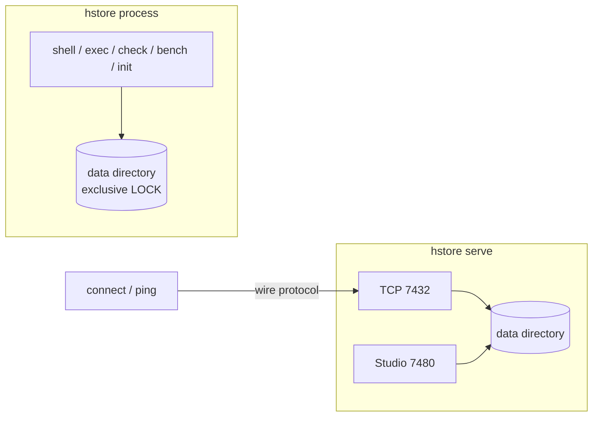

# Command-line interface

`hstore` is one native executable built from
[`Main.java`](../../server/src/main/java/io/hstore/server/Main.java). It contains the server, the Studio web
console, an embedded shell and the maintenance tools.

```
usage: hstore <command> [options]
  init    <dir> [--superuser NAME --password PW] [--<setting> VALUE]...   create a data directory
  serve   <dir> [--<setting> VALUE]...                                    run the TCP server and HStore Studio
  shell   <dir>                                  interactive HQL shell on an embedded database
  exec    <dir> (-c STATEMENTS | FILE)           run HQL against an embedded database
  connect HOST:PORT [--user NAME --password PW]  interactive shell against a server
  ping    HOST:PORT                              exit 0 when a server accepts connections
  bench   <dir> [--scenario NAME] [--scale N]    adversarial storage benchmarks
  check   <dir>                                  verify checksums and tree invariants
  config  [<dir>]                                print effective settings
  version
```

Every command that takes a data directory resolves [settings](configuration.md) from `<dir>/hstore.conf`, then
the `HSTORE_*` environment, then `--<setting>` flags.

## Embedded versus client commands



`init`, `shell`, `exec`, `check` and `bench` open the data directory *in-process*. The engine takes an
exclusive file lock (`<dir>/LOCK`), so these commands fail while a server owns the directory:

```
hstore: database /srv/hstore is opened by another process
```

Embedded commands run as the built-in `system` principal (tenant `default`, role `ADMIN`) and skip
authentication. Access to the data directory is the trust boundary, as with PostgreSQL's single-user mode.
Use `connect` to talk to a running server.

## Exit codes

| Code | Meaning |
|---|---|
| `0` | Success. |
| `1` | `exec`: at least one statement failed (an output line starts with `error`). |
| `2` | Error printed as `hstore: <message>`: unknown command, missing argument, invalid setting value, a directory that is already initialised, failed authentication, a database locked by another process, an incompatible `FORMAT`. I/O failures print `hstore: <message>: <cause>`, for example `hstore: cannot connect to /127.0.0.1:1: Connection refused`. `ping` also returns `2` when no server answers. |

## Commands

### `init`

Creates a data directory, writes a commented `hstore.conf` (flags given to `init` are written uncommented),
opens the database once (creating `FORMAT`, the WAL, the catalog and the first checkpoint) and optionally
creates an ADMIN superuser in the `default` tenant.

```
$ hstore init /srv/hstore --superuser admin --password 'change-me' --page_size 8192 --durability async
initialised /srv/hstore with superuser admin
```

| Option | Description |
|---|---|
| `--superuser NAME` | Create user `NAME` with role `ADMIN`. Defaults to `$HSTORE_USER`. |
| `--password PW` | Password for the superuser. Defaults to `$HSTORE_PASSWORD`. Required with a superuser. |
| `--if-not-exists` | Exit `0` without changes if `<dir>/FORMAT` already exists. Without it, an initialised directory is an error (exit `2`). |
| `--<setting> VALUE` | Recorded in `hstore.conf`. `page_size` is fixed from this moment on. |

Without a superuser the database accepts unauthenticated connections (`authentication = auto` and no users).

### `serve`

Runs the wire-protocol server and, unless `studio = off`, HStore Studio. It runs until SIGTERM or SIGINT.
On shutdown it closes Studio sessions and client connections, takes a final checkpoint and releases the lock.

```
$ hstore serve /srv/hstore --listen_address 0.0.0.0 --log_statement ddl
2026-10-04 06:33:29.130 IST [28997] LOG:  [main] starting hstore 0.1.0 on Java 25.0.4+7-LTS-jvmci-b01
…
2026-10-04 06:33:29.201 IST [28997] LOG:  [studio] studio listening on http://0.0.0.0:7480
2026-10-04 06:33:29.201 IST [28997] LOG:  [server] listening on 0.0.0.0:7432
```

Run `init` first to get `hstore.conf` and, optionally, a superuser. `serve` on a path that does not exist
creates an empty database with default settings, no `hstore.conf` and no users.

### `shell`

An interactive, embedded HQL shell. Statements are buffered until a line ends with `;`.

```
$ hstore shell /srv/hstore
hstore shell — /srv/hstore  (\help for help)
hstore> MATCH NODE p:Patient WHERE p.age > 80
   ...> RETURN p.name, p.age ORDER BY p.age DESC;
```

| Meta command | Effect |
|---|---|
| `\q`, `\quit` | Exit (end of input also exits). |
| `\timing` | Toggle per-request wall-clock timing. |
| `\help`, `\?` | Print a syntax cheat-sheet. |

### `exec`

Runs a script non-interactively against an embedded database and prints every result. Use `-c` for inline
statements or pass a file. `-c` always takes the next argument as the script, even if it starts with `-` or
`--`. All statements run in one session, so `$variables`, `BEGIN … COMMIT` and
`USE BRANCH` carry across statements. Execution stops at the first failing statement.

```
$ hstore exec /srv/hstore examples/clinical-claims.hql > /dev/null
$ hstore exec /srv/hstore -c "MATCH NODE p:Patient WHERE p.age > 80 RETURN p.name, p.age ORDER BY p.age DESC;"
+--------------+-------+
| p.name       | p.age |
+--------------+-------+
| Quinn Murphy | 88    |
+--------------+-------+
1 row
generation 158, pages read 2, cache hits 8, 1.748667 ms
$ hstore exec /srv/hstore -c "SHOW NOPE;"; echo $?
error [INVALID_SCHEMA]: syntax error at offset 5: expected VIEWS but found 'NOPE'
1
```

### `connect`

An interactive shell over the [wire protocol](wire-protocol.md). When the server banner says
`authentication required` and credentials are available, `connect` sends `AUTHENTICATE` before showing the
prompt, and the banner it prints ends in `authenticated as <user>` instead. A rejected login exits with code `2`
and prints the server's `error [AUTHENTICATION_FAILED]: authentication failed`.

| Source of credentials | Order |
|---|---|
| user | `--user`, then `$HSTORE_USER` |
| password | `--password`, then `$HSTORE_PASSWORD`, then an interactive no-echo prompt on the console |

With `--tls on` (or `HSTORE_TLS=on`) the connection uses TLS and verifies the server's certificate and host
name against `--tls_ca_file`, then `--tls_certificate_file`, then the system trust store:
`hstore connect db.example.com:7432 --tls on --tls_ca_file ca.pem --user admin`.

```
$ hstore connect 127.0.0.1:7432 --user admin
password for admin:
hstore shell — hstore connection 2 at generation 158; authenticated as admin  (\help for help)
hstore> WHOAMI;
+-------+---------+-------+--------+
| user  | tenant  | role  | branch |
+-------+---------+-------+--------+
| admin | default | ADMIN | 0      |
+-------+---------+-------+--------+
```

### `ping`

Opens a connection, reads the banner and closes it without sending a request. It needs no credentials and,
because the connection sends no request, produces no LOG-level connection log lines. The Docker
`HEALTHCHECK` uses it. With `tls = on` it connects over TLS with the same trust rules as `connect`, but skips
the host-name check.

```
$ hstore ping 127.0.0.1:7432; echo $?
127.0.0.1:7432 - accepting connections (hstore connection 1 at generation 158; authentication required)
0
$ hstore ping 127.0.0.1:7499; echo $?
127.0.0.1:7499 - no response
2
```

### `check`

Opens the database (performing recovery if needed) and verifies every tree of every active branch. It
checks page checksums, key ordering, node balance, monoid summaries and nested trees.

```
$ hstore check /srv/hstore
generation 158, recovered 0 commits from the log
branch main
  property-index          162 entries        9 pages      8 nested trees  height 1
  …
  catalog                 458 entries       88 pages     85 nested trees  height 2
verified 110 pages: checksums, ordering, balance and summaries are consistent
```

A violated invariant aborts the check with the offending page and a reason such as
`leaf keys out of order in <schema>` or `unbalanced tree in <schema>`.

### `bench`

The storage-engine stress suite from the paper's adversarial evaluation. It runs against a scratch
directory, not a production database. Scenarios: `small-edges`, `medium-edges`, `giant-edge`,
`cardinality-skew`, `near-identical`, `disjoint`, `reverse-hotspot`, `small-consolidation`, `mvcc-stress`, or
`all` (the default). `--scale N` multiplies the workload sizes.

```
$ hstore bench /tmp/bench --scenario small-edges
scenario                    ops     p50 µs     p95 µs     p99 µs    pg read   pg write    wal bytes       WA  notes
small-edges                  20    77604.6   106779.5   106779.5          0      21021      2095003     5.80  batches of 1000 edges with 2-5 members
```

`WA` is write amplification: bytes written to data segments plus WAL bytes, divided by the logical size of
the incidences written, counted at 32 bytes per incidence.
For the comparison against HyperGraphDB see [benchmarks](../benchmarks.md).

### `config`

Prints the effective value of every setting for an optional data directory. It applies `hstore.conf`, the
environment and flags, but does not open the database. Secrets are masked.

```
$ HSTORE_PORT=7600 hstore config /srv/hstore --port 7700 | grep '^port'
port                     = 7700
```

### `version`

```
$ hstore version
hstore 0.1.0 (Java 25.0.4+7-LTS-jvmci-b01)
```
