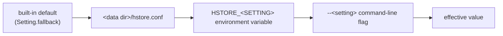

# Configuration

Every runtime knob of the `hstore` server is a *setting*. Settings are declared once, in
[`Setting.java`](../../server/src/main/java/io/hstore/server/Setting.java), and resolved by
[`ServerConfig.java`](../../server/src/main/java/io/hstore/server/ServerConfig.java) into
`EngineOptions`, `DatabaseOptions`, the wire-protocol `Server.Policy`, the Studio options and the logging
configuration.

## Sources and precedence

A setting can come from four places. Later sources override earlier ones:



| Source | Syntax | Example |
|---|---|---|
| default | compiled into the binary | `port` = `7432` |
| file | `java.util.Properties` file `hstore.conf` in the data directory; `key = value`, `#` comments | `port = 9000` |
| environment | `HSTORE_` + upper-cased key | `HSTORE_PORT=9100` |
| command line | `--key value` (dashes or underscores both accepted in the key) | `--port 9200` |

Rules enforced by `ServerConfig.load`:

* Keys are case-insensitive and `-` is normalised to `_` (`--log-statement all` equals `--log_statement all`).
* An unknown key in `hstore.conf` is a startup error (`unknown setting 'x'`).
* Unknown command-line flags are ignored by the setting resolver, because the same flag map also carries
  command options such as `--superuser`, `--password`, `--user`, `-c` and `--if-not-exists`.
* Unknown `HSTORE_*` variables are ignored. Only variables whose name matches a setting are read. `HSTORE_USER`, `HSTORE_PASSWORD`,
  `HSTORE_PASSWORD_FILE` and `HSTORE_DATA` are consumed by the CLI and the Docker entrypoint, not by the resolver.
* Boolean settings accept `on|true|yes|1` and `off|false|no|0`.

`hstore init` writes a fully commented `hstore.conf` template into the new data directory. Every setting
appears with its description. Settings passed to `init` as flags are written uncommented; all others are
written commented out with their default:

```
$ hstore init /srv/hstore --page_size 8192 --durability async
$ grep -v '^#' /srv/hstore/hstore.conf | grep -v '^$'
page_size = 8192
durability = async
```

`serve` logs every non-default value and where it came from, so a running server always records its effective
configuration:

```
LOG:  [main] configuration: port=27500 (command line), max_connections=2 (command line), page_size=8192 (file), durability=async (file)
```

`hstore config [<dir>]` prints the effective value of every setting without opening the database:

```
$ HSTORE_PORT=7600 hstore config /srv/hstore --port 7700 | head -3
listen_address           = 127.0.0.1
port                     = 7700
max_connections          = 200
```

`embedding_api_key` is always printed and logged as `***`.

## Reference

### Network and sessions

| Key | Environment | Default | Description |
|---|---|---|---|
| `listen_address` | `HSTORE_LISTEN_ADDRESS` | `127.0.0.1` | Interface for both the wire protocol and Studio. The Docker image sets `0.0.0.0`. |
| `port` | `HSTORE_PORT` | `7432` | TCP port of the [HQL wire protocol](wire-protocol.md). |
| `max_connections` | `HSTORE_MAX_CONNECTIONS` | `200` | Open wire connections allowed. Connection *n+1* receives `error [ABORTED_RESOURCE_LIMIT]: too many connections` and is closed. Studio sessions are not counted. |
| `authentication` | `HSTORE_AUTHENTICATION` | `auto` | `auto` requires `AUTHENTICATE` once at least one user exists. `on` always requires it. `off` never requires it, and every connection runs as the built-in `system` ADMIN principal. Applies to the wire protocol and to Studio. |
| `idle_timeout_seconds` | `HSTORE_IDLE_TIMEOUT_SECONDS` | `0` | Wire connections with no request for this long are closed (the socket read timeout). `0` disables the timeout. |
| `tls` | `HSTORE_TLS` | `off` | `on` serves the wire protocol over TLS and Studio over HTTPS, with the same certificate. Startup fails if the certificate or key is missing or unreadable. |
| `tls_certificate_file` | `HSTORE_TLS_CERTIFICATE_FILE` | *(empty)* | PEM certificate chain the server presents, leaf first. |
| `tls_key_file` | `HSTORE_TLS_KEY_FILE` | *(empty)* | Unencrypted PKCS#8 PEM private key (`BEGIN PRIVATE KEY`), EC, RSA or Ed25519. Convert other formats with `openssl pkcs8 -topk8 -nocrypt`. |
| `tls_ca_file` | `HSTORE_TLS_CA_FILE` | *(empty)* | Client side: certificates `hstore connect` and `hstore ping` trust when `tls = on`. Falls back to `tls_certificate_file` (handy for self-signed setups), then the system trust store. |
| `studio` | `HSTORE_STUDIO` | `on` | Serve [HStore Studio](studio.md). |
| `studio_port` | `HSTORE_STUDIO_PORT` | `7480` | HTTP port of Studio. |
| `studio_session_minutes` | `HSTORE_STUDIO_SESSION_MINUTES` | `60` | Idle minutes before a Studio session is closed and its HQL session released. |
| `studio_assets` | `HSTORE_STUDIO_ASSETS` | *(empty)* | Serve Studio's HTML/CSS/JS from this directory instead of from the binary, re-read on every request. For [Studio development](../development.md#working-on-studio) only. |

### Storage engine

| Key | Environment | Default | Description |
|---|---|---|---|
| `page_size` | `HSTORE_PAGE_SIZE` | `16384` | Page size in bytes. Must be a power of two from 1 KiB to 1 MiB. It is recorded in `<data>/FORMAT` at creation, and opening with a different value fails with `database uses N byte pages, options request M`. |
| `durability` | `HSTORE_DURABILITY` | `sync` | `sync`: a commit is acknowledged after the group-commit barrier has `fsync`ed it. `async`: acknowledged once appended, so a crash can lose a suffix of acknowledged commits but never corrupts the database. |
| `wal_mode` | `HSTORE_WAL_MODE` | `references` | `references`: the WAL logs `PageRef(pageId, address, length, crc32c)` records and data pages are synced before the WAL. `images`: the WAL logs full page images. See [WAL and recovery](../transactions/wal-and-recovery.md). |
| `cache_nodes` | `HSTORE_CACHE_NODES` | `65536` | Decoded tree nodes kept in the node cache. |
| `checkpoint_wal_mb` | `HSTORE_CHECKPOINT_WAL_MB` | `256` | WAL volume since the last checkpoint that triggers a background checkpoint. |
| `history_limit` | `HSTORE_HISTORY_LIMIT` | `64` | Committed generations kept addressable for `AT GENERATION`, `AS OF`, `HISTORY` and the Studio time slider. |
| `compaction_live_ratio` | `HSTORE_COMPACTION_LIVE_RATIO` | `0.5` | Sealed segments whose live bytes fall below this fraction of their allocated bytes are relocated by compaction: one segment (the emptiest) per background pass after every `checkpoint_wal_mb` of written node images, or all of them with `COMPACT`. Time-travel history is preserved; retired segments are deleted once `history_limit` has rolled past them. Must satisfy 0 < r < 1; other values fail at startup. |
| `feed_retention_generations` | `HSTORE_FEED_RETENTION_GENERATIONS` | `100000` | Committed generations kept in the [change feed](../storage/change-feed.md) for `HISTORY`, `DIFF` and subscribers. After every checkpoint, whole feed segments that lie entirely below `current − N` are deleted. *Holds* lower that floor: the semantic index's last persisted generation and the generation of each continuous materialised view. Feed segments roll at the WAL segment size (`EngineOptions.walSegmentBytes`, 64 MiB). Must be ≥ 1. |

### Resource budgets

| Key | Environment | Default | Description |
|---|---|---|---|
| `query_page_budget` | `HSTORE_QUERY_PAGE_BUDGET` | `2000000` | Page visits allowed per query before it is aborted with `ABORTED_RESOURCE_LIMIT`. A tenant quota (`query_pages`) can lower it per tenant. |
| `transaction_page_budget` | `HSTORE_TRANSACTION_PAGE_BUDGET` | `0` | Pages one transaction may write. `0` or a negative value means unlimited. A tenant quota (`transaction_pages`) can lower it per tenant. |

### Semantic plane

| Key | Environment | Default | Description |
|---|---|---|---|
| `embedding_provider` | `HSTORE_EMBEDDING_PROVIDER` | `hashing` | `hashing` uses the built-in deterministic feature-hashing encoder. `openai` POSTs `{"model","input"}` and reads `$.data[0].embedding[*]`. `ollama` POSTs `{"model","prompt"}` and reads `$.embedding[*]`. |
| `embedding_url` | `HSTORE_EMBEDDING_URL` | *(empty)* | Endpoint URL. Required for `openai` and `ollama`. |
| `embedding_model` | `HSTORE_EMBEDDING_MODEL` | *(empty)* | Model name sent in the request. Required for `openai` and `ollama`. |
| `embedding_dimensions` | `HSTORE_EMBEDDING_DIMENSIONS` | `256` | Vector width. A response of any other width is rejected. |
| `embedding_api_key` | `HSTORE_EMBEDDING_API_KEY` | *(empty)* | Sent as `Authorization: Bearer <key>`. Masked in all output. |

The HTTP encoder makes three attempts with exponential back-off (400 ms, 800 ms, 1.6 s). It retries on I/O
errors, `429` and `5xx`, and fails immediately on any other `4xx`.

### Logging

| Key | Environment | Default | Description |
|---|---|---|---|
| `log_level` | `HSTORE_LOG_LEVEL` | `info` | `debug`, `info`, `warning` or `error`. |
| `log_statement` | `HSTORE_LOG_STATEMENT` | `none` | `none`, `ddl`, `mod` (DDL and writes) or `all`. |
| `log_min_duration_ms` | `HSTORE_LOG_MIN_DURATION_MS` | `-1` | Log every statement that takes at least this many ms, whatever `log_statement` says. `-1` disables this, and `0` logs everything. |
| `log_connections` | `HSTORE_LOG_CONNECTIONS` | `on` | Log connection, authorisation and disconnection events. |
| `log_directory` | `HSTORE_LOG_DIRECTORY` | *(empty)* | Also write logs to `<dir>/hstore-%g.log`, rotating by size. |
| `log_rotation_mb` | `HSTORE_LOG_ROTATION_MB` | `64` | Size of one log file. |
| `log_file_count` | `HSTORE_LOG_FILE_COUNT` | `8` | Rotated files kept. |

See [logging](logging.md) for the line format and the full message catalogue.

## Tuning

**Page size.** Pages are the unit of copy-on-write, of checksum verification and of cache residency. Larger
pages fit more entries per leaf, which means shallower trees and fewer page visits per lookup. The cost is
higher write amplification per commit, because each commit rewrites one root-to-leaf path per touched tree.
16 KiB suits mixed workloads. Use 4–8 KiB for update-heavy workloads with small hyperedges, and 32–64 KiB
for analytics over giant hyperedges. The value cannot be changed after `init`.

**`cache_nodes`.** The node cache holds *decoded* nodes, not raw pages. Interior nodes are touched by every
lookup and are what you want resident. A rule of thumb: total pages × 0.02 for interior coverage, plus the
working set of hot leaves. The Dashboard *Cache hit rate* tile and `STATS;` show whether the cache suffices.

**`checkpoint_wal_mb`.** A checkpoint writes the current generation's catalog image and truncates WAL segments
before the checkpoint LSN. Lower values shorten recovery, since recovery replays WAL after the last checkpoint,
at the cost of more frequent catalog writes. Recovery time scales roughly linearly with WAL volume since the
last checkpoint.

**`durability` × `wal_mode`.**

| Combination | Commit cost | Crash guarantee |
|---|---|---|
| `sync` + `references` (default) | data `fsync` + WAL `fsync` per group-commit batch, small WAL records | Every acknowledged commit survives. |
| `sync` + `images` | WAL `fsync` per batch, WAL carries full pages (≈ page size × pages written) | Every acknowledged commit survives. Data pages need not be synced first. |
| `async` + either | no `fsync` on the commit path | Recovery yields a *prefix* of the commit history. A suffix of acknowledged commits may be lost. Never a torn or mixed state. |

Group commit amortises the `fsync` over concurrent committers. The Dashboard reports the observed average
batch size (*transactions per fsync*).

**`feed_retention_generations`.** The feed is the only on-disk record of per-generation changes older than
the retained catalog history. Raise it if `HISTORY` or branch diffs must reach further back. Lower it to bound
disk usage on write-heavy systems. Space is reclaimed a segment at a time, so the feed may hold up to one
segment more than the limit.

**Budgets.** `query_page_budget` bounds the damage of an accidental full scan in a shared deployment. Use
`EXPLAIN` to see the chosen access path and `TRACE` to see the pages it read. Tenants may get tighter limits
through `ALTER TENANT name QUOTA (query_pages N, transaction_pages N)`; see
[tenancy, users and quotas](../database/security.md).
