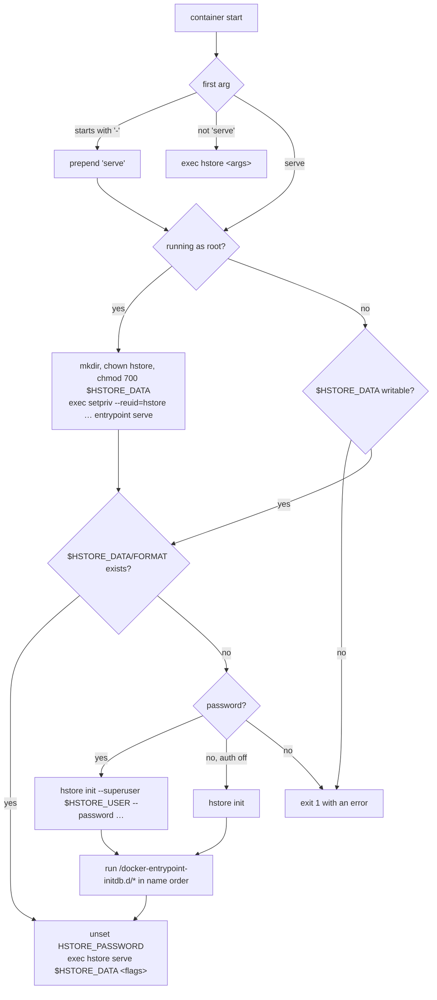

# Running HStore in Docker

The image works like the official PostgreSQL image. On first start it initialises the data directory from
environment variables, runs your init scripts, and then runs the server in the foreground as PID 1. Logs go to
stderr, a health check is built in, and `docker stop` shuts down cleanly.

## Quick start

```
docker run -d --name hstore \
  -e HSTORE_PASSWORD=change-me \
  -p 7432:7432 -p 7480:7480 \
  -v hstore-data:/var/lib/hstore/data \
  hstore

docker logs -f hstore                                        # follow the server log
open http://localhost:7480                                   # Studio: sign in as hstore / change-me
docker exec -it hstore hstore connect 127.0.0.1:7432 --user hstore   # shell inside the container
```

Inside the container, `hstore connect` takes the password from `HSTORE_PASSWORD` in the container
environment, so no prompt appears. The user comes from `--user` or `HSTORE_USER`. When `HSTORE_USER` was passed
to `docker run`, `docker exec -it hstore hstore connect 127.0.0.1:7432` needs no options at all.

## Image layout

| Path / item | Value |
|---|---|
| binary | `/usr/local/bin/hstore` (GraalVM native image, no JVM in the runtime image) |
| entrypoint | `/usr/local/bin/docker-entrypoint.sh` |
| default command | `serve` |
| data directory | `/var/lib/hstore/data` (`HSTORE_DATA`), declared as a `VOLUME`, mode `0700` |
| init scripts | `/docker-entrypoint-initdb.d/` |
| user | `hstore` (uid/gid `999`, configurable with the `UID`/`GID` build args). The image sets `USER hstore`, so the server and `docker exec` run as `hstore`. Started explicitly as root (`--user root`), the entrypoint fixes data-directory ownership and re-executes itself as `hstore` through `setpriv`. |
| ports | `7432` wire protocol, `7480` Studio |
| stop signal | `SIGTERM` |
| base | `debian:bookworm-slim` |

Image environment defaults: `HSTORE_DATA=/var/lib/hstore/data`, `HSTORE_LISTEN_ADDRESS=0.0.0.0`,
`HSTORE_PORT=7432`, `HSTORE_STUDIO_PORT=7480`.

## Environment variables

### Initialisation (read only when the data directory is empty)

| Variable | Description |
|---|---|
| `HSTORE_PASSWORD` | Password of the superuser created at first start. Required unless `HSTORE_PASSWORD_FILE` is set or `HSTORE_AUTHENTICATION=off`. The entrypoint unsets it before `exec`ing the server. |
| `HSTORE_PASSWORD_FILE` | Path of a file containing the password, for Docker or Kubernetes secrets. Takes precedence over `HSTORE_PASSWORD`. |
| `HSTORE_USER` | Superuser name. Default `hstore`. The superuser has role `ADMIN` in tenant `default`. |
| `HSTORE_AUTHENTICATION=off` | Initialise without a superuser. Because it is also the `authentication` setting, the server then accepts unauthenticated connections. |

Without a password and without `HSTORE_AUTHENTICATION=off`, the container refuses to start:

```
[entrypoint] error: the database is uninitialised and HSTORE_PASSWORD is not set
[entrypoint]        set HSTORE_PASSWORD (or HSTORE_PASSWORD_FILE) to create a superuser,
[entrypoint]        or HSTORE_AUTHENTICATION=off to allow unauthenticated connections
```

### Server settings

Every [setting](configuration.md) is available as `HSTORE_<SETTING>`, for example `HSTORE_DURABILITY=async`,
`HSTORE_LOG_STATEMENT=ddl`, `HSTORE_LOG_MIN_DURATION_MS=250`, `HSTORE_CACHE_NODES=262144`,
`HSTORE_STUDIO=off`, `HSTORE_EMBEDDING_PROVIDER=ollama`. Environment variables override
`/var/lib/hstore/data/hstore.conf`. Flags appended to the `docker run` command line override both:

```
docker run … hstore --log_statement all --max_connections 500
```

A first argument starting with `-` is treated as flags to `serve`. Any other first argument runs that `hstore`
command instead of the server, for example `docker run --rm hstore version`.

`page_size` takes effect only at initialisation, because it is stored in `<data>/FORMAT`. Setting
`HSTORE_PAGE_SIZE` to a different value on an existing volume makes startup fail.

## Initialisation sequence



Init scripts run once, in lexical order, after `init` and before the server starts:

| Extension | Handling |
|---|---|
| `*.hql` | `hstore exec $HSTORE_DATA <file>` as the embedded `system` principal. Output is discarded. If a statement fails, `exec` exits `1` and the container stops, because the entrypoint runs under `set -e`. Fix the script and remove the volume before retrying. |
| `*.sh` | Sourced by the entrypoint shell. It may call `hstore exec "$HSTORE_DATA" -c '…'`. |
| other | Ignored, with a log line. |

```
docker run -d -e HSTORE_PASSWORD=change-me \
  -v "$PWD/examples/clinical-claims.hql:/docker-entrypoint-initdb.d/01-clinical-claims.hql:ro" \
  -p 7432:7432 -p 7480:7480 hstore
```

## Health check

```
HEALTHCHECK --interval=10s --timeout=3s --start-period=10s --retries=3 \
    CMD hstore ping "127.0.0.1:${HSTORE_PORT}" > /dev/null || exit 1
```

`hstore ping` connects, reads the banner and disconnects without sending a request. When `HSTORE_TLS=on` it
connects over TLS, trusting `HSTORE_TLS_CA_FILE` or the server's own certificate, and skips the hostname check
since it always talks to `127.0.0.1`. It needs no credentials and
logs only at DEBUG level, so probes do not fill the log. `docker inspect -f '{{.State.Health.Status}}' hstore`
reports `healthy` once the server accepts connections.

## Logs

The server writes [PostgreSQL-style lines](logging.md) to stderr:

```
$ docker logs hstore
2026-10-04 00:58:25 UTC [entrypoint] running /docker-entrypoint-initdb.d/01-clinical-claims.hql
2026-10-04 00:58:26 UTC [entrypoint] initialisation complete; starting server
2026-10-04 00:58:26.448 UTC [1] LOG:  [main] starting hstore 0.1.0 on Java 25.0.2+10-jvmci-b01
2026-10-04 00:58:26.450 UTC [1] LOG:  [main] configuration: listen_address=0.0.0.0 (environment), port=7432 (environment), studio_port=7480 (environment)
2026-10-04 00:58:26.471 UTC [1] LOG:  [recovery] recovered generation 158: replayed 0 commits from lsn 156,430, discarded 0 unfinished transactions and 0 non-durable commits
2026-10-04 00:58:26.487 UTC [1] LOG:  [engine] database at /var/lib/hstore/data is ready: generation 158, 1 data segments, page size 16,384, SYNC durability, PAGE_REFERENCES wal
2026-10-04 00:58:26.490 UTC [1] LOG:  [studio] studio listening on http://0.0.0.0:7480
2026-10-04 00:58:26.490 UTC [1] LOG:  [server] listening on 0.0.0.0:7432
```

Statement logging is off by default. Use `HSTORE_LOG_STATEMENT` (`ddl`, `mod`, `all`) and
`HSTORE_LOG_MIN_DURATION_MS` to turn it on.

## Shutdown

`docker stop` sends `SIGTERM` to PID 1, the server. Its shutdown hook stops Studio, closes client connections
(aborting their open transactions), takes a final checkpoint and releases the data-directory lock:

```
LOG:  [main] received shutdown request; closing connections and checkpointing
LOG:  [engine] checkpoint complete: generation 159, lsn 158,332, 1 wal segments retained, 33 ms
LOG:  [engine] database at /var/lib/hstore/data shut down cleanly
```

A clean shutdown usually takes milliseconds. Large caches need longer, so give the container a grace period
(`docker stop -t 30`, or `stop_grace_period` in Compose). If the container is killed instead, the next start
performs [crash recovery](../transactions/wal-and-recovery.md). With `durability=sync`, no acknowledged
commit is lost.

## Docker Compose

The repository's [`docker-compose.yml`](../../docker-compose.yml) builds the image, publishes both ports,
loads the clinical-claims example on first start and keeps data in a named volume:

```yaml
services:
  hstore:
    build: .
    image: hstore:latest
    restart: unless-stopped
    ports:
      - "7432:7432"
      - "7480:7480"
    environment:
      HSTORE_USER: admin
      HSTORE_PASSWORD: change-me
      HSTORE_LOG_STATEMENT: ddl
      HSTORE_LOG_MIN_DURATION_MS: "250"
    volumes:
      - hstore-data:/var/lib/hstore/data
      - ./examples/clinical-claims.hql:/docker-entrypoint-initdb.d/01-clinical-claims.hql:ro
    stop_grace_period: 30s

volumes:
  hstore-data:
```

```
docker compose up -d
docker compose exec hstore hstore connect 127.0.0.1:7432      # HSTORE_USER is set, no prompt
docker compose down            # keeps the volume; add -v to delete the data
```

## Building the image

The [`Dockerfile`](../../Dockerfile) has two stages:

1. **build**: `ghcr.io/graalvm/native-image-community:25`. Runs `./mvnw install -DskipTests` and then
   `./mvnw -Pnative package -pl server`, producing a native `hstore` executable linked against glibc (Serial GC, `-O2`,
   `-march=compatibility` so the image runs on any CPU of the target architecture). A BuildKit cache mount
   keeps `~/.m2` between builds.
2. **runtime**: `debian:bookworm-slim` plus the binary, the entrypoint and the non-root user.

```
docker build -t hstore .
docker build --build-arg UID=1000 --build-arg GID=1000 -t hstore .   # match a host uid for bind mounts
docker buildx build --platform linux/amd64,linux/arm64 -t you/hstore --push .
```

The native-image step needs several GB of memory in the Docker builder and takes a few minutes.

## Bind mounts and permissions

With a named volume, ownership is handled automatically: Docker copies the image directory's ownership onto an
empty volume. A bind mount (`-v /srv/hstore:/var/lib/hstore/data`) must be writable by uid `999`. Either
`chown 999:999 /srv/hstore` on the host, or start the container once with `--user root`: the entrypoint then
runs `chown -R hstore:hstore` on the directory and drops to `hstore` before starting the server. If the
directory is not writable, the entrypoint stops with an error that says so instead of failing later.

`docker exec` runs as `hstore`. Embedded commands (`check`, `exec`, `shell`) cannot run beside the server,
because the server holds the data-directory lock (`database … is opened by another process`). Run them in a separate
container on the same volume while the server container is stopped, and as `-u hstore` so new files keep the
right owner.

## Backups and upgrades

HStore has no online backup command yet. Back up a stopped database by copying its directory. Every file is
written copy-on-write or append-only, and a stopped directory is self-consistent:

```
docker stop hstore
docker run --rm -v hstore-data:/data -v "$PWD":/backup debian:bookworm-slim \
  tar czf /backup/hstore-$(date +%F).tgz -C /data .
docker start hstore
```

Restore by extracting into an empty volume and starting a container on it. The initialisation step is
skipped because `FORMAT` exists. To verify a backup, run
`docker run --rm -v restored:/var/lib/hstore/data hstore check /var/lib/hstore/data`.

To upgrade, stop the container, back up the volume, and start the new image on the same volume. `FORMAT`
records the on-disk format version (`format=2`, packed segment extents) and the page size. Both are checked at
open. A directory written in another format is refused with
`database … uses storage format N; this build reads format 2 (packed segment extents); export and reload it`,
so the server never misreads it. Export the data with HQL against the old version and reload it into a fresh
volume.
