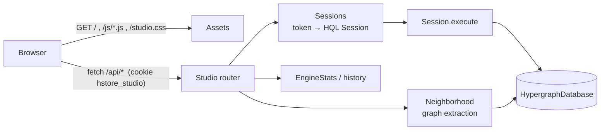

# HStore Studio

HStore Studio is the web console built into the `hstore` binary. It plays the role of pgAdmin for
PostgreSQL or Neo4j Browser for Neo4j: a query console, a native hypergraph visualiser, a schema browser, a
live engine dashboard and user and tenant administration. `hstore serve` starts it on
[`studio_port`](configuration.md#network-and-sessions) (default `7480`) next to the wire protocol, so a
single container gives you both.

```
docker run -d -p 7432:7432 -p 7480:7480 -e HSTORE_PASSWORD=change-me hstore
open http://localhost:7480          # sign in as hstore / change-me
```

The frontend is dependency-free ES modules and CSS
([`server/src/main/resources/studio`](../../server/src/main/resources/studio)), compiled into the native
image as resources. It loads nothing from a CDN, so it works air-gapped.



## Pages

| Page | Purpose |
|---|---|
| **Console** | HQL editor with syntax highlighting, line numbers, completion of keywords, type, property and role names, and persistent history. Results appear as a stream of frames, newest first. Each frame offers *Graph* (when the result contains atoms), *Table*, *JSON* and *Plan* (when the statement produced a trace) tabs. Multi-statement scripts produce one frame per statement. A failed statement gets a red frame with the error code and stops the script. |
| **Explore** | Full-screen hypergraph canvas. You can load a sample of every hyperedge type, search (`42`, `@42`, `Type:key`, `Type:'key'` or a type name), expand atoms, hide types from the legend, switch render modes and toggle labels. An inspector panel shows the selected atom. A generation slider re-renders the same atoms at any retained generation. |
| **Schema** | Cards for every node and hyperedge type: kind, visible atom count, properties with `indexed`/`required` badges and value type, JSON indexes, and roles. *Explore* and *Query* buttons on each card, plus a branch table. |
| **Dashboard** | ADMIN only. Polls `/api/stats` every 2 s. Metric tiles show generation, commits, conflicts, group-commit batch size, cache hit rate, data written, WAL and uptime. Live charts show commits/s, pages written/s, pages read/s and WAL throughput. A segment map is coloured by state (active, sealed, compacting, retired) and filled by bytes used relative to the segment size. Hover a segment for its bytes, node images and live images. Configuration and recovery details are listed. |
| **Access** | ADMIN only. Tenants (usage and quotas) and users, forms to create users and tenants, and *Drop* for users. Every action runs ordinary HQL (`CREATE USER …`, `CREATE TENANT … QUOTA (…)`, `DROP USER …`) through the session. |

The top bar shows the current branch, user, tenant, role and the latest durable generation (polled every
5 s). The rail holds a light/dark theme toggle (stored per browser) and *Sign out*.

## Visualising hypergraphs

A hypergraph cannot be drawn faithfully as a pairwise graph. Studio uses a hybrid encoding:

| Element | Encoding |
|---|---|
| node | Circle filled with its type colour. Radius grows with `log2(1 + degree)`. |
| hyperedge | A *hub*: a diamond for set edges, a rounded square for ordered edges, sized by `log2(1 + cardinality)`. |
| membership | A *spoke* from hub to member. Width encodes the member weight (0–1). Role names, weights and positions are labelled on hover or selection. |
| higher-order membership | A dashed spoke, used when the member is itself a hyperedge (an edge of edges). |
| hyperedge extent | A *hull*: the smoothed convex hull of the member circles padded by 10 layout units, filled translucently in the edge type's colour. Hulls are drawn largest first, and their opacity falls as the number of hulls rises. |
| ordered edge | A curved arrow chain through the members in `position` order, with `#position` labels. |
| truncated hyperedge | A dashed arc beside the hub, meaning only the first *members* (default 64) members were loaded. |
| pinned atom | A small dot. Dragging an atom pins it. *Release* in the inspector unpins it. |

**Render modes** (legend): *Both* draws hubs and hulls. *Hubs* draws no hulls. *Hulls* hides hubs except for
the focused edge and for edges that are members of other edges.

**Focus.** Hovering or selecting an atom dims everything outside its neighbourhood. For a node, the
neighbourhood is the node, its incident edges and their members, and only the node's own spoke in each edge
is labelled. For an edge, it is the edge, its members and the edges containing it, and every spoke is
labelled.

**Layout.** A force simulation with Barnes–Hut repulsion (θ² = 0.81) over a quadtree, spring links from hubs
to members (rest length `30 + 9·√k` for a *k*-member edge), weak gravity and velocity decay. A new
graph is pre-settled synchronously (40–220 steps depending on size), fitted, animated, and fitted once more
when it cools. Expanded atoms enter next to the atom that was expanded.

**Selection and hit-testing.** Clicking a node or hub selects it. Clicking inside a hull with no atom under the
cursor selects the smallest hull containing the point, so nested hyperedges stay selectable.

**Time travel.** The Explore slider spans the generations retained by `history_limit`. Moving it re-fetches
the atoms currently on screen at that generation (`/api/graph?ids=…&generation=G`). Atoms that did not
exist yet disappear, membership changes are re-drawn, and positions are kept. *Live* returns to the newest
generation.

**Export.** The image button writes a PNG of the current viewport, including the background colour.

## Keyboard and mouse

| Context | Input | Action |
|---|---|---|
| editor | `Ctrl`/`⌘` + `Enter` | run the editor contents |
| editor | `Ctrl` + `Space` | open completions |
| editor | `Tab` / `Enter` with completions open | accept completion |
| editor | `↑` / `↓` with completions open | move in the list |
| editor | `Esc` | close completions |
| editor | `Tab` | insert two spaces |
| editor | `Ctrl` + `↑` / `↓` | previous / next history entry (100 kept, stored in `localStorage`) |
| graph | wheel, trackpad pinch | zoom about the cursor |
| graph | drag background | pan |
| graph | drag atom | move and pin |
| graph | click | select atom or hull. Click empty space to clear. |
| graph | double-click | expand: load the atom's incident hyperedges and their members |
| graph (focused) | `+` / `=`, `-`, `f`, `Esc` | zoom in, zoom out, fit, clear selection |

## HTTP API

Every response carries `Cache-Control: no-store`, `X-Content-Type-Options: nosniff`,
`Referrer-Policy: no-referrer` and

```
Content-Security-Policy: default-src 'self'; script-src 'self'; style-src 'self'; img-src 'self' data: blob:;
                         connect-src 'self'; frame-ancestors 'none'; base-uri 'none'; form-action 'self'
```

### Authentication and sessions

* `POST /api/login` creates a server-side session holding one HQL `Session`, the same object a wire connection
  uses, and returns the cookie
  `hstore_studio=<43-char base64url token>; Path=/; HttpOnly; SameSite=Strict`. The token is 256 bits from
  `SecureRandom`. The cookie also gets `; Secure` when Studio itself serves HTTPS (`tls = on`) or when the
  login request carries `X-Forwarded-Proto: https` from a TLS-terminating proxy.
* Sessions expire after `studio_session_minutes` without a request. Expiry aborts the session's open
  transaction.
* Every `POST` must carry the header `X-HStore-Studio` (any value) and is rejected with `403` otherwise.
  Together with `SameSite=Strict`, this blocks cross-site request forgery: a cross-origin page cannot set a custom
  header without a CORS preflight, which the server never approves.
* Request bodies are limited to 1 MiB (`413`).

Errors use one JSON shape:

```json
{"error": {"code": "UNAUTHENTICATED", "message": "sign in to use the studio", "retryable": false}}
```

`code` is an `HStoreException` code (`INVALID_SCHEMA`, `RETRYABLE_CONFLICT`, …), `UNAUTHENTICATED` for
`401`, `HTTP_<status>` for other HTTP-level errors, or `INTERNAL` for `500`.

### Endpoints

| Method and path | Auth | Description |
|---|---|---|
| `GET /` and static files | no | `index.html`, `studio.css`, `favicon.svg`, `js/**.js`. Paths must match `([a-z0-9-]+/){0,3}[a-z0-9-]+\.(html|css|js|svg)`. Everything else returns `404`, which rules out path traversal. |
| `GET /api/info` | no | Product, version, current generation, `authenticationRequired`, `startedAt`, and `session` (or `null`). |
| `POST /api/login` | no | Body `{"user","password"}`. With authentication off, an empty body `{}` opens a `system` session. `401` on failure. After 5 failed attempts from one client address within 15 minutes, further attempts get `429` until the window ends; a successful login resets the count. |
| `POST /api/logout` | no | Closes the session and expires the cookie. |
| `POST /api/query` | yes | Body `{"script": "<HQL>"}`. Executes in the session; see below. |
| `GET /api/graph` | yes | Hypergraph neighbourhood for visualisation; see below. |
| `GET /api/schema` | yes | Types visible to the session: `id`, `name`, `kind`, `version`, `count`, `roles`, `properties[{name,type,indexed,required}]`, `jsonIndexes[{path,type}]`, plus `branches`. |
| `GET /api/history` | yes | `{"current": G, "generations": [{"id","wallTime","txnId"}]}` for the retained generations. |
| `GET /api/stats` | ADMIN | Engine counters, segments (`id`, `state`, `pages` = node images, `bytes`, `live`), recovery outcome, configuration (`pageSize`, `segmentBytes`, `durability`, `walMode`, `cacheBytes`, `historyLimit`, `checkpointWalBytes`), semantic index generation, Studio session count, branches. |

Example `GET /api/info`:

```json
{"product":"HStore Studio","version":"0.1.0","generation":159,"authenticationRequired":true,
 "startedAt":1791076106094,"session":null}
```

#### `POST /api/query`

Each statement produces one *frame*. Execution stops at the first failing statement, which contributes an
`error` frame. Statements are logged through the same [statement logger](logging.md#statement-logging) as the
wire protocol, with origin `studio`.

```json
{"generation": 159,
 "session": {"user":"admin","tenant":"default","role":"ADMIN","branch":"main","inTransaction":false},
 "results": [
   {"statement":"Members","text":"MEMBERS OF @120","elapsedMicros":1335,
    "columns":["position","member","roles","weight","valid","qualifier"],
    "rows":[[-1,{"label":"Provider:'dr-clara-voss'","id":27},"investigator",1,"[*, *)",null], …],
    "message":"5 rows",
    "atoms":[27,45,83,89,92]}
 ]}
```

`atoms` lists the distinct atom ids found anywhere in the result cells, at most 500. The console feeds it to
`/api/graph?connect=true`. A traced result also carries `trace`
(`generation`, `plan`, `estimatedRows`, `pagesRead`, `cacheHits`, `elapsedMicros`). A failed statement is
`{"statement": "...", "text": "...", "error": {code, message, retryable}}`. `text` is the statement's own
source (from `Parser.sourced`). A script that fails to parse yields a single frame with `"statement": "Parse"`,
the whole script as `text`, and the error.

#### `GET /api/graph`

| Parameter | Default | Bounds | Meaning |
|---|---|---|---|
| `ids` | | | Comma-separated seed atom ids. |
| `type` + `key` | | | Seed by canonical key (`reader.find(type, key)`). |
| `type` alone | | | Sample of that type: `limit/2` atoms with `connect=true`. |
| *(no seed)* | | | Sample across types: up to `limit/4` atoms in total, spread across every hyperedge type, or across node types if there are no hyperedge types. |
| `expand` | `0` | 0–3 | Breadth-first levels of incident hyperedges to add from the seeds. |
| `connect` | `false` | | Also add hyperedges (cardinality ≤ 4096) that contain at least two seeds. |
| `limit` | `300` | ≤ 5000 | Maximum atoms before members are expanded. |
| `members` | `64` | ≤ 1000 | Members listed per hyperedge. Their atoms are always included. |
| `incident` | `100` | ≤ 5000 | Incident hyperedges scanned per atom. |
| `generation` | latest | | Read at a retained generation. |

The response is `{"generation": G, "complete": bool, "atoms": [...]}`. Each atom is

```json
{"id":120,"type":"Investigation","typeId":8,"kind":"SET_EDGE","label":"Investigation #120","degree":0,
 "properties":{"reason":"duplicate billing pattern"},
 "cardinality":5,"truncated":false,
 "members":[{"atom":27,"roles":["investigator"],"weight":1.0,"position":-1}, …]}
```

`cardinality`, `truncated` and `members` appear only for hyperedges. `key` appears for keyed nodes. The label is
the first of the `name`, `title` or `label` properties, else the canonical key, else `Type #id`. Results are
filtered by the session's tenant like any other read. `complete` is `false` when `limit` cut the
neighbourhood short.

## Security notes

* Studio binds to [`listen_address`](configuration.md), the same address as the wire protocol. The default is
  loopback; the Docker image binds `0.0.0.0`.
* With `tls = on` it serves HTTPS using `tls_certificate_file` and `tls_key_file`. Otherwise it speaks plain
  HTTP; for anything beyond localhost either enable TLS or put it behind a TLS-terminating reverse proxy (nginx,
  Caddy, Traefik) and expose only the proxy. Configure the proxy to send `X-Forwarded-Proto: https` (nginx:
  `proxy_set_header X-Forwarded-Proto $scheme;`) so session cookies are marked `Secure`. The header is
  trusted as given, so do not expose the plain-HTTP port to clients who could forge it.
* `authentication = off` gives every Studio visitor a `system` ADMIN session. Never combine it with a reachable
  port.
* Disable Studio with `studio = off` (`HSTORE_STUDIO=off`) when only the wire protocol is needed.
* User-supplied strings are rendered with DOM text nodes, never as HTML. The HQL highlighter escapes before
  wrapping tokens. The CSP forbids inline scripts.

## Developing Studio

`studio_assets` serves the frontend from a directory and re-reads files on every request, so edits appear on
reload without restarting the server or losing your session:

```
./mvnw -q install -DskipTests
java -p engine/target/classes:database/target/classes:server/target/classes \
     -m io.hstore.server/io.hstore.server.Main serve /tmp/studio-db \
     --studio_assets server/src/main/resources/studio
```

See [development](../development.md#working-on-studio) for the module layout of the frontend.
