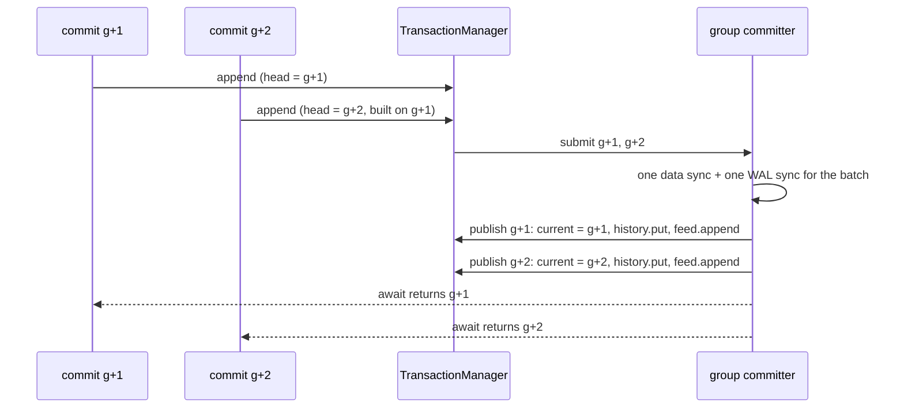

# Catalog, generations, branches and the change feed

The engine's entire logical state at a point in time is one small immutable object, the **generation**. This document covers what a generation contains, how slots name the trees inside it, and how generations are published, retained, branched, checkpointed and streamed. Sources are under `engine/src/main/java/io/hstore/engine/{catalog,feed,txn}`.

## Slots and the root vector

A **slot** (`catalog/Slot.java`) names one top-level tree:

```java
record Slot<V>(int id, String name, TreeSchema<V> schema, Kind kind)   // Kind = PRIMARY | DERIVED
```

* **Primary** slots are written by transactions through keyed writes (`Workspace.write`). Every primary write produces a `SlotChange(slot, key, before, after)`. That change is recorded for the change feed and passed to every registered `Derivation`.
* **Derived** slots are maintained only by derivations. `Workspace.replace` installs a new tree, and `Op.SlotWrite` refuses to write a derived slot directly. Derived slots are never sent to the feed, because they can be recomputed from primary changes.

A **root vector** (`catalog/RootVector.java`) is an immutable `Map<Integer, Ref>` from slot id to tree root. Empty roots are omitted. `RootVector.sameAs` compares two vectors by reference identity of their roots (`Ref.same`, which compares page ids for stored refs), so "nothing changed" is detected in O(slots).

`SlotRegistry` (`catalog/SlotRegistry.java`) holds every slot the engine knows: the built-in `EngineSlots.ALL` plus the extension slots passed in `EngineOptions.slots()`. It rejects two different slots with the same id. Recovery, the change feed codec, the compactor and the verifier all resolve a slot id to its schema through this registry.

### Engine slots

| Id | Name | Kind | Tree schema(s) | Content |
|---:|---|---|---|---|
| 1 | `catalog` | primary | `atoms` #1 | atom id → `AtomRecord` ([topology.md](topology.md#atoms)) |
| 2 | `reverse` | derived | #5 / #6 | member → edges (reverse incidence) |
| 3 | `type-index` | derived | #7 / #8 | `(tenant, type)` → atoms |
| 4 | `canonical` | derived | #9 / #10 | `hash(tenant, type, key)` → atom |
| 5 | `symbols` | primary | #11 | symbol id → role name or role set |
| 6 | `symbol-lookup` | derived | #12 / #13 | `symbol.hash()` → symbol id |
| 7 | `requests` | primary | #14 | `hash(requestId)` → `RequestRecord` (idempotent commit keys) |

Tree schema ids 2–4 are the nested topology schemas (`set-members`, `ordered-members`, `order-index`). They never appear as slot roots; they are reached only through edge records.

### Extension slots

Slot ids from `EngineSlots.FIRST_EXTENSION_SLOT = 32` and tree schema ids from `FIRST_EXTENSION_SCHEMA = 64` are reserved for the layers above. `HypergraphDatabase.extensionSlots()` registers:

| Id | Name | Kind | Schema(s) | Package |
|---:|---|---|---|---|
| 32 | `types` | primary | #64 | `db.schema` (type definitions) |
| 33 | `type-names` | primary | #65 | `db.schema` (name → type id) |
| 34 | `properties` | primary | #66 | `db.property` (property bags by atom) |
| 35 | `property-index` | derived | #69 → #67 / #68 | `db.property` (tenant-scoped value indexes) |
| 36 | `embeddings` | primary | #72 | `db.semantic` |
| 37 | `qualifiers` | primary | #73 | `db.evidence` |
| 38 | `evidence` | primary | #74 | `db.evidence` |
| 39 | `state` | primary | #75 | `db.temporal` (state bindings) |
| 40 | `signals` | primary | #76 | `db.signal` |
| 41 | `signals-by-atom` | derived | #77 / #78 | `db.signal` |
| 42 | `views` | primary | #79 | `db.view` (descriptors) |
| 43 | `view-data` | primary | #80 | `db.view` (materialized cells) |
| 44 | `tenants` | primary | #81 | `db.security` |
| 45 | `users` | primary | #82 | `db.security` |
| 46 | `tenant-usage` | primary | #83 | `db.security` (quota accounting) |

The database also passes extra `Derivation`s (`PropertyIndexing`, `Signals.INDEXING`). They run after the engine's own (`REVERSE_INCIDENCE`, `ATOM_INDEXES`, `SYMBOL_LOOKUP`) inside every workspace. Every extension tree is therefore versioned, branched, time-travelled, checkpointed, recovered and compacted exactly like the engine's trees, with no extension-specific code in the engine.

## Generations

```java
record Generation(long id, long wallTime, long txnId, long nextAtom, long nextTxn, Map<Integer, Branch> branches)
record Branch(int id, String name, int parent, long baseGeneration, long createdAt, State state, RootVector roots)
```

* `id` increases by exactly one per published commit (`Generation.successor`). Generation 0 (`Generation.initial`) has a single empty `main` branch (id 0).
* `wallTime` is the commit's `System.currentTimeMillis()`, used by `AS OF` queries.
* `nextAtom` and `nextTxn` are high-water marks for the id allocators. They are persisted in each WAL `Commit` record, so ids are never reused after a crash.
* A commit changes exactly one branch. The successor copies the branch map and replaces that one entry; all other branches are shared by reference.

The `TransactionManager` keeps two pointers:

* **`head`**: the latest generation *appended* to the WAL. It is updated under `commitLock` inside `append`. The next committer builds on it, so commits pipeline without waiting for fsync.
* **`current`**: the latest generation *published*, meaning durable when `Durability.SYNC`. It is set by the group committer's publication callback, strictly in generation order. New snapshots and transactions pin `current`, so readers never observe a commit that could be lost in a crash.



### Pins

Every `Snapshot` and `Transaction` pins its generation id in `TransactionManager.pins`, a `ConcurrentSkipListMap<Long, Integer>` reference count. `oldestPinned()` is the smallest pinned id. The compactor consults it before deleting retired segments (see [maintenance.md](maintenance.md)), and `trimHistory` never drops a pinned generation.

## History retention and time travel

Published generations are kept in `TransactionManager.history` (a `ConcurrentSkipListMap` by id).

* `trimHistory` runs on every publication. While there are more than `historyLimit` entries (`history_limit`, default 64), it drops the oldest generations that are neither pinned nor current, skipping over pinned ones rather than stopping at them. A long-running snapshot therefore keeps only its own generation alive beyond the limit; older unpinned generations are still trimmed.
* `snapshotAt(generation, branch)` pins the generation and opens a snapshot over its root vector. A generation that has been trimmed fails with `generation N is no longer retained`.
* `generationAsOf(wallTime)` returns the newest retained generation with `wallTime <= t`.

Time travel needs no undo log. Copy-on-write never overwrites a page, so an old generation's root vector still points at valid pages, and reading the past is exactly as fast as reading the present. Compaction moves the pages a retained generation still needs and keeps their page numbers, so old root vectors stay valid after their segments are deleted ([maintenance.md](maintenance.md#reclaim)). Compaction therefore never shortens the time-travel window.

The retained history is also persisted. `Checkpointer` writes up to `historyLimit` past generations into the catalog image, and `Recovery` appends every replayed generation, so time travel survives restarts.

HQL:

```sql
HISTORY LIMIT 5;
AT GENERATION 140 MATCH NODE p:Patient RETURN count(*);
AS OF '2026-10-04T00:45:00Z' MEMBERS OF @120;
DIFF GENERATION 140 AND 157;
```

## Branches

Branches are named, independently writable lines of generations that share pages with their parent:

| Operation | `TransactionManager` method | Effect |
|---|---|---|
| create | `createBranch(name, parentId)` | `id = max(existing ids) + 1`. Copies the parent's `RootVector` *by reference*, so creating a branch is O(1) with no page writes. Records `baseGeneration = head.id` and appends a `BranchMeta` WAL record. Active names must be unique. |
| write | `begin(TxnOptions.onBranch(id))` | Commits change only that branch's entry in the next generation. |
| merge | `markMerged(id)` → `closeBranch(id, MERGED)` | Sets the state to `MERGED` **and empties its roots**, so its pages are no longer reachable from the current generation. The actual three-way merge of contents happens in `db.temporal.BranchMerge` before this call. |
| drop | `dropBranch(id)` → `closeBranch(id, DROPPED)` | The same, with state `DROPPED`. `Generation.branch` rejects a dropped id. |

`main` (id 0) cannot be closed. `StorageEngine.branches()` lists only `ACTIVE` branches. Because closed branches carry empty root vectors, they keep no pages alive.

```sql
CREATE BRANCH what_if;
USE BRANCH what_if;
INSERT EDGE Claim {amount: 10.0} MEMBERS (@Patient:'asha-rao' AS patient);
DIFF BRANCH what_if AND main;
MERGE BRANCH what_if INTO main ON CONFLICT FAIL;
```

## Catalog images (checkpoints)

`CatalogImage(current, history, segments, checkpointLsn, feedEnd)` (`catalog/CatalogImage.java`) is the durable snapshot that recovery starts from. Every integer is a varint, and every string is a varint length followed by UTF-8 bytes:

```text
Generation  := id | wallTime | txnId | nextAtom | nextTxn | branchCount | Branch*
Branch      := id | name | parent | baseGeneration | createdAt | u8 state | rootCount | (slot | Ref)*
Ref         := i64le pageId | Summary   (pageId 0 ⇒ empty, no summary)
CatalogImage:= Generation(current) | historyCount | Generation* | segmentCount
               | (segmentId | u8 state | pages | retiredAt)* | checkpointLsn | feedEnd
```

`CatalogStore.publish` (`catalog/CatalogStore.java`) frames the image and writes it durably:

```text
i32le magic 0x54414348 | i32le crc32c(payload) | i64le payload length | payload
```

1. Write `catalog/generations/%016x.cat` (named by the current generation id) to a `.tmp` file, `force(true)` it, rename it atomically over the target, and fsync the directory.
2. Write `catalog/manifest`, containing the file name, the same way.
3. Delete all but the three newest `.cat` files.

`loadLatest` trusts the manifest. If the manifest is missing or the file it names fails the magic, length or checksum test, it falls back to the newest valid `.cat` file. A torn checkpoint therefore costs at most the WAL replay from the previous checkpoint. See [wal-and-recovery.md](../transactions/wal-and-recovery.md) and [maintenance.md](maintenance.md#checkpoints).

## Change feed

The change feed (`feed/ChangeFeed.java`) is an ordered, durable stream of logical commit events. The database layer uses it to keep derived state outside the trees: the HNSW embedding index (`SemanticPlane`), materialized views, and planner statistics. External consumers can tail it too.

### Event

```java
record CommitEvent(long generation, long txnId, long wallTime, int branch,
                   List<MemberChange> members, List<SlotChange<?>> slots)
```

* `members` holds every topology change in the commit, in emission order (`Added`, `Removed`, and `Updated` with locators before and after).
* `slots` holds every **primary**-slot change, with full before and after values.

### Encoding (`feed/FeedCodec.java`)

```text
varint generation | varint txnId | varint wallTime | varint branch
varint memberCount | member*
    member := u8 tag (0 added, 1 removed, 2 updated) | varint edge
              | zigzag locator [| zigzag locatorAfter for tag 2] | incidence [| incidenceAfter for tag 2]
    incidence := IncidenceCodec.SEQUENCED encoding of a single incidence (topology.md)
varint slotCount | slotChange*
    slotChange := varint slotId | zigzag key | u8 flags (1 = before present, 2 = after present)
                  | [before value] | [after value]          (the slot schema's own ValueCodec)
```

Values whose codec holds references are **detached** before encoding: every nested `Ref` is replaced with `Ref.EMPTY`. An `EdgeRecord` in the feed therefore carries its type, kind and version but not page pointers, which would be meaningless to a consumer and invalid after compaction. Topology is conveyed by the `members` list instead.

### File format

The full format, retention and consumer contract are documented in [change-feed.md](change-feed.md). In summary, the feed is a sequence of segment files, `feed/%016x.feed`, each named by the global byte offset at which it starts. A new segment is rolled at 64 MiB, after fsyncing the previous one and the directory. Each segment holds frames:

```text
i32le payloadLength | i32le crc32c(payload) | i64le generation | payload (FeedCodec)
```

* `append(event)` is called from the publication callback, so frames appear strictly in generation order and only for published commits. Events with `generation <= lastGeneration` are ignored, which makes replay during recovery idempotent.
* A sparse in-memory index maps every 64th generation (`INDEX_STRIDE`) to its file offset. `replay(after)` seeks to the floor entry and scans forward.
* On open, `scan()` validates frames from the start and truncates at the first torn or corrupt frame. Headers and bodies are read with `readFully`, which loops over `FileChannel.read` until the buffer is full or end of file is reached. A short read in the middle of the file is therefore never taken for a torn tail.
* During recovery, the WAL's `Feed` records are re-appended for every replayed commit, and `truncateAfter(recoveredGeneration)` removes frames of commits that were discarded. The feed is therefore exactly as long as the recovered history.
* `sync()` is called by the checkpointer; the feed is not on the commit's fsync path. Its durability comes from the WAL `Feed` record, from which it is rebuilt.
* **Retention.** After every checkpoint, `StorageEngine` calls `feed.retain(current − feedRetention)`. This deletes whole segments whose events all precede that generation, unless a registered `hold` (for example, a subscriber that has not caught up) still needs them. `covers(after)` tells a consumer whether a replay from `after` is still possible.

### Subscriptions

```java
ChangeFeed.Subscription subscription = engine.feed().subscribe(afterGeneration, event -> { ... });
long caughtUpTo = subscription.acknowledged();
subscription.close();
```

`subscribe` starts a virtual thread (`feed-subscriber`). It replays every event after `afterGeneration`, then blocks on a condition that `append` signals (re-checking every 250 ms), and delivers new events in order. `acknowledged()` is the generation of the last event the consumer has fully processed. `SemanticPlane` uses it to wait for freshness (`Consistency.FRESH`) and persists it together with its index, so a restart resumes from the persisted generation instead of rebuilding.

`replay(after)` gives the same events as a finite `Stream<CommitEvent>`, which is useful for audits and change-data-capture exports.
