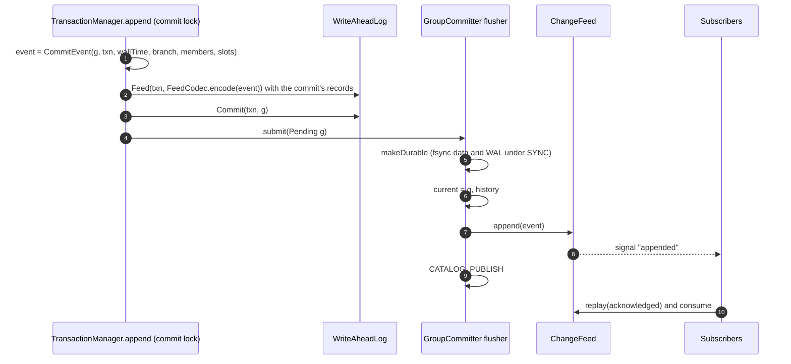
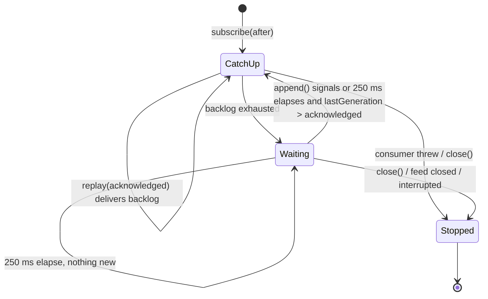
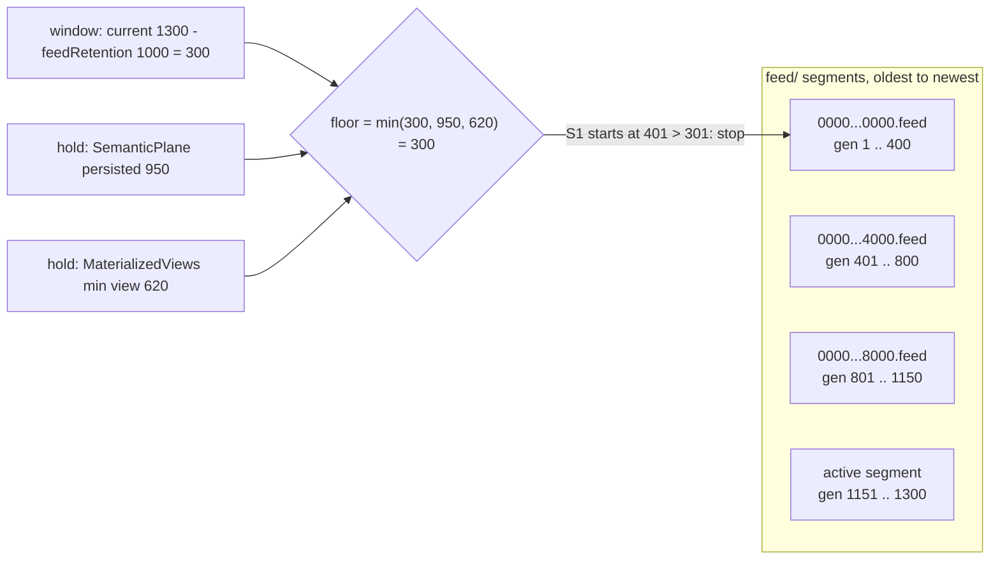

# Change feed

The change feed is an append-only, generation-ordered log of the **logical** effect of every commit: which incidences were added, removed or updated, and which primary-slot keys changed from which value to which value. It is how in-process services (semantic index, materialized views, statistics) follow the database without polling trees, and how `HISTORY` answers "what changed recently".

Source of truth:

| Concern | File |
|---|---|
| Event record | `engine/src/main/java/io/hstore/engine/feed/CommitEvent.java` |
| Event codec | `engine/src/main/java/io/hstore/engine/feed/FeedCodec.java` |
| File, index, replay, subscriptions | `engine/src/main/java/io/hstore/engine/feed/ChangeFeed.java` |
| Event construction and publication | `engine/src/main/java/io/hstore/engine/txn/TransactionManager.java` (`append`) |
| Recovery of the feed | `engine/src/main/java/io/hstore/engine/maintenance/Recovery.java` |
| Incidence encoding | `engine/src/main/java/io/hstore/engine/topology/IncidenceCodec.java` |

Related: [transactions](../transactions/transactions.md), [WAL and recovery](../transactions/wal-and-recovery.md), [topology](topology.md), [catalog and generations](catalog-and-generations.md), [architecture overview](../architecture/overview.md).

## 1. The event

```java
record CommitEvent(long generation, long txnId, long wallTime, int branch,
                   List<MemberChange> members, List<SlotChange<?>> slots)
```

* `generation`, `txnId`, `wallTime` and `branch` identify the commit; generations are global across branches, so events from all branches interleave in one total order.
* `members` is the workspace's `memberChanges()` list in emission order: `MemberChange.Added(edge, incidence, locator)`, `Removed(edge, incidence, locator)`, `Updated(edge, before, after, locatorBefore, locatorAfter)`. The locator is the member id for `SET` edges and the order label (position key in the order tree) for `ORDERED` edges (`Hyperedge.locator`).
* `slots` is the workspace's `slotChanges()`: one `SlotChange(slot, key, before, after)` per effective write to a **primary** slot (`Workspace.write` records nothing when `before.equals(after)` and nothing for derived slots). Derived indexes are not in the feed; consumers that need them recompute or read the tree.

`CommitEvent.isEmpty()` is true when both lists are empty. Empty events are never logged: `createBranch`, `closeBranch` and compaction (`relocate`) commits advance the generation but leave no feed entry. Consumers must therefore treat generation numbers in the feed as **increasing, not contiguous**.

## 2. When events are written



Two copies exist:

1. The **WAL `Feed` record** (type 5), written inside the commit before the `Commit` record. It is the durable copy and is covered by the commit's atomicity.
2. The **feed segments**, appended by the group-commit flusher during publication: after the commit is durable (under `SYNC`) and **immediately after** the generation becomes `current`. Appends happen on the single flusher thread in queue order, so the feed is in generation order.

Appending after `current.set(next)` guarantees that a subscriber told about generation `g` can read it: any transaction it starts sees `g` or later. Subscribers such as `MaterializedViews` look up the atoms an event mentions, so an event that arrived before its commit was visible would make them skip changes they can't yet see. The opposite direction is not guaranteed: a reader whose snapshot is `g` may find `feed.lastGeneration()` still at `g - 1` while `g` is being published. Code that combines a snapshot with the feed replays only up to `min(snapshot, feed.lastGeneration())` (`SemanticPlane`, `MaterializedViews.refresh`) and picks up the rest from the next event. A committing client is acknowledged only after both steps, so its own commit is always in the feed by then. The commit is durable before either step, so an event is never rolled back by a process crash.

The feed is *not* forced on every append. The active segment is forced by `ChangeFeed.sync()` during every checkpoint (before the catalog image is published) and on `close()`; a segment is also forced when the feed rolls past it. After a crash, recovery re-appends the `Feed` records of every replayed commit (`ChangeFeed.append` ignores any generation `<= lastGeneration`, so events already present are not duplicated), then `truncateAfter(recovered generation)` removes events for commits that did not survive, and forces the active segment. The checkpoint ordering (`feed.sync()` before the catalog image that moves the WAL start) guarantees that events older than the checkpoint LSN are already durable in the feed when their WAL records are truncated.

A subscriber can therefore never observe an event for a commit that recovery would roll back under `SYNC`, and after a restart the feed is exactly the events of the recovered commits.

## 3. File format

The feed is a sequence of segment files `feed/%016x.feed`, each named by the **global byte position** of its first byte (positions are continuous across segments, like WAL LSNs). The segment size is `EngineOptions.walSegmentBytes` (default 64 MiB; `StorageEngine` passes it to `ChangeFeed.open`). Each event is one frame (`FRAME_HEADER = 16`, little-endian):

```text
offset  size  field
0       4     i32  payload length L
4       4     i32  CRC-32C of the payload
8       8     i64  generation
16      L     FeedCodec payload
```

**Append and roll.** `append` writes the frame to the last segment. Before writing, it rolls when there is no segment yet or the active segment already holds at least `segmentBytes` (`end - lastKey >= segmentBytes`). A frame is never split, so a segment may exceed `segmentBytes` by at most one frame, and every segment begins at a frame boundary. Rolling forces the previous segment, creates `%016x.feed` at the current `end`, and forces the `feed/` directory.

**Open.** `restore()` opens every `*.feed`, scans all frames from the first segment's start to the end of the last segment, and stops at the first frame that is short, has a negative or overlong length, or fails its CRC. `cutAt(position)` then deletes every segment that starts after the failure point and truncates the segment containing it, so the feed always ends at a clean frame.

**Index.** Each `Segment` remembers `firstGeneration`, the generation of its first frame. An in-memory sparse index `generation -> global position` holds the first frame of **every segment** and every 64th frame thereafter (`INDEX_STRIDE = 64`). `startFor(g)` seeks to the floor entry (never before the first retained segment) and scans forward, so locating a generation costs at most 63 frame reads plus segment boundaries.

```text
feed/
  0000000000000000.feed   generations      1 .. 120,411   bytes [0, 67,108,903)
  0000000004000027.feed   generations 120,412 .. 241,007  starts at 0x4000027 = 64 MiB + 39-byte overshoot of the last frame
  0000000008000051.feed   generations 241,008 .. 250,000  active segment
```

(Generation and byte numbers are illustrative.)

### FeedCodec payload

Primitive encodings are those of [WAL and recovery, section 2](../transactions/wal-and-recovery.md#2-primitive-encodings).

```text
varlong  generation
varlong  txnId
varlong  wallTime (epoch milliseconds)
varint   branch
varint   member change count M
M x member change:
    u8       tag            0 = Added, 1 = Removed, 2 = Updated
    varlong  edge
    tag 0/1: svarlong locator, Incidence
    tag 2:   svarlong locatorBefore, svarlong locatorAfter, Incidence before, Incidence after
varint   slot change count S
S x slot change:
    varint   slot id
    svarlong key
    u8       flags          bit 0: before present, bit 1: after present
    [value]  before, encoded by the slot schema's ValueCodec with keys = {key}
    [value]  after,  same codec
```

`Incidence` uses `IncidenceCodec.SEQUENCED` for a single value:

```text
u8        column flags: bit 0 ROLES, 1 WEIGHT, 2 VALID_FROM, 3 VALID_TO, 4 DATA_REF, 5 QUALIFIER
svarlong  member
for each flagged column, in that order:
    u8    presence bitmap (bit 0 set: this incidence has the column)
    value varlong for ROLES, DATA_REF, QUALIFIER; svarlong for WEIGHT, VALID_FROM, VALID_TO
```

A column is flagged only when it differs from the default (`roleSet != NO_ROLES`, `weight != Weight.ONE`, `validFrom != Long.MIN_VALUE`, `validTo != Long.MAX_VALUE`, `dataRef != 0`, `qualifier != 0`), so a plain membership costs 1 byte of flags plus the member id.

Slot values that contain tree references (codecs with `holdsRefs()`, for example an `EdgeRecord` with member and order roots) are **detached** before encoding: every embedded `Ref` is replaced with `Ref.EMPTY`. Feed events therefore never pin pages, and compaction may relocate or reclaim any page without invalidating the feed. Consumers that need the topology of an edge read it from a snapshot, or use the event's `members` list.

### Example

A commit at generation 159 by transaction 152 on `main` that inserts node 37 into the existing set edge 90 with role set 3 and default weight decodes as:

```json
{
  "generation": 159, "txnId": 152, "wallTime": 1791074720259, "branch": 0,
  "members": [ { "Added": { "edge": 90, "locator": 37, "incidence": { "member": 37, "roleSet": 3 } } } ],
  "slots": []
}
```

The slot list is empty: membership changes update the edge's `EdgeRecord` roots through `Workspace.store`, which replaces the catalog tree directly instead of going through `Workspace.write`, so they surface only as member changes. The member change costs 1 (tag) + 1 (edge) + 1 (locator, zigzag of 37 = 74) + 1 (flags `0x01`) + 1 (member, zigzag 74) + 1 (presence bitmap) + 1 (roles) = 7 bytes. Creating node 37 in the same commit would add one `SlotChange` for `EngineSlots.CATALOG` (slot 1) with `before` absent and `after` the new `NodeRecord`.

## 4. Reading the feed

| API | Semantics |
|---|---|
| `lastGeneration()` | Generation of the newest frame (0 for an empty feed). |
| `firstGeneration()` | Smallest `firstGeneration` over retained segments; `Long.MAX_VALUE` for an empty feed. |
| `covers(after)` | True if every event with `generation > after` that was ever appended is still present: the feed is empty or `after + 1 >= firstGeneration()`. Consumers call it before resuming from a persisted watermark. |
| `size()` | Retained bytes, `end - first segment start`; stored in checkpoints as `CatalogImage.feedEnd`. |
| `segmentCount()` | Number of segment files. |
| `hold(LongSupplier)` | Registers a retention hold (section 6); returns a `Hold` whose `close()` removes it. |
| `retain(keepAfter)` | Deletes whole leading segments no longer needed (section 6); returns the bytes released. |
| `replay(after)` | Lazy `Stream<CommitEvent>` of every event with `generation > after`, in order, bounded by the `end` observed when the stream was created. |
| `subscribe(after, consumer)` | Starts a virtual thread (`feed-subscriber`) that delivers every event with `generation > after`, then every future event, to `consumer`, in order. Returns a `Subscription`. A retention gap is logged as a warning. |
| `subscribe(after, consumer, gap)` | Same, but calls `gap.missed(acknowledged, firstRetained)` when retention has released events the subscriber has not seen yet, then resumes at the first retained event. |
| `truncateAfter(g)` | Recovery only: cut the feed before the first frame with `generation > g` (later segments are deleted). |

A subscription is a loop:

```text
acknowledged = after
while not stopped and feed not closed:
    for event in replay(acknowledged):          -- catch-up and steady state are the same code path
        consumer.accept(event)
        acknowledged = event.generation
    wait on "appended" until lastGeneration > acknowledged (250 ms timeout per wait)
```

Properties:

* **Ordered, gap-free relative to the feed, single-threaded per subscription.** The consumer is called from one thread in generation order; each event is delivered after the previous `accept` returned.
* **At-most-once per subscription instance.** `acknowledged` advances after `accept` returns. If `accept` throws, the subscriber logs `change feed subscriber stopped at generation g` at `WARNING` and stops; the event is not redelivered by that subscription.
* **Restartable.** A consumer that persists `acknowledged` (or an equivalent watermark) can resubscribe from it after a restart and receive exactly the events after it, provided `covers(watermark)` is true. A consumer that needs this guarantee across retention must register a hold at its watermark.
* **Retention gaps are reported, never silent.** Before delivering, the subscription positions its reader and then checks `covers(acknowledged)`. If retention has already released events after `acknowledged`, the `Gap` callback runs with the last acknowledged generation and the first retained one, and delivery resumes at the first retained event. Checking after positioning the reader closes the race with a concurrent `retain`: a segment released after the check makes the read stop rather than skip, and the next iteration reports the gap. `Statistics` refreshes its catalog on a gap, and `SemanticPlane` clears and rebuilds its index from the embeddings slot.
* `Subscription.close()` sets a flag; the thread exits after the current event or within 250 ms. `ChangeFeed.close()` wakes and stops all subscribers.



## 5. Consumers

| Consumer | Subscribes from | What it does with events |
|---|---|---|
| `SemanticPlane` (`database/.../semantic/SemanticPlane.java`) | the generation of its persisted vector index if `covers(persisted)` is true, otherwise it rebuilds from a snapshot and subscribes from that snapshot's generation | For `main`-branch events, upserts or removes HNSW entries for every `Embedding.EMBEDDINGS` slot change, compacts an index whose tombstone ratio exceeds 0.3, and advances `indexedGeneration` for every event. `FRESH` similarity queries wait (bounded by 5 s) for `indexedGeneration >= min(snapshot generation, feed.lastGeneration())`; because the feed is appended before `current` advances, and empty commits have no feed entry, this target is always reached promptly. Holds the feed at its persisted generation. |
| `MaterializedViews` (`database/.../view/MaterializedViews.java`) | `current` at database open | For `main`-branch events with member changes, refreshes every `CONTINUOUS` view. `refresh` itself uses `replay(descriptor.lastGeneration())` up to `lastGeneration()` and applies degree or cardinality deltas; `staleness` counts pending events; `ACTIVITY` views are built from `replay(0)`, i.e. from the oldest **retained** event. Refresh commits only write view slots (slot changes, no member changes), so they do not retrigger the subscriber. Holds the feed at the minimum `lastGeneration` over all view descriptors. |
| `Statistics` (`database/.../stats/Statistics.java`) | `current` at database open | Counts member and slot changes and recomputes the planner's cardinality/degree histograms after more than 10,000 changes. |
| `HISTORY` statement (`database/.../query/Executor.java`) | n/a (one-shot `replay`) | Lists the last N events: generation, transaction, time, branch, number of member and slot changes. Only retained events can be listed. |

Signals (`database/.../signal/Signals.java`) and the temporal layer read trees and snapshots directly and do not consume the feed. `Temporal.events(CommitEvent)` converts an event into per-edge `TopologyEvent`s but is not currently called.

## 6. Retention and holds

The feed is trimmed only at the front and only in whole segments, under two kinds of constraint:

* **Generation window.** After every checkpoint (and after its listeners ran), `StorageEngine.timedCheckpoint` calls `feed.retain(current - feedRetention)`. `EngineOptions.feedRetention` defaults to 100,000 generations and must be at least 1; the server exposes it as `feed_retention_generations` (`HSTORE_FEED_RETENTION_GENERATIONS`). Because generations are counted, not events, a database with many empty commits retains fewer events than the window suggests.
* **Holds.** `hold(LongSupplier)` registers a consumer watermark, like a PostgreSQL replication slot: the feed keeps every event after the supplied generation, whatever the window says. The supplier is evaluated at every `retain` call, so it reports the consumer's live position. Holds are in-memory and must be re-registered at open; `Long.MAX_VALUE` means "no constraint".

| Holder | Supplied generation |
|---|---|
| `SemanticPlane` | `persistedGeneration` (the generation of the last persisted vector index), or `Long.MAX_VALUE` before the first persist. The plane persists in a checkpoint listener, which runs before `retain`, so the hold advances with every checkpoint. |
| `MaterializedViews` | `min(descriptor.lastGeneration)` over all views (read in a fresh snapshot), or `Long.MAX_VALUE` when there are none. |

`retain(keepAfter)`:

```text
floor = min(keepAfter, every hold's current value)
for segments S0, S1, ... in order:
    if S(i+1) does not exist or S(i+1).firstGeneration > floor + 1: stop
    delete S(i)              -- every event in S(i) precedes S(i+1).firstGeneration <= floor + 1
drop index entries that point before the new first segment
log "change feed released N bytes; generations after F are retained"
```

A segment is deleted only when its **successor** starts at or before `floor + 1`, which proves that every event `> floor` lives in the successor or later. The active segment is never deleted (it has no successor), so the feed always retains at least the newest segment, and the effective retention is between `feedRetention` generations and `feedRetention` generations plus one segment.



In the example nothing is released because `S1.firstGeneration = 401 > floor + 1 = 301`. Had the window been 500 (`keepAfter = 800`) the floor would be `min(800, 950, 620) = 620`: `S0` is deleted (`S1` starts at 401 `<= 621`), `S1` is kept because `S2` starts at 801 `> 621`; the materialized view at generation 620 still needs events 621 .. 800 from `S1`.

`covers(after)` is the consumer-side check. `SemanticPlane.load` refuses a persisted index whose generation the feed no longer covers (for example after the plane was disabled for a long time, so its hold was not registered while retention ran) and rebuilds from the embeddings slot instead of silently missing updates.
