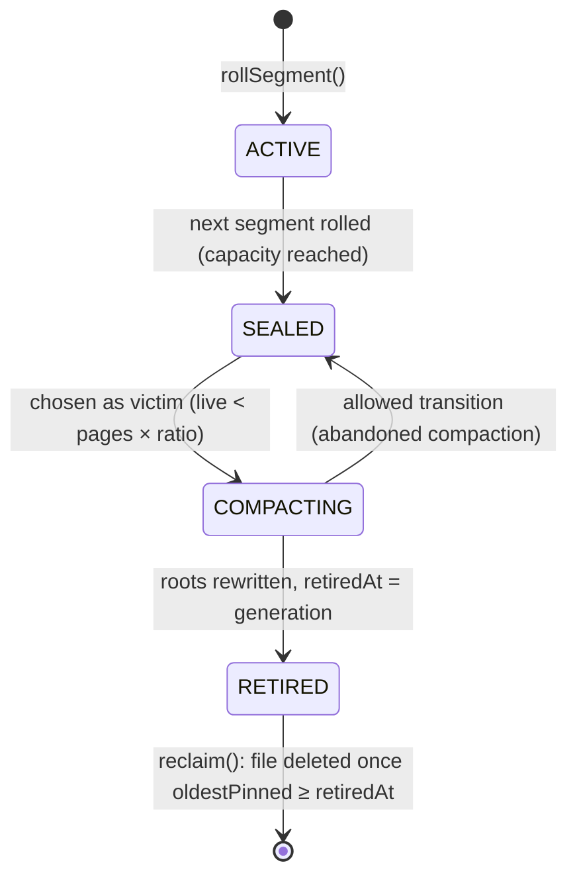

# Maintenance: checkpoints, compaction and verification

Copy-on-write storage never overwrites data, so three background concerns replace in-place update:

* **Checkpoints** bound recovery time and WAL size.
* **Compaction** returns the space of unreachable node images to the file system.
* **Verification** proves that what is on disk is internally consistent.

Sources are under `engine/src/main/java/io/hstore/engine/maintenance/`, plus `StorageEngine.java`, `tree/TreeWalker.java` and `tree/TreeVerifier.java`.

## Who runs what

| Trigger | Action | Code |
|---|---|---|
| Engine open, after recovery | checkpoint, then reclaim | `StorageEngine` constructor |
| `hstore-maintenance` virtual thread, every 500 ms (skipped when the `maintenance` lock is busy) | checkpoint if `walSinceCheckpoint() > checkpointWalBytes`; a compaction pass when more than `checkpointWalBytes` of node images were written since the previous pass (followed by a checkpoint if anything was relocated); then reclaim | `StorageEngine.maintain` |
| `CHECKPOINT;` (HQL), `StorageEngine.checkpoint()` | checkpoint | `timedCheckpoint` |
| `COMPACT;` (HQL), `StorageEngine.compact()` | compact, checkpoint, reclaim | `StorageEngine.compact` |
| `StorageEngine.close()` | final checkpoint, then shutdown | `close` |

Checkpoint and compaction are serialized by `StorageEngine.maintenance`, a `ReentrantLock`. Background compaction plays the role of PostgreSQL's autovacuum. Its trigger is write volume, `pages.bytesWritten()` advancing by more than `checkpoint_wal_mb` since the last pass, so an idle database never pays for a liveness walk. The pass only relocates segments whose live ratio is below `compaction_live_ratio`, and `COMPACT;` runs the same pass on demand.

Every checkpoint is logged, and then the checkpoint listeners run. The database registers `SemanticPlane.persist`, which saves the HNSW index alongside the catalog. A sample log line:

```text
2026-10-04 06:25:10.429 IST [23683] LOG:  [engine] checkpoint complete: generation 198, lsn 203,200, 1 wal segments retained, 25 ms
```

## Checkpoints

`Checkpointer.checkpoint()` (`maintenance/Checkpointer.java`) runs inside `TransactionManager.exclusive(...)`. That holds the commit lock **and drains the group committer**, so every appended commit is also published and nothing is in flight. Then:

1. `pages.sync()` fsyncs every dirty segment file.
2. `feed.sync()` fsyncs the active feed segment.
3. It captures `current`, `lsn = wal.end()`, and the retained history: all retained generations except current, newest first, at most `historyLimit`.
4. `catalog.publish(new CatalogImage(current, history, pages.segments(), lsn, feed.size()))` writes the image durably and atomically ([catalog-and-generations.md](catalog-and-generations.md#catalog-images-checkpoints)). The image includes every segment's `(id, state, pages, units, retiredAt)`.
5. It appends a `WalRecord.Checkpoint(0, generation, lsn)` and calls `wal.sync()`.
6. `wal.truncateBefore(lsn)` deletes WAL segment files that end before the checkpoint LSN. They are no longer needed, because the catalog image now covers them.
7. It remembers `lastLsn = lsn`.

**Trigger threshold.** `walSinceCheckpoint() = wal.end() − lastLsn` is compared with `checkpoint_wal_mb` (default 256 MiB, `EngineOptions.checkpointWalBytes`). In the default `PAGE_REFERENCES` WAL mode a commit logs about 20 bytes per new node image instead of the image itself. The threshold therefore corresponds to far more committed work than in `PAGE_IMAGES` mode, and replay after a crash stays short.

**What recovery gains.** Recovery loads the newest valid catalog image and replays only WAL records after `checkpointLsn` ([wal-and-recovery.md](../transactions/wal-and-recovery.md)). The image's persisted history makes time travel survive restarts. Its segment table restores the allocator position (`units`) and the compaction state machine.

## Space reclamation

### Why space needs reclaiming

Each commit writes fresh node images for every path it changes and references all unchanged subtrees from the previous generation ([persistent-tree.md](persistent-tree.md#update-algorithm)). The images a commit replaced stay on disk. They are still *reachable* while a retained generation references them, which is what makes time travel possible. Once the generations that reference them leave history, they are garbage.

Segments are append-only extents ([pages.md](pages.md#segment-files)), so garbage is never reused piecemeal. It is reclaimed one whole segment at a time:

1. measure how many images in each segment are still reachable;
2. copy the reachable ones out of mostly-dead segments;
3. publish roots that no longer reference those segments;
4. delete the files once no reader can still see the old roots.

### Segment state machine



`SegmentState.canTransitionTo` allows only the next state, plus `COMPACTING → SEALED`. `SegmentInfo.withState` throws on anything else. Only one segment is `ACTIVE` at a time: the one `PageStore.allocate` appends to. It is never chosen as a victim.

### Liveness

`Compactor.liveness()` returns, per segment, the number of distinct node images reachable from:

* **every retained generation** (`transactions.history()`) plus `current`;
* **every branch** in each of those generations;
* **every slot root** in each branch.

`TreeWalker.visit(root, schema, visited)` adds each `Ref.Stored` page id it meets to one shared `visited` set, so an image shared by several generations, branches or trees is counted once. It descends into branches and, for codecs that hold references (catalog edge records, promoted posting lists), into nested trees.

A detail that keeps this cheap: at height 0 of a tree whose codec has no nested references, the walker records the leaf's id **without loading it**. The summaries in the parent already prove that the leaf exists. Liveness is therefore proportional to the number of internal nodes plus the reference-holding leaves, not to total data size.

Liveness is exposed as `StorageEngine.liveness()`. The Studio dashboard shows it per segment next to `SegmentInfo.pages` and `bytes()`.

### Compaction

`Compactor.compact(liveThreshold)` (default threshold `compaction_live_ratio = 0.5`):

1. **Choose victims.** A victim is a `SEALED` segment, not the active one, with `live < pages × threshold`. Here `pages` is the number of images ever allocated in the segment, so the ratio is *live node images / images written*. If there are no victims, it reports and returns.
2. Mark the victims `COMPACTING`.
3. **Relocate.** For every **active** branch of the current generation, call `transactions.rewrite(branch, roots -> roots.map(relocate))`. `TreeWalker.relocate(ref, schema, moving, scope)` rebuilds as a fresh `Ref.Pending` copy:
   * every stored node whose page id lies in a victim segment;
   * every ancestor of such a node;
   * every leaf whose nested trees changed.

   Subtrees that touch no victim are returned unchanged and stay shared. `rewrite` publishes the new root vector as a normal commit: it takes the commit lock, materializes the pending nodes into the active segment, appends the WAL records and goes through the group-commit barrier. It also sets `relocationFence` to the new generation id.
4. Mark the victims `RETIRED` with `retiredAt = generation`. Retained history is **not** truncated. Generations older than `retiredAt` keep pointing at the old images in the victims, which stay on disk and readable, so `AT GENERATION` and `AS OF` keep working across a compaction. The victims are reclaimed once `history_limit` has rolled past `retiredAt`.

`StorageEngine.compact()` then checkpoints, which persists the new segment states and roots, and calls `reclaim()`.

Closed branches (`MERGED`, `DROPPED`) carry empty root vectors ([catalog-and-generations.md](catalog-and-generations.md#branches)), so they hold nothing alive and are not rewritten.

#### Interaction with running transactions

A transaction that started before the compaction holds roots from its base generation. At commit, one of these applies:

* **Fast path** (`Workspace.untouchedSince`). Every slot the transaction touched still has the same root in the latest generation. Compaction rewrote none of those slots, which means they contained no images in victim segments, so the transaction's versions of them cannot reference victims either. `rebasedOnto` combines them with the latest, relocated roots for every other slot.
* **Rebase path.** The op log is replayed onto the latest (relocated) roots, so the result references only relocated images.
* **Fence.** A transaction whose base generation predates `relocationFence` and that carries already-stored roots, such as spilled bulk-load subtrees (`Transaction.carriesStoredRoots`), cannot be safely rebased onto relocated data. It fails with a retryable conflict (`bulk-loaded roots of transaction N predate a compaction`), and `HypergraphDatabase.write` retries it.

### Reclaim

`Compactor.reclaim()` deletes the file and catalog entry of every `RETIRED` segment, but only when both of these hold:

* no generation is pinned, or `oldestPinned() ≥ retiredAt`; and
* the oldest generation still retained in history is `≥ retiredAt`, so no time-travel target can reference the segment.

**Why it must wait.** A `Snapshot` opened before compaction pinned a generation older than `retiredAt`. That generation's roots still point into the victim segments, and copy-on-write promises the reader those images stay valid until it closes. Deleting the file early would turn its next read into `segment does not exist`. Pins are reference counts per generation (`TransactionManager.pins`). Every `Snapshot.close()` and transaction end decrements them, and the maintenance thread retries `reclaim` every 500 ms. A retired segment therefore disappears within half a second of its last reader closing.

### History retention and pins

`TransactionManager.trimHistory` keeps at most `history_limit` generations (default 64). The current generation and every pinned generation are always kept. An unpinned old generation is dropped even when a newer pinned one exists, so one long-running snapshot keeps its own generation alive without holding back trimming of the generations before it.

## The change feed on open

`ChangeFeed.open` validates the feed segments frame by frame and truncates the file at the first incomplete or corrupt frame ([catalog-and-generations.md](catalog-and-generations.md#file-format)). Frame headers and bodies are read with loops that continue until the requested bytes have arrived or end of file is reached. A short read in the middle of the file is therefore never mistaken for a torn tail. Recovery then rewrites any missing frames from the WAL's `Feed` records and truncates frames past the recovered generation. After each checkpoint, `feed.retain(current − feedRetention)` deletes whole segments that are no longer needed; see [change-feed.md](change-feed.md).

## Verification (`hstore check`)

`hstore check <dir>` (`server/src/main/java/io/hstore/server/Check.java`) opens the engine (running recovery) and calls `TreeVerifier.verify(root, schema)` on every slot root of every active branch. The verifier ([persistent-tree.md](persistent-tree.md#verification)) decodes every reachable image, which checks:

* magic, format, page identity and CRC-32C (`PageHeader.verify`);
* the schema id against the tree being read (`NodeCodec.decode`);
* strictly ascending keys in leaves;
* separators that route each child;
* uniform height (balance);
* every stored child summary equal to its recomputed contents;
* every node summary equal to its entries;
* the root reference's summary equal to the tree.

Nested trees are verified recursively and shared images only once.

Output from a database loaded with `examples/clinical-claims.hql` (16 KiB maximum node size, packed extents):

```text
generation 157, recovered 0 commits from the log
branch main
  property-index          162 entries        9 pages      8 nested trees  height 1
  properties              122 entries        1 pages      0 nested trees  height 1
  ...
  catalog                 458 entries       86 pages     85 nested trees  height 1
verified 105 pages: checksums, ordering, balance and summaries are consistent
```

A failure names the page, for example `HStoreException.corrupt(pageId, "checksum mismatch")` or `"separator does not route child 3 in atoms#1"`, and the command exits non-zero.

## Operations summary

| Setting | Default | Effect |
|---|---|---|
| `checkpoint_wal_mb` | 256 | WAL volume since the last checkpoint that triggers a background checkpoint |
| `history_limit` | 64 | Generations kept for time travel (more while pinned) |
| `compaction_live_ratio` | 0.5 | A sealed segment is compacted when fewer than this fraction of its images are live |
| `page_size` | 16384 | Maximum node image size; fixed at `init` |

The segment capacity is `EngineOptions.pagesPerSegment × pageSize`, by default 16 384 × 16 KiB = 256 MiB, capped at 1 GiB by the 24-bit unit offset.

```sql
CHECKPOINT;
COMPACT;
STATS;
```

See [operations/](../operations/) for logging, the Studio dashboard's segment view and configuration layering.
