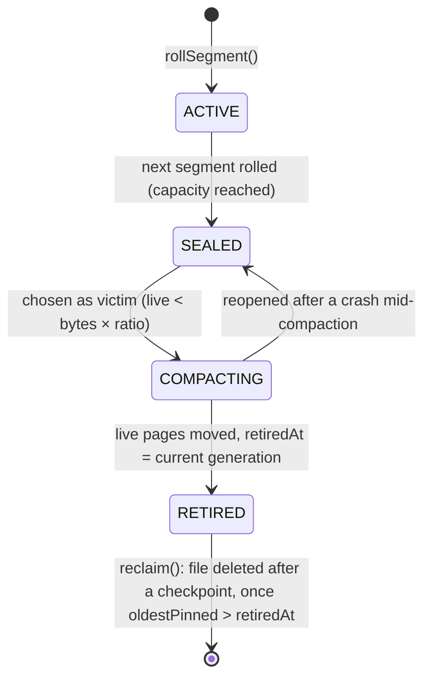

# Maintenance: checkpoints, compaction and verification

Copy-on-write storage never overwrites data, so three background concerns replace in-place update:

* **Checkpoints** bound recovery time and WAL size.
* **Compaction** returns the space of unreachable node images to the file system.
* **Verification** proves that what is on disk is internally consistent.

Sources are under `engine/src/main/java/io/hstore/engine/maintenance/`, plus `StorageEngine.java`, `tree/TreeWalker.java` and `tree/TreeVerifier.java`.

## Who runs what

| Trigger | Action | Code |
|---|---|---|
| Engine open, after recovery | checkpoint, then reclaim | `StorageEngine` constructor |
| `hstore-maintenance` virtual thread, every 500 ms (skipped when the `maintenance` lock is busy) | checkpoint if `walSinceCheckpoint() > checkpointWalBytes`; a compaction pass when more than `checkpointWalBytes` of node images were written since the previous pass (followed by a checkpoint if anything was moved); then reclaim | `StorageEngine.maintain` |
| `CHECKPOINT;` (HQL), `StorageEngine.checkpoint()` | checkpoint | `timedCheckpoint` |
| `COMPACT;` (HQL), `StorageEngine.compact()` | compact, checkpoint, reclaim | `StorageEngine.compact` |
| `StorageEngine.close()` | final checkpoint, then shutdown | `close` |

Checkpoint and compaction are serialized by `StorageEngine.maintenance`, a `ReentrantLock`. Background compaction plays the role of PostgreSQL's autovacuum. Its trigger is write volume, `pages.bytesWritten()` advancing by more than `checkpoint_wal_mb` since the last pass, so an idle database never pays for a liveness walk. The background pass empties at most one segment, the emptiest one whose live bytes are below `compaction_live_ratio` of its allocated bytes. `COMPACT;` empties every such segment on demand.

Every checkpoint is logged, and then the checkpoint listeners run. The database registers `SemanticPlane.persist`, which saves the HNSW index alongside the catalog. A sample log line:

```text
2026-10-04 06:25:10.429 IST [23683] LOG:  [engine] checkpoint complete: generation 198, lsn 203,200, 1 wal segments retained, 25 ms
```

## Checkpoints

`Checkpointer.checkpoint()` (`maintenance/Checkpointer.java`) runs inside `TransactionManager.exclusive(...)`. That holds the commit lock **and drains the group committer**, so every appended commit is also published and nothing is in flight. Then:

1. `pages.sync()` fsyncs every dirty segment file.
2. `feed.sync()` fsyncs the active feed segment.
3. It captures `current`, `lsn = wal.end()`, and the retained history: all retained generations except current, newest first, at most `historyLimit`.
4. `catalog.publish(new CatalogImage(current, history, pages.segments(), lsn, feed.size()))` writes the image durably and atomically ([catalog-and-generations.md](catalog-and-generations.md#catalog-images-checkpoints)). The image includes every segment's `(id, state, pages, units, retiredAt)`.
5. It appends a `WalRecord.Checkpoint(0, generation, lsn)` and calls `wal.sync()`.
6. `wal.truncateBefore(lsn)` deletes WAL segment files that end before the checkpoint LSN. They are no longer needed, because the catalog image now covers them.
7. It remembers `lastLsn = lsn`.

**Trigger threshold.** `walSinceCheckpoint() = wal.end() − lastLsn` is compared with `checkpoint_wal_mb` (default 256 MiB, `EngineOptions.checkpointWalBytes`). In the default `PAGE_REFERENCES` WAL mode a commit logs about 47 bytes per new node image instead of the image itself. The threshold therefore corresponds to far more committed work than in `PAGE_IMAGES` mode, and replay after a crash stays short.

**What recovery gains.** Recovery loads the newest valid catalog image and replays only WAL records after `checkpointLsn` ([wal-and-recovery.md](../transactions/wal-and-recovery.md)). The image's persisted history makes time travel survive restarts. Its segment table restores the allocator position (`units`) and the compaction state machine.

## Space reclamation

### Why space needs reclaiming

Each commit writes fresh node images for every path it changes and references all unchanged subtrees from the previous generation ([persistent-tree.md](persistent-tree.md#update-algorithm)). The images a commit replaced stay on disk. They are still *reachable* while a retained generation references them, which is what makes time travel possible. Once the generations that reference them leave history, they are garbage.

Segments are append-only extents ([pages.md](pages.md#segment-files)), so garbage is never reused piecemeal. It is reclaimed one whole segment at a time:

1. measure how many images in each segment are still reachable;
2. copy the reachable ones out of mostly-dead segments, byte for byte;
3. point their entries in the page directory at the copies;
4. delete the files once a checkpoint has made the new entries durable and no reader can still be using an old
   address.

No tree is rewritten and no generation is committed. Pages keep their numbers when they move
([pages.md](pages.md#page-numbers-and-the-page-directory)), so every node that points at a moved page, in every
generation and branch, still points at it.

### Segment state machine



`SegmentState.canTransitionTo` allows only the next state, plus `COMPACTING → SEALED`. `SegmentInfo.withState` throws on anything else. `PageStore.open` turns a `COMPACTING` segment back into `SEALED`, so a compaction cut short by a crash leaves the segment a candidate for the next pass. Only one segment is `ACTIVE` at a time: the one `PageStore.allocate` appends to. It is never chosen as a victim.

### Liveness

`Compactor.liveness()` returns, per segment, the bytes of distinct node images reachable from:

* **every retained generation** (`transactions.history()`) plus `current`;
* **every branch** in each of those generations;
* **every slot root** in each branch.

`TreeWalker.visit(root, schema, firstVisit)` calls `firstVisit` with each `Ref.Stored` page id it meets and stops descending when that returns false. The compactor sets one bit per page number in a `BitSet`, so an image shared by several generations, branches or trees is visited once, and the whole walk costs one bit per page number. Sizes come from the page directory afterwards: each set bit is looked up and its length added to its segment. The walker descends into branches and, for codecs that hold references (catalog edge records, promoted posting lists), into nested trees.

A detail that keeps this cheap: at height 0 of a tree whose codec has no nested references, the walker records the leaf's id **without loading it**. The summaries in the parent already prove that the leaf exists. Liveness is therefore proportional to the number of internal nodes plus the reference-holding leaves, not to total data size.

Liveness is exposed as `StorageEngine.liveness()` (live bytes per segment). The Studio dashboard shows it per segment next to `SegmentInfo.pages` and `bytes()`.

### Compaction

`Compactor.compact(liveThreshold)` (default threshold `compaction_live_ratio = 0.5`):

1. **Take a cut.** Inside `TransactionManager.exclusive`, which holds the commit lock and drains the group committer, record the retained generations (history plus `current`) and the set of segments that are already `SEALED`. Only those segments can become victims. A commit writes its pages under the commit lock but publishes its generation a moment later, and the active segment can fill up and be sealed while the walk runs. Taking the cut with nothing in flight means every page the walk doesn't see sits in a segment that wasn't sealed yet.
2. **Walk** the recorded generations as described under *Liveness*.
3. **Choose victims.** A victim is a segment from the cut, still `SEALED`, with `live bytes < allocated bytes × threshold`, so the ratio is *live bytes / bytes written*. Candidates are ordered from emptiest to fullest. The background pass takes only the first one (`compact(threshold, 1)`); `COMPACT` takes all of them. If there are no victims, it reports and returns.
4. Mark the victims `COMPACTING`.
5. **Move.** For every set bit whose directory entry points into a victim, `PageStore.copy` reads the image, checks it with `PageHeader.verify`, and writes the same bytes to the active segment. The header holds the page number, not the address, so neither the header nor the checksum changes. Every 4 MiB of copies, `PageStore.sync()` forces the segments and only then are the directory entries pointed at the copies. A directory entry therefore never reaches the disk pointing at bytes that are not already there.
6. Count the compaction in `TransactionManager.compacted()` (see below) and mark the victims `RETIRED` with `retiredAt` set to the current generation.

`StorageEngine.compact()` then checkpoints, which forces the page directory and persists the segment states, and calls `reclaim()`.

Nothing in this takes the commit lock except the short cut in step 1, and nothing commits. Commits carry on while pages move, readers keep using the node cache, whose entries are keyed by page number and stay valid, and retained history keeps working because old generations reach the moved pages through the same directory.

Moves are not written to the WAL. If the engine crashes before the checkpoint that follows a compaction, recovery replays the commits since the previous checkpoint and writes their original addresses back into the directory. Those addresses are in the victims, which are only deleted after that checkpoint, so they still hold the same bytes. The copies made before the crash become unreferenced space in the active segment, and the victims are picked again by a later pass. `CompactionTest` crashes at `COMPACTION_MOVE` and `COMPACTION_RETIRE`, with and without losing the directory writes made since the last checkpoint, and checks the data after reopening and after another compaction.

#### Interaction with running transactions

Compaction doesn't change any root, so transactions that started before it commit exactly as they would have without it, on the fast path or by rebasing.

The one exception is a bulk load. `Transaction.load` can spill finished subtrees to disk before commit (`Transaction.carriesStoredRoots`), and those pages are not reachable from any generation until the transaction commits, so the walk can't see them. If one of them sits in a victim, it isn't moved. Each transaction therefore records `TransactionManager.compactions()` when it begins, and a transaction that carries stored roots and saw fewer compactions than have since finished fails with a retryable conflict (`bulk-loaded roots of transaction N predate a compaction`). `HypergraphDatabase.write` retries it. The check applies on the fast path too, since compaction no longer changes the roots that would otherwise push such a transaction off it.

### Reclaim

`Compactor.reclaim()` deletes the file and catalog entry of every `RETIRED` segment, but only when both of these hold:

* a checkpoint has completed since the segment was retired (`Checkpointer.completed()`), so the new directory entries are durable and the WAL no longer holds commits whose addresses point into it; and
* no generation is pinned, or `oldestPinned() > retiredAt`.

Retained history no longer holds a segment back. Old generations reach moved pages through the directory like everything else, so `AT GENERATION` and `AS OF` keep working after the victims are gone.

**Why it must wait for readers.** A reader looks up a page's address and then reads the page. One that started before the move may have looked up an old address and not read it yet. Every reader and writer pins its generation, and anyone pinned at `retiredAt` or earlier may have started before the moves finished. Deleting the file early would turn that reader's next read into `segment does not exist`. Pins are reference counts per generation (`TransactionManager.pins`). Every `Snapshot.close()` and transaction end decrements them, and the maintenance thread retries `reclaim` every 500 ms. A retired segment therefore disappears within half a second of its last reader closing.

### History retention and pins

`TransactionManager.trimHistory` keeps at most `history_limit` generations (default 64). The current generation and every pinned generation are always kept. An unpinned old generation is dropped even when a newer pinned one exists, so one long-running snapshot keeps its own generation alive without holding back trimming of the generations before it.

## The change feed on open

`ChangeFeed.open` validates the feed segments frame by frame and truncates the file at the first incomplete or corrupt frame ([catalog-and-generations.md](catalog-and-generations.md#file-format)). Frame headers and bodies are read with loops that continue until the requested bytes have arrived or end of file is reached. A short read in the middle of the file is therefore never mistaken for a torn tail. Recovery then rewrites any missing frames from the WAL's `Feed` records and truncates frames past the recovered generation. After each checkpoint, `feed.retain(current − feedRetention)` deletes whole segments that are no longer needed; see [change-feed.md](change-feed.md).

## Verification (`hstore check`)

`hstore check <dir>` (`server/src/main/java/io/hstore/server/Check.java`) opens the engine (running recovery) and calls `TreeVerifier.verify(root, schema)` on every slot root of every active branch. The verifier ([persistent-tree.md](persistent-tree.md#verification)) decodes every reachable image, which checks:

* magic, format, page identity and CRC-32C (`PageHeader.verify`);
* the schema id against the tree being read (`NodeCodec.decode`);
* strictly ascending keys in leaves;
* separators that route each child;
* uniform height (balance);
* every stored child summary equal to its recomputed contents;
* every node summary equal to its entries;
* the root reference's summary equal to the tree.

Nested trees are verified recursively and shared images only once.

Output from a database loaded with `examples/clinical-claims.hql` (16 KiB maximum node size, packed extents):

```text
generation 157, recovered 0 commits from the log
branch main
  property-index          162 entries        9 pages      8 nested trees  height 1
  properties              122 entries        1 pages      0 nested trees  height 1
  ...
  catalog                 458 entries       86 pages     85 nested trees  height 1
verified 105 pages: checksums, ordering, balance and summaries are consistent
```

A failure names the page, for example `HStoreException.corrupt(pageId, "checksum mismatch")` or `"separator does not route child 3 in atoms#1"`, and the command exits non-zero.

## Operations summary

| Setting | Default | Effect |
|---|---|---|
| `checkpoint_wal_mb` | 256 | WAL volume since the last checkpoint that triggers a background checkpoint |
| `history_limit` | 64 | Generations kept for time travel (more while pinned) |
| `compaction_live_ratio` | 0.5 | A sealed segment is compacted when fewer than this fraction of its images are live |
| `page_size` | 16384 | Maximum node image size; fixed at `init` |

The segment capacity is `EngineOptions.pagesPerSegment × pageSize`, by default 16 384 × 16 KiB = 256 MiB, capped at 1 GiB by the 24-bit unit offset.

```sql
CHECKPOINT;
COMPACT;
STATS;
```

See [operations/](../operations/) for logging, the Studio dashboard's segment view and configuration layering.
