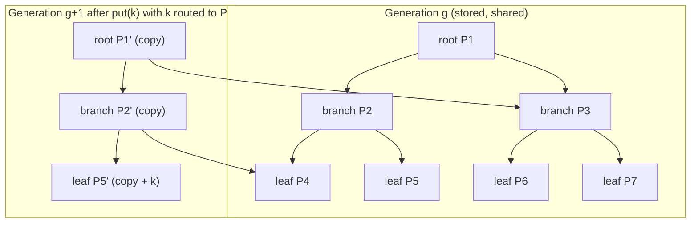

# The persistent counted B+tree

Every persistent structure in HStore is one data structure: a copy-on-write B+tree over signed 64-bit keys (`engine/src/main/java/io/hstore/engine/tree/`). That covers the atom catalog, every hyperedge's membership, the reverse incidence index, property indexes, symbols, users and views. Trees are *counted*: every child reference carries its subtree's entry count, so rank and select take O(log n). Trees are also *annotated*: every child reference carries a monoid `Summary` that queries use to skip subtrees without reading them.

This document describes the node structure, the write path, the summaries and the algorithms built on them. For the bytes on disk see [pages.md](pages.md). For how hyperedges use the tree see [topology.md](topology.md).

## Types at a glance

| Type | File | Role |
|---|---|---|
| `Tree<V>(schema, source, root)` | `Tree.java` | An immutable handle. Every update returns a new `Tree`; the old one stays valid. |
| `TreeSchema<V>(id, name, fingerprint, codec, measure)` | `TreeSchema.java` | Identity (1 byte, stored in every page header), fingerprint mode, value codec and entry measure. `KEY_BYTES = 10` is the worst-case varint key size. |
| `Ref` = `Empty` / `Pending(Node)` / `Stored(pageId, Summary)` | `Ref.java` | A child pointer. `Pending` points at an in-memory node that has not been written yet. `Stored` points at a page and carries the child's full summary. |
| `Node` = `Leaf` / `Branch` | `Node.java`, `Leaf.java`, `Branch.java` | The schema, an `owner` token (null means frozen and shared), and a lazily computed, cached `Summary`. |
| `NodeSource` | `NodeSource.java`, `PagedNodeSource.java` | Loads `Stored` refs into nodes, through `NodeCache`, then `PageStore`, then `NodeCodec.decode`. `NodeSource.ephemeral(pageSize)` is for purely in-memory trees. |
| `Layout(pageSize, leafBudget, maxFanout)` | `Layout.java` | Size limits derived from the page size. |
| `WriteScope` | `WriteScope.java` | The ownership token that decides which nodes may be mutated in place, plus an optional spill sink. |
| `TreeWriter` | `TreeWriter.java` | Path-copying insert, update, delete and join. |
| `BulkBuilder` | `BulkBuilder.java` | Bottom-up construction from ascending keys. |
| `TreeCursor` | `TreeCursor.java` | Bidirectional cursor with seek and summary-based pruning. |
| `TreeAlgebra`, `TreeDiff` | `TreeAlgebra.java`, `TreeDiff.java` | Intersection (leapfrog, synchronized descent, probing), union, difference, subset, equality and structural diff. |
| `Materializer` | `Materializer.java` | Freezes and encodes pending nodes into pages, post-order. |
| `TreeWalker`, `TreeVerifier` | | Reachability (liveness), relocation (compaction) and invariant checking. |

## Node structure

```text
Leaf                                   Branch
  long[]   keys      (sorted, unique)    long[] separators   (separators[0] unused for routing)
  Object[] values                        Ref[]  children
  int      size                          int    size, height (leaf = 0)
  int      keyBytes  (exact varint size) long   count       (cached sum of child counts)
  int      valueBytes(codec.maxSize sum)
  Object   owner     (WriteScope token, null when frozen)
  Summary  summary   (volatile, recomputed lazily after mutation)
```

**Routing.** `Branch.route(key)` binary-searches `separators[1..size-1]` for the last separator `<= key` and returns index 0 when there is none. `separators[0]` therefore never takes part in routing. A freshly grown root stores `Long.MIN_VALUE` there. When a branch is frozen (`Branch.frozenWith`), `separators[0]` is rewritten to the first child's `summary().min()`, so the encoded page carries its real lower bound and delta-encodes compactly.

**Page budget.** `Layout.of(pageSize)` computes:

```text
leafBudget = pageSize − 80 (PageHeader.SIZE) − 96 (Summary.MAX_ENCODED_BYTES) − 32 (reserve)
maxFanout  = leafBudget / (KEY_BYTES 10 + Ref.maxEncodedSize() (8 + 3 + 96))
maxValueBytes = leafBudget / 2 − KEY_BYTES        (largest inline value; larger values throw HStoreException.limit)
leaf underfull   ⇔ leaf.bytes()  < leafBudget / 4
branch underfull ⇔ branch.size() < max(2, maxFanout / 4)
```

| page size | leafBudget | maxFanout | maxValueBytes | leaf underfull below | branch underfull below |
|---:|---:|---:|---:|---:|---:|
| 4 096 | 3 888 | 34 | 1 934 | 972 B | 8 children |
| 16 384 (default) | 16 176 | 141 | 8 078 | 4 044 B | 35 children |
| 65 536 | 65 328 | 573 | 32 654 | 16 332 B | 143 children |

**Exact leaf sizing.** A leaf tracks its encoded size incrementally instead of counting entries:

* `keyBytes` is the exact size of the delta-varint key stream: `zigzag-varint(keys[0])` plus `Σ varint(keys[i] − keys[i−1])`.
* `Leaf.insert` and `Leaf.remove` adjust it with `insertionDelta`, which accounts for the two gaps a key creates or closes.
* `valueBytes` is the sum of `codec.maxSize(value)`.

A leaf splits as soon as `bytes() > leafBudget`. `Leaf.splitOff(budget)` walks entries until the left part holds half the bytes, then keeps advancing until the right part fits the budget. Leaves therefore fill by *bytes*, not by entry count. A leaf of 8-byte dense keys holds thousands of entries, and a leaf of large records holds only a few.

## Summaries: a monoid on every reference

`Summary` (`Summary.java`) is attached to every `Ref.Stored` and cached on every node:

| Field | Combine | Used for |
|---|---|---|
| `count` | sum | rank and select (`Tree.at`, `rankOf`), `Tree.size()`, cardinality, posting-list sizes |
| `min`, `max` | min, max | routing in `TreeCursor.seek`; range pruning (`overlaps`); disjointness tests in the set algebra |
| `weightSum`, `weightMin`, `weightMax` | sum (checked with `Math.addExact`), min, max | weighted member queries (`mayHaveWeightIn`); `PostingIndex.countRange` stores posting-set sizes as weights |
| `timeMin`, `timeMax` | min, max | valid-time pruning (`mayBeValidAt`, `mayOverlapInterval`) |
| `roleBits` | bitwise or | role pruning (`mayHaveRoles`) |
| `fingerprint` | depends on `FingerprintMode` | O(1) inequality detection, equality short-cuts, and content hashes of edges |

`Summary.EMPTY` is the identity element: count 0, min `Long.MAX_VALUE`, max `Long.MIN_VALUE`, fingerprint 0.

Leaves build their summary with a `Summary.Builder`, calling the schema's `EntryMeasure` once per entry. Branches build theirs with `Builder.merge(child.summary())`. Each entry measure decides which fields it feeds. Plain keyed trees use `EntryMeasure.keyed(valueHash)`, which only calls `entry(key, combine(mix(key), valueHash(value)))`. The incidence measure in `TopologySchemas` also feeds weight, validity and roles.

### Fingerprints

All arithmetic is modulo 2^64, using two's-complement `long` overflow. Let `h(e)` be an entry's hash as produced by the measure.

* **`FingerprintMode.SET`** (unordered contents):
  `F(S) = Σ_{e ∈ S} h(e)`, with `append(F, h) = F + h` and `concat(L, R, |R|) = L + R`.
  Addition is commutative and associative, so the fingerprint depends only on the *set* of entries, never on tree shape, split points or insertion order. Two trees built in different orders compare equal by fingerprint.

* **`FingerprintMode.SEQUENCE`** (order-sensitive contents, used for `ORDERED` hyperedges):
  `F(e₁…eₙ) = Σ_{i=1..n} h(eᵢ) · B^(n−i)`, with `B = 0x9E3779B97F4A7C15`.
  `append(F, h) = F·B + h` and `concat(L, R, |R|) = L · B^|R| + R`. `B^|R|` is computed by binary exponentiation in `FingerprintMode.power`. Because the merge is a valid monoid concatenation, a branch's fingerprint equals that of the flattened sequence, again independent of shape.

`Hashing.mix` is the murmur3 64-bit finalizer. `Hashing.combine(seed, v) = mix(seed·φ + v + 0x632BE59BD9B4E019)`. Every hash in the system is computed from these explicit functions, never from `Object.hashCode()`, so fingerprints are stable across JVM runs and across the native image.

Worked example (SET mode). Insert the keys {3, 1, 2} into one tree and {2, 3, 1} into another. Both root fingerprints equal `h(1) + h(2) + h(3)`, so `TreeAlgebra.equal` gets past the fingerprint check and confirms equality with a diff that yields nothing. If one tree also contains key 4, the fingerprints differ (with probability 1 − 2⁻⁶⁴), and `equal` returns `false` without reading a single page beyond the roots.

For an ordered hyperedge the entry hash is `Incidence.contentHash()`, a hash of member, role set, weight, validity, payload reference and qualifier. It does *not* include the order-maintenance label used as the tree key. Relabeling members during an insert therefore leaves the edge fingerprint unchanged: the fingerprint describes the *sequence of members*, not their internal labels. See [topology.md](topology.md#ordered-hyperedges).

## Writing: ownership tokens and path copying

A node may be mutated in place if and only if `node.owner == scope.token()` (`Node.writableBy`). Otherwise `TreeWriter.writable` copies it first (`Leaf.copyFor` and `Branch.copyFor` give the copy the current token and some spare capacity). Decoded and materialized nodes have `owner == null`, so they are never written in place.

This provides transient batching in the style of Clojure's transients:

* Within one transaction (one `WriteScope`), the first write to a path copies the root-to-leaf path. Later writes that reach the same nodes mutate those private copies directly. A bulk of n updates under one root costs O(n + touched nodes) allocations, not O(n · height).
* `WriteScope.freeze()` replaces the token with a fresh `Object`. Every node created so far becomes immutable for subsequent writes. `freeze` is called when a version escapes:
  * `Tree.join` freezes the scope before concatenating.
  * `Transaction.exposeLazily()` freezes the scope whenever a lazily evaluated stream or subtree is handed to the caller (`View.incident`, `scan`, `atoms`, `edge`). Writes made while that stream is consumed copy instead of mutating nodes the stream is still traversing.

### Update algorithm

`TreeWriter.update(root, key, change)` descends recursively and returns one of three outcomes per level:

* `Same`: nothing changed, so the parent is not copied. An update that writes back an equal value costs no allocation.
* `One(ref)`: the child was replaced by one node, or by `Empty` if it became empty.
* `Two(left, separator, right)`: the child split.

At a leaf the value is inserted, replaced or removed in a writable copy. If `bytes() > leafBudget` the leaf splits with `splitOff`.

At a branch the outcome is applied (`setChild`, `insertChild`, or `removeChild` for `Empty`). Then:

* `repair` merges an underfull child with a neighbour (`combineLeaves`, `combineBranches`), re-splitting if the merge overflows.
* `finish` splits the branch if `size > maxFanout`.

At the root:

* `Two` grows the tree with a new branch whose `separators[0] = Long.MIN_VALUE`.
* `collapse` removes chains of single-child roots.
* A value larger than `maxValueBytes` is rejected (`checked`) before it is stored.



Only the path P1 → P2 → P5 is copied. P3, P4, P6 and P7 are shared by both generations as `Ref.Stored` references with identical page ids. At commit the three pending nodes are materialized into three new pages. Generation g still references the old pages, which stay valid until compaction reclaims them (see [maintenance.md](maintenance.md)).

### Join (concatenation)

`Tree.join(scope, greater)` concatenates two trees whose key ranges are disjoint and ascending:

* If the heights are equal, the two roots are combined at the same level (`joinLevel`).
* Otherwise the shorter tree is attached as a child along the right spine of the taller one (or the left spine when prepending), at height `subtreeHeight + 1`. Splits propagate upward as `Two` outcomes.

The cost is O(|height difference| + 1) node copies. `TreeAlgebra.union` uses it when the two operands' summaries show disjoint ranges.

### Spilling large writes

A `WriteScope` built with a `PageSink` (every `Transaction` has one) can spill completed nodes to pages before commit. `BulkBuilder.sealLeaf` spills all but the two most recent leaves once more than 32 (`SPILL_BATCH`) unspilled leaves have accumulated, through `TransactionManager.spill`. Bulk-loading a hyperedge with millions of members therefore keeps memory bounded. Spilled pages are logged in the WAL like commit-time pages and counted against the transaction's page budget (`TxnOptions.maxPages`, the `transaction_page_budget` setting).

### Materialization

`Materializer.materialize(ref, schema)` (`Materializer.java`) runs at commit, inside `TransactionManager.append`. It turns every `Pending` reference reachable from the new root vector into a `Stored` one, post-order:

1. For a branch, materialize every child first, then freeze the branch (`frozenWith`, which also sets `separators[0]` to the first child's min).
2. For a leaf whose codec `holdsRefs()`, map every nested reference through `materialize` first. An `EdgeRecord` value in the catalog holds the roots of that edge's member tree and order tree; a promoted posting list holds a postings tree root. Nested trees are therefore always written before the leaf that points at them.
3. Allocate a page id, encode with `NodeCodec.encode(frozen, pageId, epoch = new generation, pageSize)`, and hand the image to the sink. The sink records a WAL `Page` or `PageRef` record, queues the page write, and admits the frozen node into the `NodeCache` under its new page id, so the next reader finds it without decoding.
4. Return `Ref.Stored(pageId, frozen.summary())`. Parents embed the child's full summary in their own page, which is what lets readers prune without loading children.

## Reading

### Point lookups and ranks

* `Tree.get(key)` routes from the root. A child whose stored summary does not overlap `[key, key]` ends the search early, without loading it.
* `Tree.at(rank)` subtracts child counts while walking down; `Tree.rankOf(key)` adds them. Both are O(height · fanout) on in-memory counts, because the counts live in the references.
* `Tree.summarize(low, high)` returns the summary of an arbitrary key range. Children wholly inside the range contribute their stored summary without being loaded; only the two boundary paths are visited. This is O(height · fanout).

### Cursors with summary pruning

A `TreeCursor` (`TreeCursor.java`) keeps an explicit stack of up to 48 `(branch, slot)` pairs and is built with an `admit: Predicate<Summary>`. A child subtree is entered only if `admit.test(child.summary())`. Because the summary sits in the parent, a rejected subtree is skipped without I/O. Queries built on this:

| Query | Predicate |
|---|---|
| `Tree.range(low, high)` | `summary.overlaps(low, high)`, then `takeWhile(key <= high)` |
| `Hyperedge.validAt(t)` | `summary.mayBeValidAt(t)`: `timeMin <= t < timeMax` |
| `Hyperedge.weightedBetween(lo, hi)` | `summary.mayHaveWeightIn(lo, hi)` |
| `Hyperedge.withRoleSets(sets)` | `summary.mayHaveRoles(mask)`, where the mask is built from `Incidence.roleBit` |
| `Hyperedge.overlapping(from, to)` | `summary.mayOverlapInterval(from, to)` |
| leapfrog intersection | `summary.overlaps(low, high)` for the global bounds |

`seek(key)` first tries the current leaf: when the target lies between the cursor's current key and the leaf's last key, it binary-searches in place without touching the stack. Otherwise it descends from the root, choosing the first child (or the last, when descending) whose summary admits the key. Forward-only seeks are therefore amortised O(1) when targets are close and O(height) when they are far.

`Tree.slice(Keyset, limit)` is keyset pagination: it seeks past the last returned key, never by offset.

## Set algebra (`TreeAlgebra`)

| Operation | Algorithm | Cost |
|---|---|---|
| `intersectKeys(trees…)` | Leapfrog join over k cursors sorted by size, all restricted to `[max(min), min(max)]` by summary pruning (`Leapfrog.search`, below). The result is lazy, sorted and distinct. | O(k · m · log(n/m)) seeks for result size m over trees of size n, with no pages read outside the overlapping key range |
| `countIntersect(a, b, AUTO)` | Chooses `PROBE` when `pages(small) + small · max(1, log₁₂₈ large)` is smaller than `pages(a) + pages(b)`, with 128 estimated entries per leaf. Otherwise uses `SYNCHRONIZED`. | see below |
| synchronized descent | Recursive. Pairs whose summaries are disjoint contribute 0. **Identical references (`Ref.same`) contribute `summary.count` without being read.** Two leaves are merge-counted; otherwise the taller side is split. | Proportional to the *differing* part of two trees that share structure, such as two generations of the same set |
| probe | Iterate the smaller tree and `seek` each key in the larger one with one cursor. | O(small · log large) |
| `union(a, b, scope, onBoth)` | Equal roots return `a`. Disjoint ranges are concatenated with `join`. Equal fingerprints confirmed by `equal` return `a`. Otherwise a merged stream is fed into a `BulkBuilder`. | O(1) to O(n + m) |
| `difference(a, b)` | Disjoint summaries return `a`; equal roots return the empty tree; otherwise filter `a` by probing `b`. | O(|a| · log |b|) |
| `subset(a, b)` | Rejects by size and by min/max bounds, then checks `countIntersect == |a|`. | as `countIntersect` |
| `equal(a, b)` | Same root, then count, fingerprint, min and max must all match, then `TreeDiff` must produce nothing. | O(1) to reject, O(differing subtrees) to confirm |
| `jaccard`, `containment` | Derived from `countIntersect` and sizes. | as `countIntersect` |

`Leapfrog.search` keeps a `candidate` (initially the target: the global lower bound, then `last emitted + 1`) and an `agreeing` count. It visits the cursors round-robin. For each one:

1. `seek(candidate)`. If the cursor is exhausted or lands above `high`, the intersection is complete.
2. If the cursor's key equals `candidate`, increment `agreeing`. Otherwise adopt the larger key as the new `candidate` and reset `agreeing` to 1, since this cursor agrees with itself.
3. If `agreeing == k`, emit `candidate`. The check runs after *both* branches, so a single-cursor intersection (k = 1) emits every key instead of looping.

Each cursor only moves forward, and every seek either confirms the candidate or raises it, so the whole intersection is one forward pass of each cursor. `nextLong` stops after emitting `Long.MAX_VALUE` rather than overflowing the next target.

Hyperedge queries use these directly. For example, "hyperedges containing both a and b" intersects the two atoms' incident trees:

```java
try (Snapshot snapshot = engine.snapshot()) {
    LongStream edges = TreeAlgebra.intersectKeys(snapshot.incidentTree(a), snapshot.incidentTree(b));
}
```

## Structural diff (`TreeDiff`)

`TreeDiff.diff(before, after)` produces an ordered stream of `Added`, `Removed` and `Changed` deltas. It keeps two stacks (frontiers) of items, each either an unexpanded `Subtree(ref)` or an `Element(key, value)`, and compares the two tops:

* **Both subtrees.** If `Ref.same`, both are dropped: shared structure is skipped in O(1). Otherwise, by summaries: a subtree entirely below the other is expanded; else the subtree with the larger count is expanded; with equal counts both are expanded.
* **Subtree against element.** If the subtree's min is greater than the element's key, the element is emitted (`Added` or `Removed`). Otherwise the subtree is expanded.
* **Two elements.** Emit `Removed` or `Added` for the smaller key, or `Changed` if the keys are equal and `Objects.equals` fails on the values.

Expanding a leaf pushes its elements; expanding a branch pushes its children, in reverse so the smallest ends on top.

The cost is proportional to the changed region plus O(height) per boundary, not to tree size. Diffing generation g against g+1 after one insert reads about 2 · height pages. `Hyperedge.diff`, `TreeAlgebra.equal`, three-way branch merge ([database/](../database/)) and generation diffs (`DIFF GENERATION a AND b` in HQL) are all built on it.

## Bulk construction (`BulkBuilder`)

`Tree.builder(scope)` builds a tree bottom-up from strictly ascending keys. Equal consecutive keys are combined with `mergingWith(op)`; the default keeps the latest value.

1. Entries are appended to the current leaf until the next one would exceed `leafBudget`, measured exactly with the same delta-varint accounting as `Leaf`. The leaf is then sealed as `Ref.Pending` and possibly spilled (see above).
2. `balanceTail` merges an underfull final leaf into its predecessor, re-splitting if needed.
3. Parent levels are built by distributing children *evenly*: `groups = ⌈n / maxFanout⌉`, and each group takes `(remaining) / (groups left)` children. No branch ends up underfull, and the tree has minimal height.

`Hyperedge.build`, the database `Writer.load(edge, members, spec)` path, `TreeAlgebra.union/intersection/difference`, and posting-list promotion all use it.

## Verification

`TreeVerifier.verify(root, schema)` (used by `hstore check`) recursively decodes every page, which also verifies each page's checksum and identity. It then checks:

* keys strictly ascending within leaves;
* every separator `i ≥ 1` greater than the previous child's max and no greater than child i's min;
* all children of a branch at height `parent.height − 1`;
* each child's recomputed summary equal to the summary stored in the parent's `Ref`;
* each node's summary equal to its recomputed contents;
* the root's summary equal to the root reference's summary.

Nested trees (edge memberships, promoted postings) are verified recursively. Pages shared between branches or trees are counted once.

## Complexity summary

n is the tree size, B the fanout (141 for 16 KiB pages), and k the number of results.

| Operation | Pages read (cold) | Notes |
|---|---|---|
| `get`, `contains` | ≤ height = O(log_B n) | stops early when the summary has no overlap |
| `at(rank)`, `rankOf` | O(log_B n) | counts are in the references |
| `put`, `remove`, `update` | O(log_B n) read, O(log_B n) written at commit | amortized in-place within one scope |
| `range(lo, hi)` | O(log_B n + k / leaf entries) | summary pruning |
| `summarize(lo, hi)` | O(log_B n) | only boundary paths are loaded |
| `intersectKeys` (2 trees) | O(m · log_B(n/m)) | m results, lazy |
| `countIntersect` between two generations | O(changed pages) | `Ref.same` short-cut |
| `diff(g, g+1)` | O(changes · log_B n) | shared subtrees skipped |
| `join` | O(Δheight + 1) | |
| `BulkBuilder.build` | O(n / leaf entries) pages written | balanced, minimal height |

## Example: using the tree directly

```java
NodeSource source = NodeSource.ephemeral(4096);
TreeSchema<Long> longs = new TreeSchema<>(200, "longs", FingerprintMode.SET,
        TopologySchemas.LONG_CODEC, EntryMeasure.keyed(Hashing::mix));

WriteScope scope = new WriteScope();
Tree<Long> a = Tree.empty(longs, source);
for (long k = 0; k < 100_000; k++) {
    a = a.put(scope, k * 3, k);
}
scope.freeze();

Tree<Long> b = a.put(scope, 1, -1L);
assert a.size() == 100_000 && b.size() == 100_001;
assert a.at(10).key() == 30;
assert TreeAlgebra.countIntersect(a, b) == 100_000;
assert TreeDiff.diff(a, b).toList().size() == 1;
assert a.summarize(0, 299).count() == 100;
```

`b` shares every node with `a` except one root-to-leaf path. The `countIntersect` call descends synchronously and counts the shared subtrees from their references. The diff touches only the copied path.
