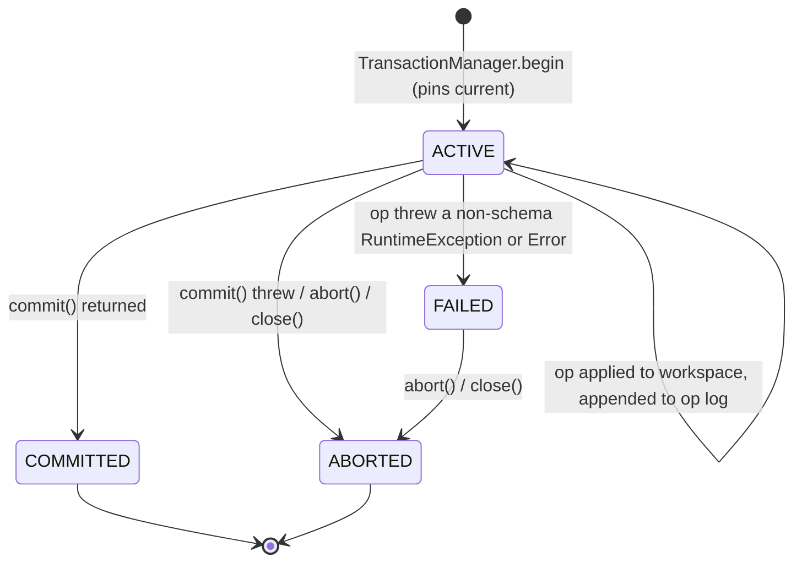
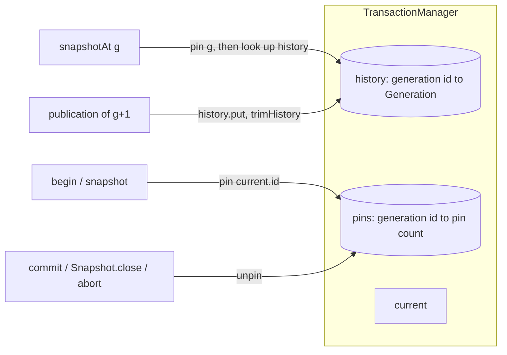
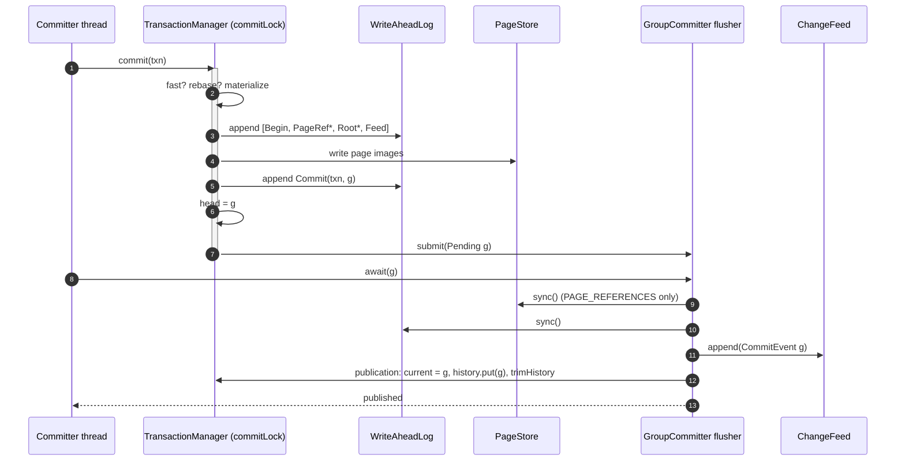
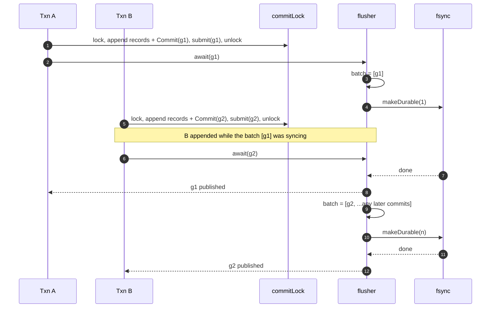
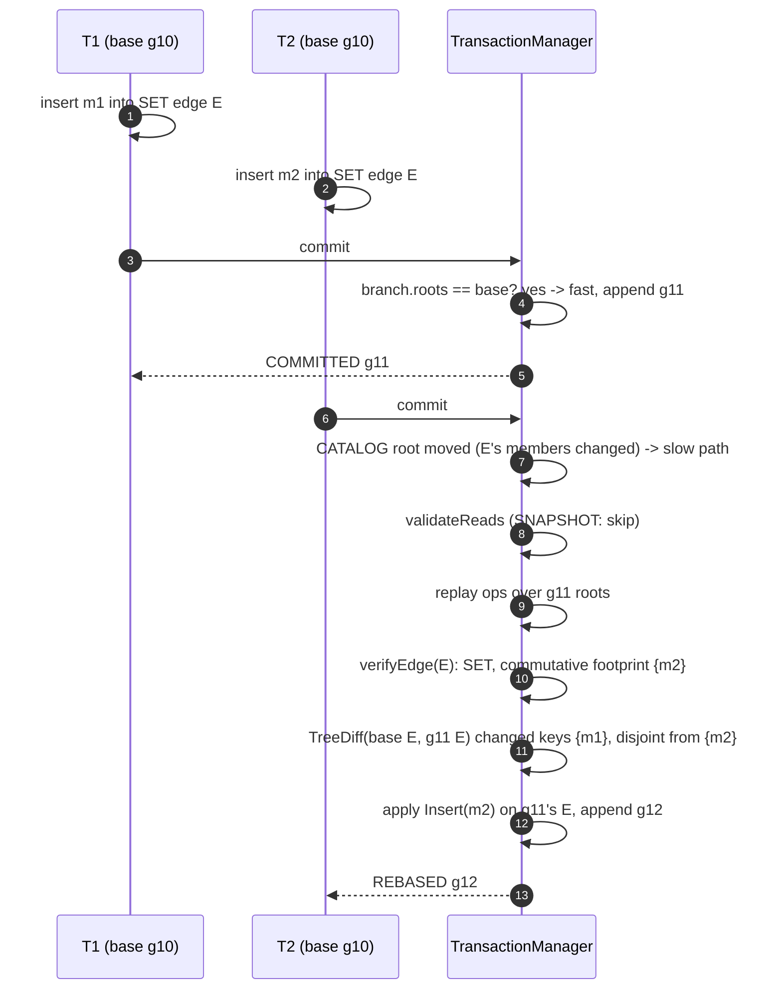

# Transactions

This document describes the transaction model of the storage engine from `begin` to the moment a commit becomes visible: workspaces, the operation log, the fast and slow commit paths, conflict detection, isolation levels, the commit lock, and the group-commit pipeline that turns many concurrent commits into one durability barrier.

Source of truth:

| Concern | File |
|---|---|
| Transaction handle, op log, footprints, read sets | `engine/src/main/java/io/hstore/engine/txn/Transaction.java` |
| Mutable per-transaction tree overlay | `engine/src/main/java/io/hstore/engine/txn/Workspace.java` |
| Logged operations | `engine/src/main/java/io/hstore/engine/txn/Op.java`, `EdgeAction.java` |
| Commit lock, append, publication, pinning | `engine/src/main/java/io/hstore/engine/txn/TransactionManager.java` |
| Durability batching | `engine/src/main/java/io/hstore/engine/txn/GroupCommitter.java` |
| Options and results | `TxnOptions.java`, `Isolation.java`, `CommitResult.java` |
| Read-only views | `Snapshot.java`, `View.java` |
| Retry loop | `engine/src/main/java/io/hstore/engine/StorageEngine.java` (`write`) |

Related: [WAL and recovery](wal-and-recovery.md), [change feed](../storage/change-feed.md), [catalog and generations](../storage/catalog-and-generations.md), [persistent tree](../storage/persistent-tree.md), [topology](../storage/topology.md), [architecture overview](../architecture/overview.md).

## 1. Vocabulary

| Term | Meaning |
|---|---|
| Generation | Immutable record `Generation(id, wallTime, txnId, nextAtom, nextTxn, branches)`. Every successful write produces exactly one new generation whose `id` is the predecessor's `id + 1` (`Generation.successor`). |
| Branch | `Branch(id, name, parent, baseGeneration, createdAt, state, roots)`. `Branch.MAIN == 0`. A generation maps branch ids to branches; a commit replaces one branch. |
| Root vector | `RootVector`: slot id → `Ref` (root of one persistent tree). All state of a branch is its root vector. |
| Slot | A named keyed tree (`Slot<V>`). *Primary* slots are written by operations; *derived* slots (for example `EngineSlots.REVERSE`, `EngineSlots.CANONICAL`) are maintained by `Derivation`s and cannot be written directly (`Op.SlotWrite` rejects them). |
| `head` | `TransactionManager.head`: the latest generation whose records were **appended** to the WAL. Only touched under the commit lock. Base for the next commit. |
| `current` | `TransactionManager.current`: the latest generation that is **durable and published**. New snapshots and new transactions start here. |

`head` runs ahead of `current` by exactly the commits that are queued in the group committer. Readers never observe `head`.

## 2. Lifecycle



`Transaction.State` has exactly these four values. Two details matter:

* `execute(Op)` lets `HStoreException.InvalidSchema` and `HStoreException.ResourceLimit` propagate **without** failing the transaction: a rejected operation (duplicate canonical key, wrong atom kind, over quota) leaves the workspace untouched because the operation threw before any tree was replaced, and the caller may continue. Any other exception moves the transaction to `FAILED`.
* `commit()` always unpins the snapshot generation in a `finally` block, whether it succeeds or throws. `abort()` acts only from `ACTIVE` or `FAILED`: it unpins and, if the transaction spilled pages, appends `WalRecord.Abort(txnId)` through `TransactionManager.logAbort` (section 3).

`Transaction` implements `AutoCloseable`; `close()` is `abort()`. `StorageEngine.write` wraps a transaction in try-with-resources and retries `HStoreException.Conflict` up to `MAX_ATTEMPTS = 8` times with a randomised sleep of `1 .. 2^min(attempt, 6)` milliseconds.

## 3. Workspace and op log

A transaction is two structures kept in lockstep:

1. **The workspace** (`Workspace`): a map `slot id → Tree<?>` over the base root vector. `tree(slot)` lazily creates a tree rooted at `base.get(slot)`; each write replaces the map entry with a new copy-on-write tree produced under the transaction's `WriteScope` (ownership token, see [persistent tree](../storage/persistent-tree.md)). Every write to a primary slot is recorded as a `SlotChange(slot, key, before, after)` and fanned out to every `Derivation.onSlot`; every membership change is recorded as a `MemberChange` and fanned out to `Derivation.onMember`. Derivations write derived slots through the same workspace, so derived indexes are always consistent with primary data inside one workspace.
2. **The op log** (`Transaction.ops`): every successfully applied `Op` is appended. Ops are *intent*, not effect:

| `Op` | Effect when applied to a workspace |
|---|---|
| `CreateAtom(id, record)` | Fails with a conflict if `id` exists; checks canonical-key uniqueness through `Views.resolve` on `EngineSlots.CANONICAL`; edges must be created empty. |
| `UpdateAtom(id, change)` | Applies a function to the current `AtomRecord`; kind and edge type are immutable; topology may not change through this path. |
| `DeleteAtom(id)` | Removes the atom from every incident hyperedge (via the reverse index), emits `Removed` for an edge's own members, clears the record. |
| `EdgeOp(edge, action)` | Applies an `EdgeAction` (`Insert`, `Upsert`, `Replace`, `Remove`, `InsertAt`, `RemoveAt`, `UpdateAt`, `Load`) to the edge's member/order trees. |
| `SlotWrite(slot, key, precondition, change)` | Tests `precondition` against the current value, then writes `change(current)`. |
| `Apply(description, action)` | Arbitrary workspace action (used by higher layers). |

Because ops are functions of the state they are applied to, the same op log can be re-applied to a *different* base. This is the basis of rebase (section 5).

Keyed writes through the public API record their expectation:

* `Transaction.update(slot, key, change)` reads `expected = workspace.get(slot, key)` and logs `SlotWrite(slot, key, current -> current.equals(expected), change)`. Replaying it over a base where the key changed fails the precondition.
* `Transaction.merge(slot, key, precondition, change)` logs a caller-supplied precondition. A commutative counter passes `_ -> true` (or a bound check) so that concurrent increments rebase instead of conflicting. The database layer uses this for tenant usage accounting.

During replay (`Workspace.replaying() == true`) a failed precondition, a duplicate canonical key or a missing atom raise `HStoreException.conflict(...)` (code `RETRYABLE_CONFLICT`). Outside replay the same conditions raise `HStoreException.invalid(...)` (`INVALID_SCHEMA`, not retryable): the caller's own request is wrong, not racing.

### Spilling large workspaces

`Transaction` constructs its `WriteScope` with a `PageSink` that calls `TransactionManager.spill`. Only `BulkBuilder` spills (every `SPILL_BATCH = 32` leaves during `Hyperedge.build`, used by `Transaction.load`), so very large bulk loads do not have to hold every new leaf in memory. `spill` materializes the subtree, **writes the page images to their data segments first**, then appends the matching `Page`/`PageRef` WAL records under the transaction id (before the transaction commits), and returns a `Ref.Stored`. Writing data before logging means that by the time a checkpoint can observe an LSN past the spill records, the pages are already in the page cache, so the checkpoint's `pages.sync()` makes them durable before the records are truncated. The spilled pages count against the transaction's page budget (`spilledPages`).

If a transaction that spilled is aborted (explicitly, or by `close()` without commit), `abort()` appends `WalRecord.Abort(txnId)`; recovery then drops its buffered records instead of reporting them as an unfinished transaction. A transaction that spilled and then crashed before `Commit` or `Abort` still appears in `Outcome.discardedTransactions`. In both cases the spilled pages are unreachable garbage reclaimed by compaction (see [maintenance](../storage/maintenance.md)). A commit that throws marks the transaction `ABORTED` directly and does not log `Abort`.

## 4. Snapshots, pinning and history



* `snapshot(branch)` and `begin(options)` call `pinCurrent()`: read `current`, increment `pins[id]`.
* `snapshotAt(g, branch)` pins `g` first and then looks it up in `history`, so a concurrent trim cannot remove it between lookup and pin. If `g` is gone it unpins and throws `INVALID_SCHEMA` (`"generation g is no longer retained"`).
* `trimHistory()` (run during publication) computes `excess = history.size() - historyLimit` and walks the history oldest first, removing every generation that is neither pinned nor `current` until `excess` reaches 0. Pinned generations are **skipped**, not barriers: a long-running snapshot on an old generation keeps exactly that generation, while newer unpinned ones are still trimmed, so the history size stays bounded by `historyLimit + number of distinct pinned generations`.
* `oldestPinned()` exposes the oldest pinned generation to maintenance so that compaction never reclaims pages still reachable from a pinned snapshot.
* `generationAsOf(wallTime)` returns the newest retained generation with `wallTime <= t` (used by `AS OF` time travel).

A `Snapshot` is a `View` whose trees are rooted at the pinned branch's root vector; `Snapshot.close()` unpins once (`AtomicBoolean` guard). Retention defaults: `EngineOptions.historyLimit = 64`.

## 5. Commit

`Transaction.commit()` delegates to `TransactionManager.commit(txn)`:

```text
commit(txn):
  if txn.ops is empty                  -> READ_ONLY (no lock, no I/O)
  lock(commitLock)
    latest  = head
    branch  = latest.branch(txn.branch)
    if txn has requestId and REQUESTS[hash(id)] exists -> DUPLICATE (prior txn id, prior generation)
    fast = branch.roots sameAs txn.baseRoots
        || (requestsStable && workspace.untouchedSince(branch.roots, isolation == SERIALIZABLE))
    if !fast and txn.generation < relocationFence and txn carries Load ops -> Conflict
    if fast: workspace = txn.workspace
    else:    txn.validateReads(branch.roots); workspace = txn.replay(branch.roots)
    if requestId: workspace.write(REQUESTS, hash(id), RequestRecord(id, txn.id, latest.id + 1))
    merged = fast ? workspace.rebasedOnto(branch.roots) : workspace.roots()
    appended = append(latest, branch.withRoots(merged), ...)      -- WAL + data writes, head = next
  unlock(commitLock)
  committer.await(appended.pending)                              -- durability + publication
  -> COMMITTED (fast) or REBASED (slow)
```

### 5.1 Fast path: per-slot merge

`Workspace.untouchedSince(latest, includingReads)` is true when every slot the transaction **changed** still has the same root in `latest` as in its base (`Ref.same`). A slot counts as changed when its tree root differs from the base root. Slots that were only read are ignored for `SNAPSHOT` transactions. For `SERIALIZABLE` transactions they are included, because the fast path skips `validateReads`. When the check passes, the commit takes the latest root vector and overlays only the changed slots (`rebasedOnto`). A concurrent commit to a slot this transaction merely read is therefore kept, and commits that write disjoint slots never replay, however many other commits landed in between.

`requestsStable` handles idempotency keys: if the transaction carries a request id, the `REQUESTS` slot is written inside the commit lock, so the fast path additionally requires that `REQUESTS` itself has not moved since the base.

### 5.2 Slow path: validation and replay

If any touched slot moved, the commit re-executes the op log against the latest roots:

1. `validateReads(latest)` (no-op under `SNAPSHOT`, see section 6).
2. `replay(latest)` builds a new workspace over `latest` with `replaying = true` and an `EdgeGuard` that calls `verifyEdge` the first time each hyperedge is touched, then applies every op in log order.

`verifyEdge` uses the per-edge `Footprint(base, existed, members, commutative)` that `Transaction.edgeAction` recorded at first touch:

| Latest state of the edge | Result |
|---|---|
| Deleted, and it existed at the base | Conflict: `hyperedge e was deleted concurrently` |
| Member root `Ref.same` as base | OK, nothing happened to the edge |
| Changed, and footprint not commutative or edge is not a `SET` edge | Conflict: `hyperedge e root changed since the transaction began` |
| Changed, `SET` edge, commutative footprint | Diff base vs latest member trees with `TreeDiff.diff`; conflict only if any changed member key is one this transaction touched |

A footprint is *commutative* iff the edge was a `SET` edge at the base and every action on it named a member (`EdgeAction.member()` is present for `Insert`, `Upsert`, `Replace`, `Remove`; empty for positional actions and `Load`). This is the **commutative SET rebase**: two transactions that add or remove *different* members of the same set hyperedge both commit; the second one replays its member actions on top of the first. Ordered edges and bulk loads are positional and always conflict when the edge moved.

`TreeDiff.diff` uses the frontier algorithm over shared subtrees ([persistent tree](../storage/persistent-tree.md)), so the cost of the overlap check is proportional to the changed region, not the edge cardinality.

### 5.3 Relocation fence

Compaction rewrites roots through `TransactionManager.rewrite`, which records `relocationFence = new generation id`. A transaction that bulk-loaded stored subtrees (`carriesStoredRoots()`: any `EdgeOp` with `EdgeAction.Load`) began before the fence and cannot take the fast path is rejected with a conflict, because its stored roots may point into segments that compaction is about to retire. Retrying rebuilds the subtree.

### 5.4 Page budget

`append` counts the pending tree nodes, nested trees included, with `Materializer.pendingNodes` and rejects the commit with `HStoreException.limit` (`ABORTED_RESOURCE_LIMIT`, not retryable) if that count exceeds `txn.options().maxPages() - txn.spilledPages()`. The check runs before anything is materialized, so a rejected commit allocates no segment space, admits nothing to the node cache and does no WAL or data I/O.

### 5.5 Outcomes

`CommitResult(txnId, generation, outcome, pagesWritten, walBytes, memberChanges, slotChanges)` with `Outcome`:

| Outcome | When |
|---|---|
| `COMMITTED` | Fast path. |
| `REBASED` | Slow path, replay succeeded. |
| `DUPLICATE` | `TxnOptions.requestId` already recorded in `EngineSlots.REQUESTS`; returns the original transaction id and generation, writes nothing. A hash collision between two different request ids raises `INVALID_SCHEMA`. |
| `READ_ONLY` | Empty op log; no lock taken. |

## 6. Isolation

`TxnOptions(branch, isolation, requestId, maxPages)`; defaults are `Branch.MAIN`, `Isolation.SNAPSHOT`, no request id, `Long.MAX_VALUE` pages.

**SNAPSHOT.** Reads come from the pinned base generation plus the transaction's own writes. Write-write conflicts are detected by replay (section 5.2). Read-write anomalies (write skew) are possible, as in any snapshot-isolation system.

**SERIALIZABLE.** `View` calls `observeAtom` / `observeKey` on every read; under `SERIALIZABLE` the transaction records the value as of the **base** snapshot for each atom (`atomReads`) and each `(slot, key)` (`keyReads`) on first observation. On the slow path, `validateReads(latest)` re-reads each recorded key in the latest roots and raises a conflict if:

* a key read: `now.equals(seen)` is false;
* an atom read: presence differs, or the record differs **unless** both are `EdgeRecord`s with the same member root (`Ref.same(was.members(), is.members())`). Membership changes made by replay are still validated through `verifyEdge`.

The fast path never needs read validation: it is only taken when every touched slot, including every read slot, is byte-for-byte the same root as at the base. Validation is therefore at key granularity when slots moved and free when they did not.

Write skew rejected under `SERIALIZABLE` (this is `EngineTest.serializableReadsDetectWriteSkew`):

```text
setup: SET edges A, B; node p
L (SERIALIZABLE): if !contains(B, p) insert p into A     -- observes atom B
R (SERIALIZABLE): if !contains(A, p) insert p into B     -- observes atom A
L.commit()  -> fast path, generation g+1 (A's member root changed)
R.commit()  -> CATALOG root moved -> slow path -> validateReads:
               A's EdgeRecord now has a different member root -> Conflict (RETRYABLE_CONFLICT)
```

Under `SNAPSHOT` both commits succeed (R replays `Insert(p)` into B, which L never touched), leaving p in both edges.

## 7. Errors

`HStoreException.Code`:

| Code | Class | Retryable | Raised by |
|---|---|---|---|
| `RETRYABLE_CONFLICT` | `Conflict` | yes | replay preconditions, `verifyEdge`, `validateReads`, relocation fence, concurrent atom id/canonical key |
| `RETRYABLE_IO` | `TransientIo` | yes | WAL/page/feed I/O failures; a broken commit pipeline (`"the commit pipeline stopped after a durability failure; restart the engine"`) |
| `ABORTED_RESOURCE_LIMIT` | `ResourceLimit` | no | page budget, quotas |
| `INVALID_SCHEMA` | `InvalidSchema` | no | caller errors |
| `CORRUPT_PAGE` | `CorruptPage` | no | checksum/identity failures on read |
| `CORRUPT_LOG` | `CorruptLog` | no | a damaged WAL frame in a segment that is not the tail (see [WAL and recovery](wal-and-recovery.md#3-segments-and-frames)) |

`StorageEngine.write` retries only `Conflict`. A broken pipeline reports `RETRYABLE_IO` but every subsequent commit fails the same way until the engine is reopened, because `GroupCommitter.failure` is sticky.

## 8. The commit lock

`TransactionManager.commitLock` is a single `ReentrantLock`. Holding it serialises the decisions that must be totally ordered; everything else happens outside it.

| Inside the commit lock | Outside the commit lock |
|---|---|
| Read `head`, duplicate-request check | Executing the transaction's operations (concurrent, lock-free) |
| Fast/slow decision, read validation, replay | Spilling bulk-loaded subtrees |
| Materialization of new nodes into page images (`Materializer`) | `fsync` of data segments and WAL (`GroupCommitter` flusher) |
| WAL append of `Begin`, `Page`/`PageRef`, `Root`, `BranchMeta`, `Feed` records | Publication: feed append, `current.set`, `history.put` |
| Data page writes into the OS page cache | Waking the committing thread |
| WAL append of `Commit`, `head.set(next)`, `committer.submit(pending)` | |

The same lock guards `system(...)` (internal writes such as the dictionary), `createBranch`, `closeBranch` and `rewrite` (compaction). `exclusive(action)` takes the lock **and** drains the committer, which is how `Checkpointer.checkpoint()` obtains a quiescent point where `current == head` and every appended commit is durable and published.

Because the lock is released before waiting for durability, the next committer can append while the previous batch is being synced. This pipelining is what lets group commit amortise `fsync`.

## 9. Group commit

`GroupCommitter` owns one platform daemon thread named `hstore-group-commit` and a FIFO `Deque<Pending>`.

```text
Pending(generation, publication: Runnable, published: boolean)
Barrier.makeDurable(batchSize)    -- TransactionManager.makeDurable
```

Protocol:

1. `submit(pending)` (called inside the commit lock, so queue order equals WAL commit order) appends to the queue and signals `submitted`.
2. The flusher waits until the queue is non-empty, copies **the whole queue** as the batch, releases the lock, and calls `barrier.makeDurable(batch.size())` once.
3. It then runs each batch member's `publication` in order: `feed.append(event)` for non-empty events, then `current.set(next)`, `history.put`, `trimHistory()`, and `CrashPoint.CATALOG_PUBLISH`. Appending to the feed **before** making the generation current gives readers an invariant: any thread that observes `current == g` also observes `feed.lastGeneration()` covering every non-empty commit up to `g`. The semantic plane relies on this for `FRESH` queries (see [change feed](../storage/change-feed.md#5-consumers)).
4. Under the lock it marks the batch `published`, pops it from the queue, updates `batches`/`flushedCommits`, and `signalAll`s `progressed`.
5. `await(pending)` blocks (uninterruptibly) until its own `published` flag is set.

`makeDurable` for `Durability.SYNC`: if `walMode == PAGE_REFERENCES`, `pages.sync()` (force every dirty data segment); reach `DATA_SYNC`; `wal.sync()`; reach `WAL_SYNC`. For `Durability.ASYNC` it returns immediately: publication still happens in order on the flusher thread, but nothing is forced. A single `wal.sync()` covers every commit record appended so far, including records appended after the batch was copied; those commits are simply published in the next batch.

Failure handling: any `Throwable` from the barrier or a publication is stored in `failure`, logged at `ERROR`, and `progressed` is signalled; the flusher exits. Two checks consult it:

| Check | Used by | Fails when |
|---|---|---|
| `failIfFailed()` | `await`, `drain` | a durability failure was recorded: rethrows an `Error` as-is (this is how `CrashPoint.SimulatedCrash` reaches the committing thread in tests), wraps anything else in `RETRYABLE_IO` |
| `failIfBroken()` | `submit` | `failIfFailed()` fails, or the committer is closed (`IllegalStateException: the commit pipeline is closed`) |

`close()` sets `closed`, wakes the flusher, and joins it. The flusher drains the remaining queue before exiting because its wait condition is `queue.isEmpty() && !closed`. Because `await` does not treat `closed` as an error, a commit that was submitted before shutdown is reported to its caller exactly as it ends up on disk: published and acknowledged, never "failed but durable". `submit` still rejects work after `close()`. It runs inside the commit lock after the `Commit` record has been appended and `head` advanced, so a commit rejected there is in the WAL and recovery would replay it (the same "outcome unknown" case as a crash at `COMMIT_APPEND`, see [WAL and recovery](wal-and-recovery.md#10-what-the-crash-tests-prove)). `TransactionManager.shutdown()` closes the committer while holding the commit lock, so no commit can reach `submit` after close through the normal paths; `StorageEngine.requireOpen()` rejects new transactions once the engine is closed.

`averageBatch()` (`flushedCommits / batches`) is exported as `Statistics.averageGroupCommit` and appears on the Studio dashboard.

### Single commit



### Concurrent commits sharing one fsync



Under load, step 2 of every batch picks up everything that queued during the previous `fsync`, so batch size grows with concurrency. `CrashRecoveryTest.concurrentCommitsShareDurabilityBarriers` runs 400 virtual-thread writers and asserts all 400 commits are visible and the average batch is at least 1.

### A conflicting commit that rebases



Had T2 also touched `m1`, or had `E` been an `ORDERED` edge, the overlap check would raise `RETRYABLE_CONFLICT` and `StorageEngine.write` would retry T2 from a fresh snapshot.

## 10. Branch operations and internal writes

`system(branchId, work)`, `createBranch`, `closeBranch` and `rewrite` reuse `append` and the group committer, so they are durable and ordered exactly like user commits:

* `createBranch` appends a `BranchMeta` record and a branch whose roots are the parent's current roots (copy-on-write makes this O(number of slots)). Names must be unique among active branches; the new id is one past the largest existing id.
* `closeBranch` (`MERGED` or `DROPPED`, never for `MAIN`) empties the root vector so the branch's pages become unreachable.
* `rewrite` (compaction) replaces roots without member or slot changes and sets the relocation fence.

These commits carry no member or slot changes, so their `CommitEvent` is empty and nothing is written to the change feed (see [change feed](../storage/change-feed.md)).
