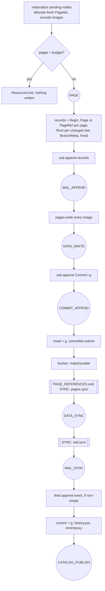
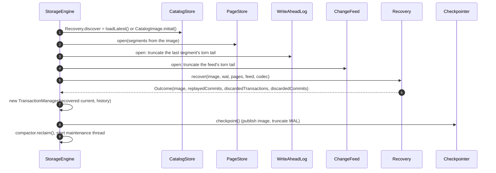

# Write-ahead log, durability and recovery

This document specifies the on-disk write-ahead log byte for byte, the two WAL modes, the two durability levels, the exact ordering of writes and syncs in a commit, the crash points that the test-suite injects, the recovery algorithm, and checkpointing.

Source of truth:

| Concern | File |
|---|---|
| Record types and payload codecs | `engine/src/main/java/io/hstore/engine/wal/WalRecord.java` |
| Segment files, framing, torn-tail handling | `engine/src/main/java/io/hstore/engine/wal/WriteAheadLog.java` |
| What a commit writes and in which order | `engine/src/main/java/io/hstore/engine/txn/TransactionManager.java` (`append`, `makeDurable`, `spill`) |
| Crash points | `engine/src/main/java/io/hstore/engine/txn/CrashPoint.java` |
| Recovery | `engine/src/main/java/io/hstore/engine/maintenance/Recovery.java` |
| Checkpoints | `engine/src/main/java/io/hstore/engine/maintenance/Checkpointer.java`, `catalog/CatalogStore.java` |
| Byte encodings | `engine/src/main/java/io/hstore/engine/page/ByteCursor.java`, `tree/Ref.java`, `tree/Summary.java` |
| Crash test matrix | `engine/src/test/java/io/hstore/engine/CrashRecoveryTest.java` |

Related: [transactions](transactions.md), [change feed](../storage/change-feed.md), [pages](../storage/pages.md), [catalog and generations](../storage/catalog-and-generations.md), [maintenance](../storage/maintenance.md), [configuration](../operations/configuration.md).

## 1. Directory layout

`StorageEngine` places every durable structure under the database directory:

```text
<db>/
  FORMAT                         properties: format=1, page-size=<bytes>
  LOCK                           exclusive FileLock held while open
  catalog/manifest               name of the current catalog image file
  catalog/generations/%016x.cat  checkpointed catalog images (3 newest retained)
  data/segments/*.seg            page segments (see pages.md)
  wal/segments/%016x.wal         WAL segments, named by their starting LSN in hex
  feed/%016x.feed                change feed segments, named by global byte position (see change-feed.md)
```

## 2. Primitive encodings

All fixed-width integers are **little-endian** (`ByteCursor` uses `JAVA_INT_UNALIGNED` / `JAVA_LONG_UNALIGNED` with `ByteOrder.LITTLE_ENDIAN`).

| Notation | Encoding |
|---|---|
| `u8` | one byte |
| `i32`, `i64` | little-endian two's complement |
| `varlong` | unsigned LEB128: 7 data bits per byte, low group first, high bit = continuation, at most 10 bytes |
| `varint` | `varlong` of the int interpreted as **unsigned** 32-bit (`Integer.toUnsignedLong`) |
| `svarlong` | zigzag (`(v << 1) ^ (v >> 63)`) then `varlong` |
| `blob` | `varint` length, then that many bytes |
| `string` | `blob` of UTF-8 |
| `Ref` | `i64 pageId`; `0` (`PageId.NONE`) means the empty tree and ends the encoding; otherwise followed by `varlong units` (the image size in 64-byte units, at most 3 bytes) and a `Summary` |
| `Summary` | `varlong count`; if `count == 0` nothing else; otherwise `svarlong min`, `varlong (max - min)`, `svarlong weightSum`, `svarlong weightMin`, `svarlong weightMax`, `svarlong timeMin`, `svarlong timeMax`, `i64 roleBits`, `i64 fingerprint` (at most `Summary.MAX_ENCODED_BYTES = 96`) |

## 3. Segments and frames

The WAL is a single logical byte stream addressed by **LSN** (absolute byte offset since the log was created). It is cut into segment files named `%016x.wal` after the LSN of their first byte. `EngineOptions.walSegmentBytes` defaults to 64 MiB.

Every record is one frame with a 25-byte header (`WriteAheadLog.HEADER = 25`):

```text
offset  size  field
0       4     i32  payload length P (0 <= P <= 2^30)
4       4     i32  CRC-32C over bytes [8, 25 + P)
8       8     i64  LSN of this frame (must equal its position in the stream)
16      1     u8   record type (1..9)
17      8     i64  transaction id
25      P     payload (per type, section 4)
```

The checksum covers the LSN, type, transaction id and payload. Embedding the LSN means that stale bytes left behind by an earlier, longer file (or a frame from a different position) can never validate.

**Append.** `append(List<WalRecord>)` encodes the whole list into one buffer and issues it as one positional write under the WAL lock, so the records of one call are contiguous. Before writing, the log rolls to a new segment if the active segment is non-empty and the batch would push it past `walSegmentBytes`. A batch is never split across segments; a batch larger than a segment gets an oversized segment of its own. Rolling `force(true)`s and closes the previous segment, creates the new file, and forces the `wal/segments` directory (`syncDirectory`; filesystems that cannot open a directory for sync are logged at `DEBUG` and skipped) so that the new segment's directory entry survives a power loss.

**Sync.** `sync()` calls `FileChannel.force(false)` on the active segment if anything was written since the last sync (`dirty`). Rolled segments were forced when they were closed, so one call makes the entire log durable.

**Open.** `restore()` lists `*.wal`, scans only the **last** segment frame by frame, truncates it to the end of the last valid frame and forces it. Recovery therefore always appends after a clean frame boundary. The scan checks each frame's header and CRC-32C but doesn't decode the records, and a reader reuses one header and one body buffer, growing the body only for a larger frame, so opening doesn't allocate per frame.

**Read.** `read(from)` iterates frames starting at LSN `from` across segments. When fewer than 25 header bytes remain in a segment, the reader treats it as the clean end of that segment and continues with the next one. A *damaged* frame is one whose length is out of range, whose embedded LSN differs from the expected one, whose body is short, or whose CRC does not match. What happens next depends on where it is:

| Damaged frame in | Result |
|---|---|
| the tail segment (no later segment exists) | reading stops; everything from that frame on is treated as never written (torn-tail rule) |
| any earlier segment | `HStoreException.CorruptLog` (code `CORRUPT_LOG`, not retryable): `write-ahead log segment X.wal is damaged (reason) but later segments exist; replay would silently drop committed transactions` |

Only the tail can legitimately be torn, because every earlier segment was forced when the log rolled past it. Damage anywhere else means data loss or tampering, and the engine refuses to open rather than recover a silently shortened history.

**Truncate.** `truncateBefore(lsn)` deletes every segment whose *successor* starts at or before `lsn`, never the active segment. The segment containing `lsn` is always kept.

## 4. Record types

`WalRecord` is a sealed interface; `typeOf` and `readPayload` define the wire ids.

| Type | Record | Payload layout | Emitted by |
|---|---|---|---|
| 1 | `Begin(txnId, branch, baseGeneration)` | `varint branch`, `varlong baseGeneration` | first record of every commit (`append`) |
| 2 | `Page(txnId, pageId, image)` | `i64 pageId`, `blob image` | `PAGE_IMAGES` mode, one per materialized page |
| 3 | `Root(txnId, branch, slot, root)` | `varint branch`, `varint slot`, `Ref root` | one per slot whose root changed (`Ref.same` false), in ascending slot order |
| 4 | `BranchMeta(txnId, id, name, parent, baseGeneration, createdAt, state)` | `varint id`, `string name`, `varint parent`, `varlong baseGeneration`, `varlong createdAt`, `u8 state` (`ACTIVE=0`, `MERGED=1`, `DROPPED=2`) | `createBranch`, `closeBranch` |
| 5 | `Feed(txnId, payload)` | `blob` containing a `FeedCodec`-encoded `CommitEvent` | commits with at least one member or slot change |
| 6 | `Commit(txnId, generation, wallTime, nextAtom, nextTxn)` | `varlong generation`, `varlong wallTime`, `varlong nextAtom`, `varlong nextTxn` | last record of every commit, appended separately |
| 7 | `Abort(txnId)` | empty | `Transaction.abort()` via `TransactionManager.logAbort`, only for transactions that spilled pages (the only case in which a transaction has WAL records before its commit) |
| 8 | `Checkpoint(0, generation, lsn)` | `varlong generation`, `varlong lsn` | `Checkpointer`, transaction id is always 0 |
| 9 | `PageRef(txnId, pageId, length, checksum)` | `i64 pageId`, `varint length`, `i32 checksum` (CRC-32C of the page image's first `length` bytes) | `PAGE_REFERENCES` mode, one per materialized page |

Frame sizes that follow directly from the layouts (25-byte header included):

| Record | Bytes |
|---|---|
| `PageRef` with `128 <= length < 16384` | 25 + 8 + 2 + 4 = **39** |
| `PageRef` with `length = 16384` | 25 + 8 + 3 + 4 = **40** |
| `Page` with image length `L` (128 <= L < 16384) | 25 + 8 + 2 + L = **35 + L** |
| `Commit` | 25 + 4 varlongs; with a 6-byte millisecond wall clock typically 34 to 42 |
| `Root` | 25 + 2 + 8 + summary; empty tree 35, otherwise typically 60 to 130 |
| `Checkpoint` | 25 + 2 varlongs |

### Example frame

A `PageRef` for the (arbitrary) page id `0x0000000300000101`, image length 3,912, checksum `0x1A2B3C4D`, transaction 77, at LSN 4096. The payload is 8 + 2 + 4 = 14 bytes, so the frame is 39 bytes and the next frame starts at LSN 4135:

```text
0e 00 00 00              payload length 14
xx xx xx xx              CRC-32C of frame bytes [8, 39)
00 10 00 00 00 00 00 00  LSN 4096
09                       type 9 (PageRef)
4d 00 00 00 00 00 00 00  txn 77
01 01 00 00 03 00 00 00  pageId (i64 LE)
c8 1e                    varint 3912 (0x0F48): low 7 bits 0x48 | 0x80, then 0x1E
4d 3c 2b 1a              checksum (i32 LE)
```

## 5. What one commit writes

`TransactionManager.append` runs inside the commit lock. For a commit of transaction `t` producing generation `g = head.id + 1`:



Circles are `CrashPoint`s, reached through `storage.faults().reach(point)` exactly where drawn. The enum order is the order of the write path:

```text
PAGE < WAL_APPEND < DATA_WRITE < COMMIT_APPEND < DATA_SYNC < WAL_SYNC < CATALOG_PUBLISH
```

The `Commit` record is appended in a separate call **after** the data pages were written. It is the atomic commit point: a transaction is part of the recovered state if and only if its `Commit` frame is valid in the recovered log and the durability-prefix rule (section 8) admits it. Consequently a crash at any point `>= COMMIT_APPEND` that preserves the operating system's page cache recovers the commit, and a crash at any point `< COMMIT_APPEND` recovers the prior state.

Spilled subtrees (`TransactionManager.spill`, only for bulk loads) are handled earlier, outside the commit lock: the page images are written to their segments **first**, then the `Page`/`PageRef` records are appended, carrying the transaction id but no `Begin`. Recovery attaches them to the transaction's body by id. The data-before-log order closes a checkpoint race in `PAGE_IMAGES` mode: a checkpoint can only observe an LSN past the spill records after the pages are already in the page cache, so its `pages.sync()` makes them durable before `truncateBefore` drops the records. If the transaction is aborted, `WalRecord.Abort` follows the spill records.

## 6. WAL modes

`EngineOptions.walMode`, default `PAGE_REFERENCES` (`WalMode`).

### PAGE_IMAGES

Every materialized page is logged in full (`Page`). At commit (`SYNC`) only the WAL is forced; data segments are forced at the next checkpoint (`Checkpointer` calls `pages.sync()` before publishing the catalog image). Recovery rewrites every logged image into its segment (`redo`), so the data files may be arbitrarily stale or torn at crash time.

### PAGE_REFERENCES

Every materialized page is logged as a 39 or 40 byte `PageRef` holding its id, length and CRC-32C. The image itself lives only in the data segment. This is safe because of two invariants:

1. **Pages are never overwritten in place while reachable.** The tree is copy-on-write: a commit writes new versions of changed nodes to *freshly allocated* `PageId`s and never modifies a page that any generation, pinned snapshot or retained catalog image can reach. Compaction copies live pages to new ids and only reclaims a segment after a checkpoint has moved the WAL past every record that could reference it ([maintenance](../storage/maintenance.md)). A page id additionally embeds the allocation epoch, and `PageHeader.verify` rejects an image whose stored id differs from the requested one.
2. **Data is forced before the log.** `makeDurable` calls `pages.sync()` (every dirty segment file, `force(false)`) and only then `wal.sync()`. When the commit's `Commit` frame is durable, so is every page it references.

Invariant 2 alone is not enough: the OS may write the WAL segment back to disk on its own *before* `pages.sync()` runs, and a power failure at that moment leaves a durable `Commit` frame whose pages are missing. That commit was never acknowledged (acknowledgement happens after `WAL_SYNC` and publication). Recovery detects the situation by verifying every `PageRef` (section 8) and discards the commit together with everything after it.

### Write amplification

Let a commit materialize `N` pages with mean image length `L` (images are `PageHeader.SIZE = 80` bytes plus the encoded node, at most the page size `P`; `NodeCodec.encode` returns a slice of exactly that length). Ignoring the per-commit constant (one `Begin`, a few `Root`s, an optional `Feed`, one `Commit`: typically 150 to 400 bytes):

| | `PAGE_IMAGES` | `PAGE_REFERENCES` |
|---|---|---|
| WAL bytes | `N (35 + L)` | `39 N` |
| Data segment bytes | `N L` | `N L` |
| Total bytes written per commit | `N (2L + 35)` | `N (L + 39)` |
| Forced at commit (`SYNC`) | WAL only | dirty data segments, then WAL |
| Forced later | data segments at checkpoint | nothing |
| Recovery source of page bytes | WAL | data segments (verified) |

Worked numbers for the default page size `P = 16 KiB` and a commit that rewrites a root-to-leaf path in three trees of height 4 (`N = 12`):

| `L` | `PAGE_IMAGES` total | `PAGE_REFERENCES` total | Ratio |
|---|---|---|---|
| 16,384 (full pages) | 12 x (32,768 + 35) = 393,636 B | 12 x (16,384 + 40) = 197,088 B | 2.00x |
| 8,000 | 12 x 16,035 = 192,420 B | 12 x 8,039 = 96,468 B | 1.99x |
| 1,024 | 12 x 2,083 = 24,996 B | 12 x 1,063 = 12,756 B | 1.96x |

`PAGE_REFERENCES` halves device write volume and shrinks the log by roughly `L / 39`, which also shortens recovery scans and makes checkpoints rarer for the same `checkpointWalBytes`. The price is a second `fsync` target per group-commit batch (the dirty segment files), amortised across the batch like the WAL sync.

## 7. Durability levels

`EngineOptions.durability`, default `SYNC` (`Durability`).

| Mode | Commit acknowledged after | Data at risk on power loss | Never possible |
|---|---|---|---|
| `SYNC` + `PAGE_REFERENCES` | data `fsync`, WAL `fsync`, publication | nothing acknowledged | a recovered state that mixes a commit's effects |
| `SYNC` + `PAGE_IMAGES` | WAL `fsync`, publication | nothing acknowledged | same |
| `ASYNC` (either mode) | publication only, no `fsync` | acknowledged commits after the last checkpoint or OS write-back | same; recovery yields a prefix of the commit order |

Under `ASYNC` the group committer still publishes commits strictly in order and readers still see only appended and published generations; only the `fsync` calls are skipped. Process crashes (as opposed to power or kernel failures) lose nothing in either mode, because the OS page cache survives the process.

## 8. Recovery

`StorageEngine` constructor:



`Recovery.recover(checkpoint, wal, pages, feed, codec)`:

1. **Scan.** Read the WAL from `checkpoint.checkpointLsn()` (may throw `CORRUPT_LOG`, section 3). `Commit` frames are collected in log order; `Abort` drops the transaction's buffered spill records; `Checkpoint` is ignored; every other record is buffered in `pending[txnId]`.
2. **Filter.** For each commit in log order, remove its body from `pending`. Skip it if `commit.generation <= checkpoint.current().id()` (already in the image).
3. **Durability prefix.** If any earlier commit was discarded, discard this one too. Otherwise check `intact(body, pages)`: for every `PageRef` in the body, read the page, run `PageHeader.verify(page, pageId)` (magic, format, identity, header checksum), and require `page.byteSize() >= length` and `crc32c(page[0, length)) == checksum`. Any exception or mismatch means the page never reached storage; log a warning once (`durable prefix ends before generation g`) and discard this and every later commit. `Page` records need no verification because they carry their own bytes, protected by the frame CRC.
4. **Redo.** Apply the body in order: `Page` writes the image to its page id; `BranchMeta` inserts or updates the branch (keeping its current roots); `Root` sets one slot root of one branch; `Feed` appends the decoded event to the change feed (a no-op if the feed already holds that generation). Build `Generation(commit.generation, commit.wallTime, commit.txnId, max(nextAtom), max(nextTxn), branches)` and append it to the history.
5. **Seal.** `pages.sync()`; `feed.truncateAfter(recovered generation)` drops feed frames for commits that did not survive (possible under `ASYNC`, or after the prefix rule fired); `feed.sync()`.
6. **Result.** `CatalogImage(recovered generation, history, segments, wal.end(), feed.size())` and `Outcome(image, replayedCommits, discardedTransactions = pending.size(), discardedCommits)`. `discardedTransactions` counts transactions that wrote records but neither a `Commit` nor an `Abort` (crashed mid-commit, or spilled and then lost to a crash before committing or aborting).

The prefix rule is what makes recovery produce *the state after some prefix of the commit order*. Without it, a durable commit `k+1` whose pages survived could be replayed on top of a lost commit `k`, and its root records (which point at pages built on `k`'s trees) would expose a mixture.

Recovery is idempotent: it writes nothing to the WAL, `Page` redo rewrites identical bytes, feed appends are keyed by generation, and the constructor immediately publishes a new checkpoint. A crash during recovery repeats the same work on the next open.

The log line written at the end has the form:

```text
LOG:  [recovery] recovered generation 158: replayed 0 commits from lsn 156,490, discarded 0 unfinished transactions and 0 non-durable commits
```

## 9. Checkpoints

`Checkpointer.checkpoint()` runs inside `TransactionManager.exclusive(...)`, which takes the commit lock **and** drains the group committer, so `current == head` and nothing is in flight:

1. `pages.sync()`, `feed.sync()` (forces the active feed segment; earlier feed segments were forced when the feed rolled).
2. `lsn = wal.end()`; `history` = retained generations other than `current`, newest first, at most `historyLimit`.
3. `catalog.publish(CatalogImage(current, history, segments, lsn, feed.size()))`. The image is framed as `i32 magic 0x54414348`, `i32 crc32c(payload)`, `i64 length`, payload; written to `generations/%016x.cat.tmp`, forced, atomically renamed, the directory forced; then `manifest` is rewritten the same way. The three newest `.cat` files are kept; `loadLatest()` falls back to the newest valid file if the manifest is missing or names a corrupt file.
4. `wal.append(Checkpoint(0, current.id, lsn))`, `wal.sync()`, `wal.truncateBefore(lsn)`.

The checkpoint LSN is the position of the `Checkpoint` record itself, so the next recovery starts there and skips it. Triggers:

| Trigger | Where |
|---|---|
| Every open, right after recovery | `StorageEngine` constructor |
| WAL grew by more than `checkpointWalBytes` (default 256 MiB) since the last checkpoint; checked every 500 ms | `StorageEngine.maintain` |
| Compaction, between relocation and segment reclamation | `StorageEngine.compact` |
| Clean shutdown | `StorageEngine.close` |
| On demand | `StorageEngine.checkpoint()`, HQL `CHECKPOINT` |

After each completed checkpoint, `StorageEngine.timedCheckpoint` logs `checkpoint complete: generation g, lsn n, k wal segments retained, t ms`, runs the registered checkpoint listeners (the semantic plane persists its vector index there, which also advances its feed hold), and finally applies change-feed retention with `feed.retain(current - feedRetention)` (see [change feed retention](../storage/change-feed.md#6-retention-and-holds)).

## 10. What the crash tests prove

`CrashRecoveryTest.recoveryYieldsPriorOrNewStateNeverAMixture` is parameterised over every `WalMode` x every `CrashPoint` (2 x 7 = 14 cases). Each case:

1. Commits an ordered edge with 200 members (each a fresh node).
2. Arms a fault injector that throws `CrashPoint.SimulatedCrash` (an `Error`) the first time the chosen point is reached.
3. Begins a transaction that creates 300 more nodes and inserts each at position 0, then commits: the commit must throw `SimulatedCrash`. Crash points up to `COMMIT_APPEND` throw on the committing thread inside `append`; `DATA_SYNC`, `WAL_SYNC` and `CATALOG_PUBLISH` throw on the flusher thread, break the pipeline, and are rethrown to the waiting committer by `GroupCommitter.failIfFailed`.
4. `halt()`s the engine (no checkpoint, files closed as after a process crash; the OS page cache is preserved).
5. Reopens and asserts the edge has 200 or 500 members, never anything else; exactly `500` iff `point >= COMMIT_APPEND`; the node count equals the member count; every member has degree 1 (the reverse index agrees with the forward index). It then writes again, reopens, and checks that the post-crash write survived (recovery left the log appendable).

| Crash point | Thread | On disk at crash | `PAGE_IMAGES` | `PAGE_REFERENCES` |
|---|---|---|---|---|
| `PAGE` | committer | nothing for this commit | 200 (prior) | 200 (prior) |
| `WAL_APPEND` | committer | `Begin`, page records, `Root`s, `Feed`; no `Commit` | 200, counted as unfinished | 200, counted as unfinished |
| `DATA_WRITE` | committer | as above plus data pages (orphaned) | 200 | 200 |
| `COMMIT_APPEND` | committer | `Commit` frame written, not synced | 500 (new) | 500, `PageRef`s verify |
| `DATA_SYNC` | flusher | data synced (refs mode only), WAL not synced | 500 | 500 |
| `WAL_SYNC` | flusher | WAL synced, not published | 500 | 500 |
| `CATALOG_PUBLISH` | flusher | feed appended (not forced), published to `current` | 500, feed frame kept or re-appended from the `Feed` record | 500, same |

`COMMIT_APPEND` is the instructive row: the client received an error, yet the commit is recovered. This is the standard "commit outcome unknown" case of every database; clients that must know use `TxnOptions.withRequestId(...)` and retry, and the retry returns `DUPLICATE` with the original generation.

`recoveryStopsAtTheFirstCommitWhosePagesAreMissing` covers the power-loss reordering that a process crash cannot produce. With `PAGE_REFERENCES` it commits `durable`, reopens, commits `lost-1` and `lost-2`, halts, and truncates the last data segment to one byte short of its size before `lost-2`, so `lost-1`'s last page fails its checksum. Recovery must report `discardedCommits >= 1`, keep `durable`, drop `lost-2` (which itself has intact pages but follows a broken commit), and accept new writes that survive another reopen.

`concurrentCommitsShareDurabilityBarriers` runs 400 concurrent writers and checks that all 400 commits are visible and that `averageGroupCommit >= 1`.
